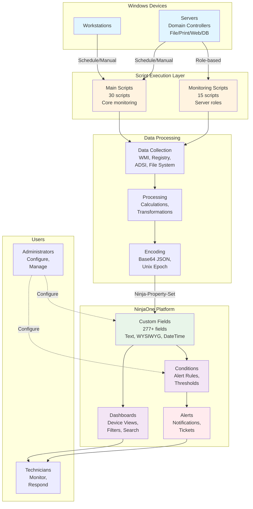

# Diagram 1: Framework Architecture Overview

**Purpose:** High-level view of Windows Automation Framework structure  
**Created:** February 8, 2026  
**Type:** Architecture Diagram

---

## Framework Architecture

---

## Component Descriptions

### Windows Devices
**Workstations:** End-user devices monitored for health, security, capacity  
**Servers:** Infrastructure servers with role-specific monitoring

### Script Execution Layer
**Main Scripts (30):** Core monitoring for all device types  
**Monitoring Scripts (15):** Role-specific monitoring for servers

**Execution Methods:**
- Scheduled: Daily/weekly automated runs
- Manual: On-demand execution by technicians
- Condition-triggered: Based on alert conditions

### Data Processing
**Collection:** Gather data from Windows APIs, WMI, Registry, ADSI LDAP, file system  
**Processing:** Calculate metrics, analyze trends, classify health status  
**Encoding:** Base64-encode complex JSON, Unix Epoch for timestamps

### NinjaOne Platform
**Custom Fields (277+):** Store all monitoring data  
- Text fields: Status values, simple data
- WYSIWYG fields: Formatted HTML reports
- DateTime fields: Unix Epoch timestamps

**Dashboards:** Display device data with filtering, sorting, searching

**Conditions:** Evaluate field values against thresholds  
**Alerts:** Notify technicians of issues requiring attention

### Users
**Administrators:** Configure fields, scripts, conditions, dashboards  
**Technicians:** Monitor device health, respond to alerts, troubleshoot issues

---

## Data Flow Summary

1. **Script Execution:** Scheduled or manual trigger on device
2. **Data Collection:** Scripts query Windows systems
3. **Processing:** Calculate metrics, determine health status
4. **Encoding:** Format data for storage (Base64, Unix Epoch)
5. **Storage:** Write to NinjaOne custom fields
6. **Display:** Dashboards show data to users
7. **Evaluation:** Conditions check thresholds
8. **Alerting:** Notify technicians of issues

---

## Key Statistics

- **Total Scripts:** 45 (30 main + 15 monitoring)
- **Custom Fields:** 277+ fields
- **Supported Devices:** Windows workstations and servers
- **Execution Frequency:** Daily to weekly (configurable)
- **Data Encoding:** Base64 JSON for complex data
- **Timestamp Format:** Unix Epoch (numeric)
- **Field Types:** Text (searchable/filterable)

---

## Technical Foundation

**Built on Pre-Phases:**
- LDAP:// protocol (no RSAT required)
- Base64 JSON encoding (complex data)
- Unix Epoch timestamps (date/time)
- Language-neutral code (German/English)
- Self-contained scripts (no external dependencies)
- Consistent coding standards (WAF standards)

---

**Related Diagrams:**
- [Diagram 3: Data Flow](03_Data_Flow.md) - Detailed execution flow
- [Diagram 5: PrePhase Foundation](05_PrePhase_Foundation.md) - Technical foundation
- [Diagram 6: Script Dependencies](06_Script_Dependencies.md) - Script relationships
