# Diagram 2: Script Organization Structure

**Purpose:** Repository directory structure and file organization  
**Created:** February 8, 2026  
**Type:** Structure Diagram

---

## Repository Structure

```mermaid
graph TD
    ROOT[waf Repository]
    
    ROOT --> SCRIPTS[scripts/]
    ROOT --> DOCS[docs/]
    ROOT --> PLANNING[planning/]
    ROOT --> README[README Files]
    
    SCRIPTS --> MAIN[Main Scripts<br/>01-36 + P1-P4]
    SCRIPTS --> MONITORING[monitoring/]
    
    MAIN --> CORE[Core Monitoring<br/>01-13: Infrastructure]
    MAIN --> EXTENDED[Extended Automation<br/>14-27: Advanced]
    MAIN --> TELEMETRY[Telemetry<br/>28-36: Analytics]
    MAIN --> VALIDATORS[Validators<br/>P1-P4: Patching]
    
    MONITORING --> SERVER_MON[Server Monitoring<br/>Script_01-48]
    
    DOCS --> PREPHASE[Pre-Phase Docs<br/>A-F Summaries]
    DOCS --> PHASE[Phase Docs<br/>0-7 Plans/Tracking]
    DOCS --> FIELD[Field Mapping<br/>Conversion Docs]
    DOCS --> STANDARDS[Coding Standards<br/>WAF Guidelines]
    DOCS --> DIAGRAMS[diagrams/<br/>Visual Docs]
    
    PLANNING --> CONTINUATION[Continuation Plans<br/>Roadmaps]
    PLANNING --> STATUS[Status Updates<br/>Phase Progress]
    PLANNING --> COMPLETION[Completion Summaries<br/>Phase Results]
    
    README --> MAIN_README[README.md]
    README --> CONTRIB[CONTRIBUTING.md]
    README --> LICENSE[LICENSE]
    
    style ROOT fill:#e3f2fd
    style SCRIPTS fill:#fff3e0
    style DOCS fill:#e8f5e9
    style PLANNING fill:#f3e5f5
    style README fill:#fce4ec
```



---

## Directory Details

### /scripts/ - PowerShell Scripts

**Main Scripts (30 files):**
```
01_Device_Health_Collector.ps1
02_System_Stability_Monitor.ps1
03_Performance_Analyzer.ps1
04_Security_Posture_Evaluator.ps1
05_File_Server_Monitor.ps1
06_Print_Server_Monitor.ps1
07_BitLocker_Monitor.ps1
08_Hyper-V_Host_Monitor.ps1
09_Capacity_Score_Calculator.ps1
10_Risk_Classification_Engine.ps1
11_MySQL_Server_Monitor.ps1
12_FlexLM_License_Monitor.ps1
13_Telemetry_Collection_Agent.ps1
14_Local_Admin_Drift_Analyzer.ps1
15_Security_Posture_Scorer.ps1
16_Suspicious_Login_Detector.ps1
17_BitLocker_Monitor.ps1
18_Profile_Hygiene_Cleanup_Advisor.ps1
19_Chronic_Slow_Boot_Detector.ps1
20_Server_Role_Identifier.ps1
21_Critical_Service_Drift_Monitor.ps1
22_Resource_Capacity_Forecaster.ps1
23_Patch_Aging_Analyzer.ps1
24_Device_Replacement_Predictor.ps1
25-27: Additional automation scripts
28-36: Advanced telemetry scripts
P1_Critical_Device_Validator.ps1
P2_High_Priority_Validator.ps1
P3_Normal_Priority_Validator.ps1
P4_Low_Priority_Validator.ps1
```

**Monitoring Scripts (15 files):**
```
scripts/monitoring/
Script_01_Apache_Web_Server_Monitor.ps1
Script_02_DHCP_Server_Monitor.ps1
Script_03_DNS_Server_Monitor.ps1
Script_37_IIS_Web_Server_Monitor.ps1
Script_38_MSSQL_Server_Monitor.ps1
Script_39_MySQL_Server_Monitor.ps1
Script_40_Network_Monitor.ps1
Script_41_Battery_Health_Monitor.ps1
Script_42_Active_Directory_Monitor.ps1
Script_43_Group_Policy_Monitor.ps1
Script_44_Event_Log_Monitor.ps1
Script_45_File_Server_Monitor.ps1
Script_46_Print_Server_Monitor.ps1
Script_47_FlexLM_License_Monitor.ps1
Script_48_Veeam_Backup_Monitor.ps1
```

### /docs/ - Documentation

**Pre-Phase Documentation:**
- Pre-Phase A-F completion summaries
- LDAP migration, module deps, Base64, language, datetime, embedding

**Phase Documentation:**
- Phase 0: WAF_CODING_STANDARDS.md
- Phase 1: Field conversion tracking and guides
- Phase 2: Documentation progress (complete)
- Phase 3: TBD audit results (complete)
- Phase 4: Diagrams (this directory)
- Phases 5-7: Pending

**Field Mapping:**
- Field-to-script mappings
- Conversion procedures
- Batch execution guides

**Diagrams:**
- Visual documentation (this directory)
- Architecture, data flow, dependencies

### /planning/ - Project Planning

**Continuation Plans:**
- Overall project roadmap
- Phase execution plans
- Timeline estimates

**Status Updates:**
- Phase progress tracking
- Current status documentation
- Decision records

**Completion Summaries:**
- Phase completion reports
- Time tracking
- Lessons learned

### Root Files

**README.md:** Main project documentation  
**CONTRIBUTING.md:** Contribution guidelines (if exists)  
**LICENSE:** Project license

---

## Script Naming Conventions

### Main Scripts
**Pattern:** `##_Descriptive_Name.ps1`  
**Examples:**
- `01_Device_Health_Collector.ps1`
- `14_Local_Admin_Drift_Analyzer.ps1`
- `P1_Critical_Device_Validator.ps1`

### Monitoring Scripts
**Pattern:** `Script_##_Descriptive_Name.ps1`  
**Examples:**
- `Script_42_Active_Directory_Monitor.ps1`
- `Script_48_Veeam_Backup_Monitor.ps1`

---

## File Counts

| Directory | PowerShell | Markdown | Total |
|-----------|------------|----------|-------|
| /scripts/ (main) | 30 | 0 | 30 |
| /scripts/monitoring/ | 15 | 0 | 15 |
| /docs/ | 0 | 50+ | 50+ |
| /planning/ | 0 | 10+ | 10+ |
| **Total** | **45** | **60+** | **105+** |

---

## Navigation Tips

**Finding Scripts:**
- Main scripts: Browse `/scripts/` numerically
- Server monitoring: Look in `/scripts/monitoring/`
- Search by function: Check field mapping docs

**Finding Documentation:**
- Technical foundation: `/docs/` pre-phase summaries
- Project status: `/planning/` continuation plans
- Visual guides: `/docs/diagrams/`
- Coding standards: `/docs/WAF_CODING_STANDARDS.md`

**Understanding Relationships:**
- See [Diagram 6: Script Dependencies](06_Script_Dependencies.md)
- Check field mapping documents in `/docs/`

---

**Related Diagrams:**
- [Diagram 1: Framework Architecture](01_Framework_Architecture.md) - Overall structure
- [Diagram 6: Script Dependencies](06_Script_Dependencies.md) - Script relationships
