# Diagram 6: Script Dependency Map

**Purpose:** Script relationships and dependencies  
**Created:** February 8, 2026  
**Type:** Relationship/Network Diagram

---

## Script Categories and Dependencies

```mermaid
graph TD
    subgraph "Independent Scripts (Most)"
        IND1[Health Collector<br/>Stability Monitor<br/>Performance Analyzer]
        IND2[Security Posture<br/>Capacity Score<br/>Risk Classification]
        IND3[Telemetry Collection<br/>Various monitors]
    end
    
    subgraph "Baseline-Dependent Scripts"
        BASE[12_Baseline_Manager]
        BASE_DEP1[Software Inventory Scripts]
        BASE_DEP2[Shadow IT Detection]
        BASE_DEP3[Drift Analyzers]
        
        BASE -->|Provides baseline| BASE_DEP1
        BASE -->|Provides baseline| BASE_DEP2
        BASE -->|Provides baseline| BASE_DEP3
    end
    
    subgraph "AD-Dependent Scripts"
        AD[Active Directory]
        AD_DEP1[Script_42<br/>AD Monitor]
        AD_DEP2[Group Policy<br/>Monitor]
        AD_DEP3[Domain-joined<br/>systems only]
        
        AD -->|Requires domain| AD_DEP1
        AD -->|Requires domain| AD_DEP2
        AD -->|Requires domain| AD_DEP3
    end
    
    subgraph "Role-Dependent Scripts"
        ROLE[20_Server_Role_Identifier]
        ROLE_DEP1[Server Monitoring<br/>Scripts 15x]
        ROLE_DEP2[DHCP Monitor]
        ROLE_DEP3[DNS Monitor]
        ROLE_DEP4[File/Print Monitors]
        
        ROLE -.->|Identifies roles| ROLE_DEP1
        ROLE -.->|Identifies DHCP| ROLE_DEP2
        ROLE -.->|Identifies DNS| ROLE_DEP3
        ROLE -.->|Identifies File/Print| ROLE_DEP4
    end
    
    subgraph "Patching Workflow"
        VAL1[P1: Critical Validator]
        VAL2[P2: High Priority Validator]
        VAL3[P3: Normal Validator]
        VAL4[P4: Low Priority Validator]
        DEPLOY[Patch Deployment<br/>Automation]
        
        VAL1 -->|Validates readiness| DEPLOY
        VAL2 -->|Validates readiness| DEPLOY
        VAL3 -->|Validates readiness| DEPLOY
        VAL4 -->|Validates readiness| DEPLOY
    end
    
    style IND1 fill:#e8f5e9
    style IND2 fill:#e8f5e9
    style IND3 fill:#e8f5e9
    style BASE fill:#e1f5ff
    style AD fill:#fff3e0
    style ROLE fill:#f3e5f5
    style DEPLOY fill:#ffebee
```



---

## Dependency Details

### Independent Scripts (No Dependencies)

**Characteristics:**
- Run on any Windows device
- No prerequisites
- No external dependencies
- Work in workgroup or domain

**Examples:**
1. **01_Device_Health_Collector.ps1**
   - WMI queries only
   - No domain required
   - Works on all devices

2. **02_System_Stability_Monitor.ps1**
   - Event log queries
   - Registry checks
   - No dependencies

3. **09_Capacity_Score_Calculator.ps1**
   - Calculates from local metrics
   - No external data needed

4. **15_Security_Posture_Scorer.ps1**
   - Local security settings
   - No domain dependency

**Count:** ~35 scripts (majority)

---

### Baseline-Dependent Scripts

**Primary Script:** `12_Baseline_Manager.ps1`

**Purpose:** Establishes software baseline for device

**Dependent Scripts:**

**1. Software Inventory Scripts:**
- Compare installed software to baseline
- Detect additions/removals
- Track software changes

**2. Shadow IT Detection:**
- Identify unapproved software
- Requires baseline of approved software
- Flags deviations

**3. Drift Analyzers:**
- Track configuration drift
- Compare against baseline
- Alert on unexpected changes

**Dependency Flow:**
```
12_Baseline_Manager runs first
↓
Creates software baseline in custom field
↓
Other scripts read baseline
↓
Compare current state to baseline
↓
Report deviations
```

**Shared Field:** `baselineData` (Base64-encoded JSON)

---

### AD-Dependent Scripts

**Requirement:** Device must be domain-joined

**Scripts:**

**1. Script_42_Active_Directory_Monitor.ps1:**
- Queries computer object in AD
- Retrieves AD attributes
- Gets group memberships
- Password last set date
- Last logon information

**2. Script_43_Group_Policy_Monitor.ps1:**
- Queries GPO application status
- Requires domain connection
- Checks replication status

**Graceful Handling:**
```powershell
# Check if domain-joined
if ((Get-WmiObject Win32_ComputerSystem).PartOfDomain) {
    # Run AD queries
} else {
    Write-Host "INFO: Not domain-joined, skipping AD checks"
    Ninja-Property-Set adStatus "Workgroup"
    exit 0
}
```

**Fields Written When Not Domain-Joined:**
- Status fields set to "N/A" or "Workgroup"
- Script exits gracefully
- No errors generated

---

### Role-Dependent Scripts

**Role Identifier:** `20_Server_Role_Identifier.ps1`

**Purpose:**
- Detect installed server roles
- Write `srvRole` field
- Enable targeted monitoring

**Values:**
- None (workstation)
- DC (Domain Controller)
- File (File Server)
- Print (Print Server)
- Web (IIS Web Server)
- SQL (SQL Server)
- Multi (Multiple roles)

**Dependent Scripts:**

**Server Monitoring Scripts (15 scripts):**
- Check `srvRole` field or detect role directly
- Run only when appropriate role present
- Examples:
  - DNS Monitor: Only runs if DNS role installed
  - DHCP Monitor: Only runs if DHCP role installed
  - IIS Monitor: Only runs if IIS installed

**Role Detection Pattern:**
```powershell
# Option 1: Check Windows Feature
if (Get-WindowsFeature -Name DNS -ErrorAction SilentlyContinue | 
    Where-Object {$_.Installed}) {
    # Run DNS monitoring
}

# Option 2: Check for service
if (Get-Service -Name "DNS" -ErrorAction SilentlyContinue) {
    # Run DNS monitoring
}

# If role not present:
Write-Host "INFO: DNS role not installed, skipping"
exit 0
```

---

### Patching Workflow Dependencies

**Validator Scripts:**
- P1_Critical_Device_Validator.ps1
- P2_High_Priority_Validator.ps1
- P3_Normal_Priority_Validator.ps1
- P4_Low_Priority_Validator.ps1

**Purpose:**
- Validate devices ready for patching
- Check prerequisites
- Verify health status
- Confirm backup status

**Validation Checks:**
```powershell
# Prerequisites for patching:
- Disk space > 10GB
- System healthy (no critical issues)
- Backup < 24 hours old
- Maintenance window active
- No pending reboots
- BitLocker suspended (if applicable)
```

**Output Field:** `patchValidationStatus`
- Passed: Ready for patching
- Failed: Not ready (reason provided)
- Pending: Checks in progress

**Deployment Scripts:**
- Ring-based deployment (PR1 Test, PR2 Production)
- Reads validator output
- Only patches devices with "Passed" status
- Respects priority levels

**Workflow:**
```
P1-P4 Validators run daily
↓
Check device readiness
↓
Write patchValidationStatus
↓
Deployment scripts read status
↓
Deploy patches to "Passed" devices
↓
Respect ring schedule (PR1/PR2)
```

---

## Shared Fields

### Scripts Writing to Same Fields

**Health Status Fields:**

Multiple scripts may write to similar health status fields:

**Example: File Server Monitoring**
- `05_File_Server_Monitor.ps1` (main scripts)
- `Script_45_File_Server_Monitor.ps1` (monitoring scripts)
- Both write to: `fsHealthStatus`

**Resolution:**
- Only one script runs per device (based on configuration)
- Choose main OR monitoring version
- Don't run both simultaneously

**MySQL Monitoring:**
- `11_MySQL_Server_Monitor.ps1` (main)
- `Script_39_MySQL_Server_Monitor.ps1` (monitoring)
- Shared fields: `mysqlHealthStatus`, `mysqlReplicationStatus`

**FlexLM Monitoring:**
- `12_FlexLM_License_Monitor.ps1` (main)
- `Script_47_FlexLM_License_Monitor.ps1` (monitoring)
- Shared field: `flexlmHealthStatus`

---

## Execution Order Considerations

### Recommended Order

**1. Role Identification (if needed):**
```
20_Server_Role_Identifier.ps1
↓
Write srvRole field
↓
Other scripts can read role
```

**2. Baseline Management (if using baseline-dependent scripts):**
```
12_Baseline_Manager.ps1
↓
Establish software baseline
↓
Drift analyzers can compare
```

**3. Independent Scripts:**
```
All other scripts
(order doesn't matter)
```

**4. Validators (before patching):**
```
P1-P4 Validators
↓
Validate readiness
↓
Patch deployment
```

### Parallel Execution

**Safe to Run Concurrently:**
- Independent scripts
- Scripts writing to different fields
- Scripts targeting different roles

**Avoid Concurrent:**
- Scripts writing to same fields
- Main + monitoring versions of same function
- Baseline-dependent before baseline created

---

## Dependency Matrix

| Script | Domain Required | Role Required | Baseline Required | Other Dependencies |
|--------|----------------|---------------|-------------------|--------------------|
| 01_Device_Health | No | No | No | None |
| 12_Baseline_Manager | No | No | No | None |
| 20_Server_Role_Identifier | No | No | No | None |
| Script_42_AD_Monitor | Yes | No | No | Domain-joined |
| Script_43_GPO_Monitor | Yes | No | No | Domain-joined |
| Script_02_DHCP_Monitor | No | Yes (DHCP) | No | DHCP role |
| Script_03_DNS_Monitor | No | Yes (DNS) | No | DNS role |
| P1_Critical_Validator | No | No | No | Health fields |
| Drift Analyzers | No | No | Yes | 12_Baseline |

---

## Troubleshooting Dependencies

### Script Fails: "AD Query Failed"
**Cause:** Script requires domain, device is workgroup  
**Solution:** Only run on domain-joined devices or update script to handle gracefully

### Script Fails: "Baseline Not Found"
**Cause:** Baseline-dependent script ran before baseline created  
**Solution:** Run 12_Baseline_Manager first

### Script Reports "N/A" for Server Role
**Cause:** Role not installed  
**Solution:** Normal behavior, script detects absence of role

### Multiple Scripts Overwriting Same Field
**Cause:** Main and monitoring versions both running  
**Solution:** Choose one version, disable the other

---

## Related Documentation

**Script Documentation:**
- Individual script headers document dependencies
- NOTES section lists prerequisites
- Graceful handling patterns documented

**Related Diagrams:**
- [Diagram 1: Framework Architecture](01_Framework_Architecture.md) - Overall structure
- [Diagram 2: Script Organization](02_Script_Organization.md) - Script categories
