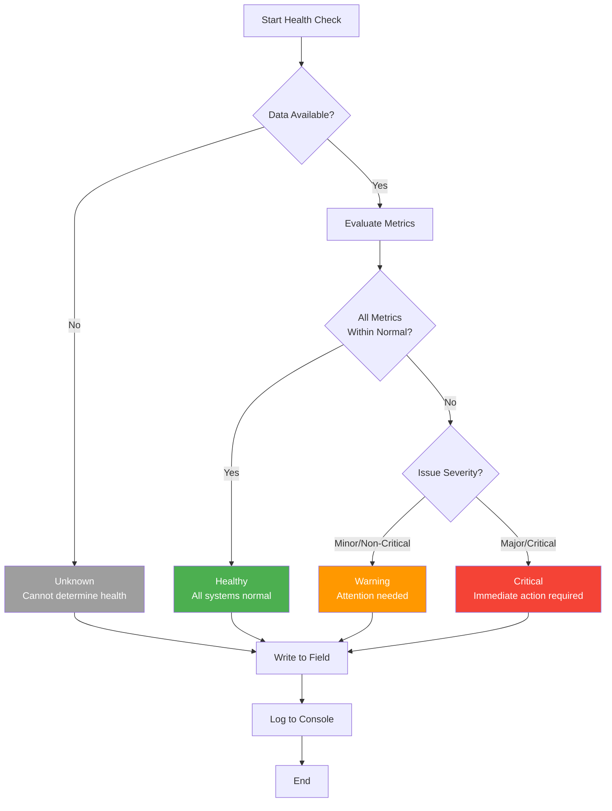
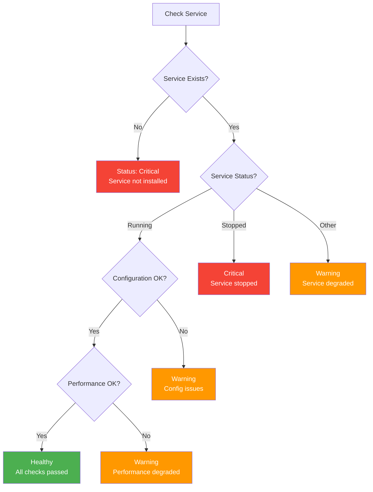
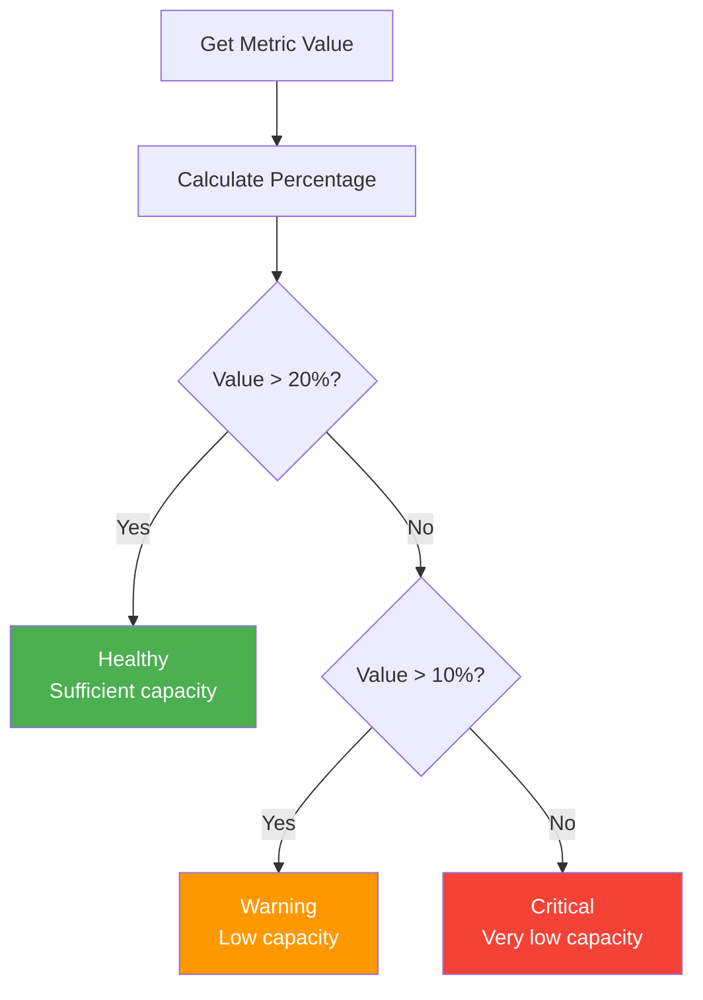
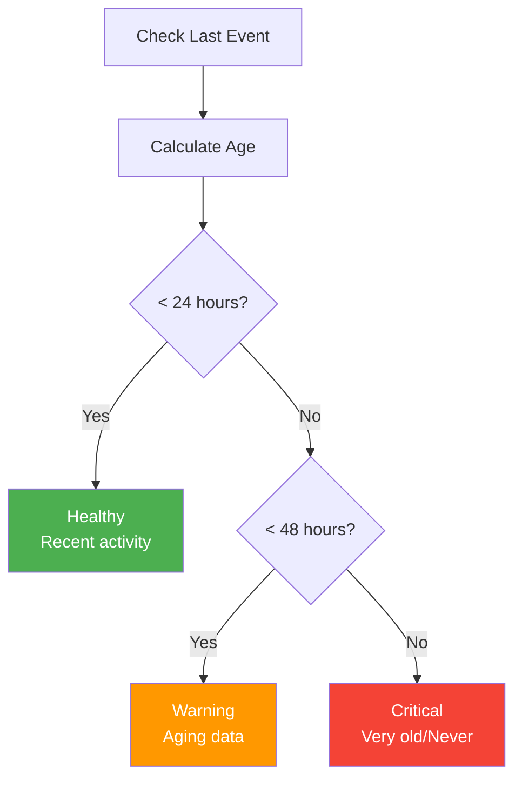
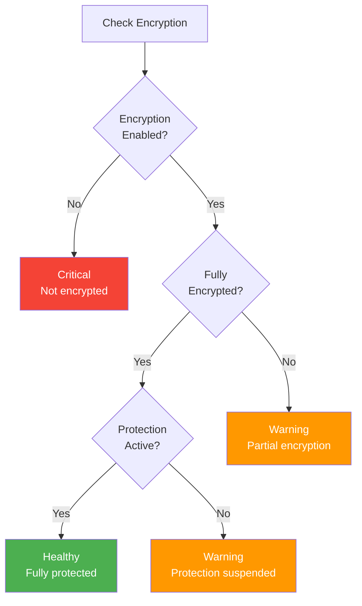
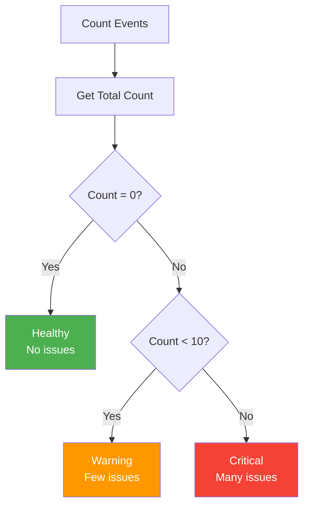

# Diagram 7: Health Status Classification

**Purpose:** How scripts determine health status values  
**Created:** February 8, 2026  
**Type:** Decision Tree/Flowchart

---

## Standard 4-State Health Classification



---

## Health Status Patterns

### Pattern 1: Service-Based Health

**Used By:** DHCP, DNS, IIS, MySQL, MSSQL monitors



**Example: DNS Server**
```powershell
# Check if DNS service exists
$dnsService = Get-Service -Name "DNS" -ErrorAction SilentlyContinue

if (-not $dnsService) {
    $status = "Critical"
    $reason = "DNS service not installed"
} elseif ($dnsService.Status -ne "Running") {
    $status = "Critical"
    $reason = "DNS service not running"
} else {
    # Check zone status, queries, etc.
    if ($zonesLoaded -and $queriesResponding) {
        $status = "Healthy"
    } else {
        $status = "Warning"
    }
}

Ninja-Property-Set dnsServerStatus $status
```

---

### Pattern 2: Threshold-Based Health

**Used By:** Disk space, memory, CPU, capacity monitors



**Thresholds by Metric:**

| Metric | Healthy | Warning | Critical |
|--------|---------|---------|----------|
| Disk Free Space | >20% | 10-20% | <10% |
| Memory Available | >20% | 10-20% | <10% |
| CPU Average | <70% | 70-90% | >90% |
| Battery Health | >80% | 50-80% | <50% |
| Backup Age | <24h | 24-48h | >48h |

**Example: Disk Space**
```powershell
$freePercent = ($disk.FreeSpace / $disk.Size) * 100

if ($freePercent -gt 20) {
    $status = "Healthy"
} elseif ($freePercent -gt 10) {
    $status = "Warning"
    $reason = "Disk space below 20%"
} else {
    $status = "Critical"
    $reason = "Disk space critically low (<10%)"
}

Ninja-Property-Set diskHealthStatus $status
```

---

### Pattern 3: Time-Based Health

**Used By:** Backup monitors, patch age, last login, update checks



**Time Thresholds by Type:**

| Check Type | Healthy | Warning | Critical |
|------------|---------|---------|----------|
| Backup | <24h | 24-48h | >48h |
| Patch Age | <30d | 30-60d | >60d |
| Antivirus Update | <24h | 24-48h | >48h |
| GPO Application | <8h | 8-24h | >24h |
| Last Reboot | <30d | 30-60d | >60d |

**Example: Veeam Backup**
```powershell
$lastBackup = Get-VBRBackupSession | 
    Sort-Object EndTime -Descending | 
    Select-Object -First 1

$ageHours = (Get-Date) - $lastBackup.EndTime).TotalHours

if ($ageHours -lt 24) {
    $status = "Healthy"
} elseif ($ageHours -lt 48) {
    $status = "Warning"
    $reason = "Backup older than 24 hours"
} else {
    $status = "Critical"
    $reason = "Backup older than 48 hours"
}

Ninja-Property-Set veeamHealthStatus $status
```

---

### Pattern 4: Encryption/Security-Based Health

**Used By:** BitLocker, security posture, compliance monitors



**Example: BitLocker**
```powershell
$bitlocker = Get-BitLockerVolume -MountPoint "C:"

if ($bitlocker.ProtectionStatus -eq "Off") {
    $status = "Critical"
    $reason = "BitLocker not enabled"
} elseif ($bitlocker.VolumeStatus -ne "FullyEncrypted") {
    $status = "Warning"
    $reason = "Encryption in progress"
} elseif ($bitlocker.ProtectionStatus -eq "On") {
    $status = "Healthy"
} else {
    $status = "Warning"
    $reason = "Protection suspended"
}

Ninja-Property-Set bitlockerHealthStatus $status
```

---

### Pattern 5: Count-Based Health

**Used By:** Event log errors, failed services, license usage



**Thresholds by Type:**

| Event Type | Healthy | Warning | Critical |
|------------|---------|---------|----------|
| Critical Errors (24h) | 0 | 1-10 | >10 |
| Failed Services | 0 | 1-2 | >2 |
| Security Warnings | 0 | 1-5 | >5 |
| License Violations | 0 | 1-3 | >3 |

**Example: Event Log Monitor**
```powershell
$criticalErrors = Get-WinEvent -FilterHashtable @{
    LogName = 'System'
    Level = 1  # Critical
    StartTime = (Get-Date).AddHours(-24)
} -ErrorAction SilentlyContinue

$count = ($criticalErrors | Measure-Object).Count

if ($count -eq 0) {
    $status = "Healthy"
} elseif ($count -lt 10) {
    $status = "Warning"
    $reason = "$count critical errors in last 24h"
} else {
    $status = "Critical"
    $reason = "$count critical errors in last 24h"
}

Ninja-Property-Set evtHealthStatus $status
```

---

## Special Cases

### Unknown Status

**When to Use:**
- Data cannot be collected
- Service/feature not applicable
- Insufficient information
- Error during checks

**Example:**
```powershell
try {
    # Attempt to collect data
    $data = Get-SomeData
} catch {
    Write-Host "ERROR: Cannot collect data: $_"
    Ninja-Property-Set healthStatus "Unknown"
    exit 1
}

if ($data -eq $null) {
    Ninja-Property-Set healthStatus "Unknown"
    exit 0
}
```

### N/A Status

**When to Use:**
- Feature not installed
- Role not present
- Not applicable to device type

**Example:**
```powershell
if (-not (Get-WindowsFeature -Name DHCP).Installed) {
    Write-Host "INFO: DHCP role not installed"
    Ninja-Property-Set dhcpServerStatus "N/A"
    exit 0
}
```

### Multi-Factor Health

**Combining Multiple Checks:**

```powershell
# Start with Healthy assumption
$overallHealth = "Healthy"
$issues = @()

# Check factor 1: Service status
if ($service.Status -ne "Running") {
    $overallHealth = "Critical"
    $issues += "Service stopped"
}

# Check factor 2: Performance
if ($avgResponseTime -gt 1000) {
    if ($overallHealth -eq "Healthy") {
        $overallHealth = "Warning"
    }
    $issues += "Slow response time"
}

# Check factor 3: Errors
if ($errorCount -gt 10) {
    $overallHealth = "Critical"  # Upgrade to Critical
    $issues += "High error count"
}

Ninja-Property-Set healthStatus $overallHealth
Ninja-Property-Set healthIssues ($issues -join "; ")
```

---

## Consistency Guidelines

### Standard Values
**Always use these exact strings:**
- `Healthy` (not "Good", "OK", "Normal")
- `Warning` (not "Caution", "Alert", "Warn")
- `Critical` (not "Error", "Failed", "Bad")
- `Unknown` (not "N/A", "Error", "Unavailable")

### Reason Messages
**Provide context:**
```powershell
# Good:
Ninja-Property-Set healthStatus "Warning"
Ninja-Property-Set healthReason "Disk space at 15% (threshold: 20%)"

# Bad:
Ninja-Property-Set healthStatus "Warning"
Ninja-Property-Set healthReason "Low disk"
```

### Logging
**Always log health determination:**
```powershell
Write-Host "INFO: Health check complete"
Write-Host "INFO: Status: $status"
if ($reason) {
    Write-Host "INFO: Reason: $reason"
}
```

---

## Related Documentation

**Coding Standards:**
- [WAF Coding Standards](../WAF_CODING_STANDARDS.md) - Health status patterns

**Related Diagrams:**
- [Diagram 1: Framework Architecture](01_Framework_Architecture.md) - Where health status fits
- [Diagram 3: Data Flow](03_Data_Flow.md) - Health status in data flow
- [Diagram 6: Script Dependencies](06_Script_Dependencies.md) - Scripts using health status
