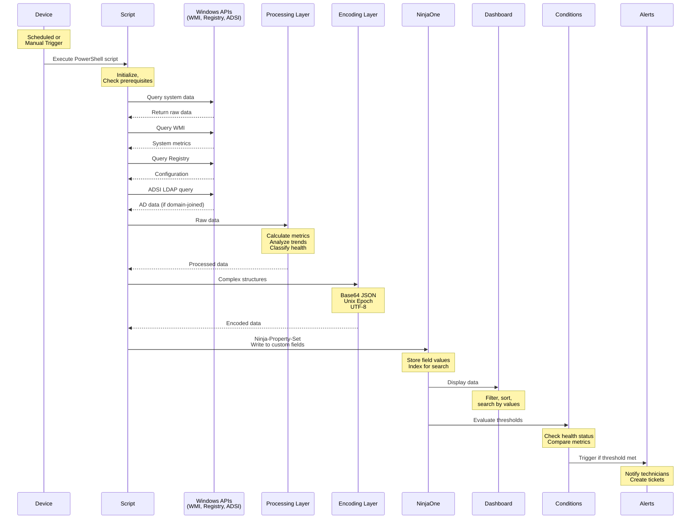
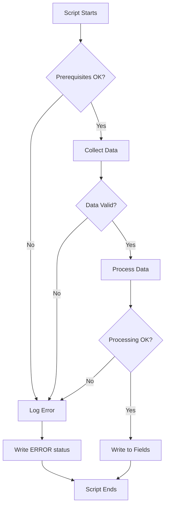

# Diagram 3: Data Flow - Script to Dashboard

**Purpose:** Detailed execution flow from script to dashboard  
**Created:** February 8, 2026  
**Type:** Sequence Diagram

---

## Complete Data Flow



---

## Detailed Step Breakdown

### Step 1: Script Execution Trigger
**Trigger Methods:**
- Scheduled: NinjaOne automation policy (daily/weekly)
- Manual: Technician runs from dashboard
- Condition-based: Alert condition triggers script

**Execution Context:**
- Runs as SYSTEM account
- Full administrator privileges
- Local or domain-joined context

### Step 2: Data Collection
**Sources:**

**WMI (Windows Management Instrumentation):**
- Hardware information
- System metrics (CPU, memory, disk)
- Service status
- Event logs
- Performance counters

**Registry:**
- Configuration settings
- Installed software
- System settings
- Last boot time

**ADSI LDAP://**
- Active Directory queries
- Computer object attributes
- Group memberships
- Password age
- Last login information

**File System:**
- File/folder sizes
- Share configurations
- Log file analysis
- Profile sizes

### Step 3: Data Processing
**Operations:**

**Calculations:**
- Disk space percentages
- Average metrics
- Trend analysis
- Score calculations

**Transformations:**
- Convert dates to Unix Epoch
- Format HTML for WYSIWYG fields
- Structure JSON for complex data
- Normalize text values

**Classification:**
- Determine health status (Unknown/Healthy/Warning/Critical)
- Categorize findings
- Prioritize issues
- Calculate risk scores

### Step 4: Data Encoding
**Encoding Methods:**

**Base64 JSON (Complex Data):**
```powershell
$data = @{
    groups = @("Group1", "Group2", "Group3")
    metrics = @{
        cpu = 45
        memory = 78
    }
}
$json = $data | ConvertTo-Json -Compress
$bytes = [System.Text.Encoding]::UTF8.GetBytes($json)
$base64 = [Convert]::ToBase64String($bytes)
Ninja-Property-Set complexField $base64
```

**Unix Epoch (DateTime):**
```powershell
$timestamp = [DateTimeOffset]$dateTime | 
    Select-Object -ExpandProperty ToUnixTimeSeconds
Ninja-Property-Set lastUpdated $timestamp
```

**Direct Text (Simple Data):**
```powershell
Ninja-Property-Set healthStatus "Healthy"
Ninja-Property-Set deviceType "Server"
```

### Step 5: Field Writing
**Ninja-Property-Set Command:**
```powershell
Ninja-Property-Set fieldName $value
```

**Field Types:**
- **Text:** Status values, simple strings
- **WYSIWYG:** HTML-formatted reports
- **DateTime:** Unix Epoch numeric timestamps

**Character Limits:**
- Text fields: 9,999 characters (validated)
- WYSIWYG fields: 200,000 characters

### Step 6: NinjaOne Storage
**Storage Operations:**
- Write field value to device record
- Index text fields for search
- Store datetime as numeric
- Preserve WYSIWYG formatting

**Data Persistence:**
- Values stored until next script run
- Historical data in activity log
- Searchable and filterable

### Step 7: Dashboard Display
**Display Features:**
- Filter by field values
- Sort by any field
- Search across text fields
- Custom views
- Column customization

**User Actions:**
- View device details
- Run scripts manually
- Export data
- Create conditions

### Step 8: Condition Evaluation
**Condition Types:**

**Threshold Conditions:**
```
IF healthStatus = "Critical"
THEN trigger alert
```

**Numeric Comparisons:**
```
IF diskSpacePercent < 10
THEN trigger alert
```

**DateTime Comparisons:**
```
IF lastBackup > 48 hours ago
THEN trigger alert
```

**Complex Logic:**
```
IF healthStatus = "Warning" AND
   deviceType = "Server" AND
   environment = "Production"
THEN trigger alert
```

### Step 9: Alert Generation
**Alert Actions:**
- Send email notification
- Create ticket
- Run automation script
- Webhook to external system
- Update device status

**Alert Content:**
- Device name
- Field values that triggered
- Timestamp
- Condition description
- Remediation guidance

---

## Data Encoding Standards

### Base64 JSON Pattern
**Use For:**
- Arrays of objects
- Nested structures
- Complex data relationships
- UTF-8 special characters

**Example:**
```powershell
function ConvertTo-Base64 {
    param([Parameter(Mandatory)]$InputObject)
    $json = $InputObject | ConvertTo-Json -Compress
    $bytes = [System.Text.Encoding]::UTF8.GetBytes($json)
    $base64 = [Convert]::ToBase64String($bytes)
    if ($base64.Length -gt 9999) {
        Write-Host "WARNING: Encoded length exceeds 9999 chars"
    }
    return $base64
}
```

### Unix Epoch Pattern
**Use For:**
- All date/time fields
- Timestamps
- Age calculations
- Sorting by date

**Example:**
```powershell
$timestamp = [DateTimeOffset]::Now.ToUnixTimeSeconds()
Ninja-Property-Set lastChecked $timestamp
```

**Benefits:**
- Language-neutral
- Sortable numeric value
- Easy age calculations
- No timezone confusion

---

## Performance Considerations

**Script Execution Time:**
- Simple scripts: 5-30 seconds
- Complex scripts: 30-120 seconds
- Depends on data volume and system speed

**Data Collection:**
- WMI queries: Fast (milliseconds)
- ADSI LDAP: Fast (under 1 second)
- File system scans: Slower (depends on size)
- Performance counters: Fast

**Field Writing:**
- Single field write: <100ms
- Multiple fields: Sequential, additive
- NinjaOne API handles storage

**Dashboard Update:**
- Near real-time (1-2 minutes)
- Depends on NinjaOne sync
- Conditions evaluate immediately

---

## Error Handling Flow



**Error Handling:**
- Try/Catch blocks around all operations
- Log errors to console (visible in NinjaOne)
- Write "ERROR" or "Unknown" status on failure
- Graceful degradation (partial data OK)
- Exit codes for automation systems

---

## Related Documentation

**Technical Standards:**
- [WAF Coding Standards](../WAF_CODING_STANDARDS.md) - Error handling patterns
- [Pre-Phase C Summary](../PRE_PHASE_C_COMPLETION_SUMMARY.md) - Base64 encoding
- [Pre-Phase E Summary](../PRE_PHASE_E_COMPLETION_SUMMARY.md) - Unix Epoch

**Related Diagrams:**
- [Diagram 1: Framework Architecture](01_Framework_Architecture.md) - Overall structure
- [Diagram 7: Health Status Classification](07_Health_Status_Classification.md) - Status logic
