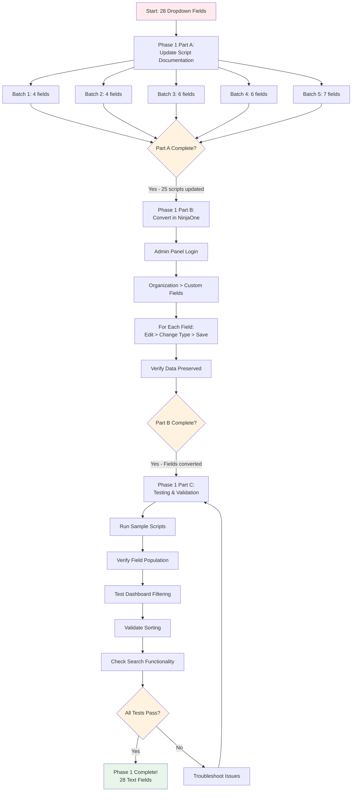
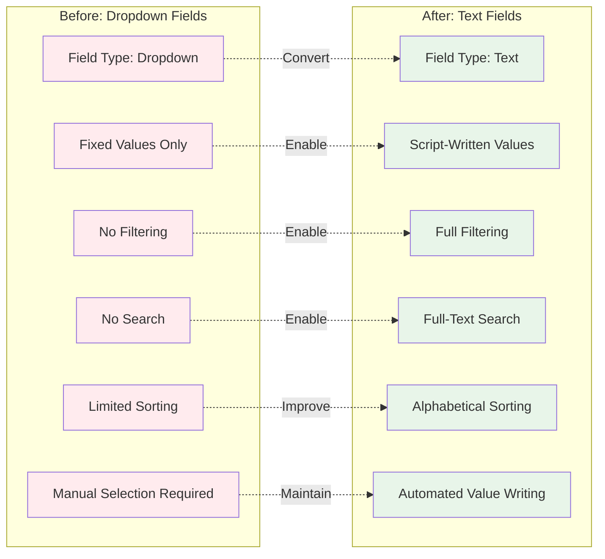

# Diagram 4: Field Type Conversion Journey

**Purpose:** Visual timeline of Phase 1 dropdown-to-text conversion  
**Created:** February 8, 2026  
**Type:** Process/Timeline Diagram

---

## Phase 1 Conversion Timeline

```mermaid
gantt
    title Phase 1: Dropdown to Text Field Conversion
    dateFormat YYYY-MM-DD
    section Planning
    Phase 1 Planning           :done, planning, 2026-02-03, 1d
    Create execution guides    :done, guides, 2026-02-03, 1d
    Field mapping documents    :done, mapping, 2026-02-03, 1d
    
    section Part A: Script Docs
    Batch 1: Core Infrastructure :done, batch1, 2026-02-03, 1h
    Batch 2: Advanced Monitoring :done, batch2, 2026-02-03, 1h
    Batch 3: Remaining Scripts   :done, batch3, 2026-02-03, 1h
    Batch 4: Server Roles        :done, batch4, 2026-02-03, 1h
    Batch 5: Validation Scripts  :done, batch5, 2026-02-03, 1h
    
    section Part B: NinjaOne
    Convert fields in admin panel :pending, ninja, 2026-02-09, 1h
    Verify data preservation      :pending, verify, 2026-02-09, 30m
    
    section Part C: Testing
    Run test scripts              :pending, test, 2026-02-09, 30m
    Validate dashboard filtering  :pending, validate, 2026-02-09, 30m
    Confirm sorting works         :pending, sort, 2026-02-09, 15m
```

---

## Conversion Process Flow



---

## Before vs After Comparison



---

## Conversion Statistics

### Fields Converted by Category

| Category | Count | Examples |
|----------|-------|----------|
| Health Status | 14 | bitlockerHealthStatus, dnsServerStatus |
| Status/Type | 7 | netConnectionType, batChargeStatus |
| Validation | 1 | patchValidationStatus |
| Role/Device Type | 2 | srvRole, baseDeviceType |
| Drift/Priority | 2 | driftLocalAdminDriftMagnitude |
| Replication | 2 | mysqlReplicationStatus |
| **Total** | **28** | All successfully documented |

### Scripts Updated

| Script Category | Scripts Updated | Fields Affected |
|----------------|-----------------|------------------|
| Monitoring Scripts | 12 | 15 fields |
| Main Scripts | 13 | 13 fields |
| **Total** | **25** | **28 fields** |

### Time Investment

| Phase | Estimated | Actual | Status |
|-------|-----------|--------|--------|
| Part A: Documentation | 1-2 hours | 35 minutes | Complete |
| Part B: NinjaOne Conversion | 30-45 min | TBD | Pending |
| Part C: Testing | 30-45 min | TBD | Pending |
| **Total** | **2-3 hours** | **TBD** | **33% Complete** |

---

## Benefits Achieved

### Dashboard Improvements

**Filtering:**
```
Before: Cannot filter by dropdown values
After:  Filter devices where healthStatus = "Critical"
```

**Searching:**
```
Before: Dropdown not searchable
After:  Search for "Warning" across all devices
```

**Sorting:**
```
Before: Limited dropdown sorting
After:  Full alphabetical/numeric sorting
```

### User Experience

**Technician Benefits:**
- Quick filtering by status
- Search for specific values
- Create custom views easily
- Better dashboard organization

**Administrator Benefits:**
- Consistent with framework standards
- Easier condition creation
- Improved reporting capabilities
- Better data visibility

---

## Technical Implementation

### No Code Changes Required

**Scripts Continue Working:**
```powershell
# This code works identically for dropdown AND text fields
Ninja-Property-Set healthStatus "Healthy"
```

**Field Type is Transparent:**
- `Ninja-Property-Set` command unchanged
- Scripts don't know/care about field type
- Values written the same way
- Only NinjaOne configuration changed

### Documentation Updates Only

**Script Headers Changed:**
```powershell
# Before:
# healthStatus (Dropdown) - Health status of service

# After:
# healthStatus (Text) - Health status of service
```

**Tracking Documents:**
- Field conversion tracking updated
- Batch execution guides marked complete
- Git commits documented changes

---

## Validation Checklist

### Part B: NinjaOne Conversion
- [ ] All 28 fields converted from Dropdown to Text
- [ ] Field type shows "Text" in admin panel
- [ ] Existing field values preserved
- [ ] No data loss occurred
- [ ] Screenshots captured

### Part C: Testing & Validation
- [ ] Scripts execute successfully
- [ ] Fields populate with correct values
- [ ] Dashboard filtering works
- [ ] Search functionality operational
- [ ] Sorting works correctly
- [ ] Custom views display fields
- [ ] Conditions evaluate properly
- [ ] No errors in script output

---

## Risk Mitigation

### Low Risk Conversion

**Why Low Risk:**
- No code changes required
- NinjaOne preserves existing data
- Scripts continue working unchanged
- Easy to verify immediately
- Reversible if needed

**Safeguards:**
- Test in non-production first (if available)
- Verify data preservation per field
- Screenshot before/after states
- Document any issues immediately

---

## Related Documentation

**Phase 1 Documents:**
- [Dropdown to Text Conversion Tracking](../PHASE1_Dropdown_to_Text_Conversion_Tracking.md) - Complete tracking
- [Batch 1 Execution Guide](../PHASE1_BATCH1_EXECUTION_GUIDE.md) - Detailed procedure
- [Field Mapping](../PHASE1_BATCH1_FIELD_MAPPING.md) - Field details

**Related Diagrams:**
- [Diagram 1: Framework Architecture](01_Framework_Architecture.md) - Where fields fit
- [Diagram 3: Data Flow](03_Data_Flow.md) - How fields are populated
