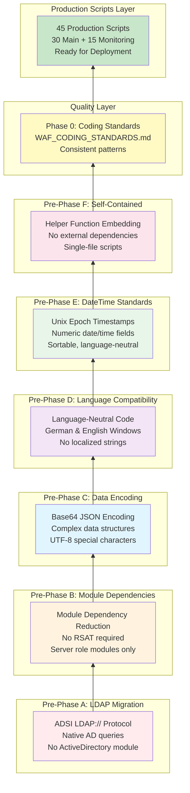

# Diagram 5: Pre-Phase Technical Foundation

**Purpose:** How pre-phases built the technical foundation  
**Created:** February 8, 2026  
**Type:** Layer/Architecture Diagram

---

## Technical Foundation Layers



---

## Layer Details

### Foundation: Pre-Phase A - ADSI LDAP://

**Completed:** February 3, 2026 (prior)  
**Time Spent:** Part of earlier work

**Problem Solved:**
- ActiveDirectory PowerShell module requires RSAT
- RSAT not installed on all systems
- Module loading adds execution time
- Complex deployment requirements

**Solution Implemented:**
- Use ADSI with LDAP:// protocol
- Native Windows capability
- No external dependencies
- Works on any domain-joined system

**Technical Pattern:**
```powershell
# Before (required RSAT):
Import-Module ActiveDirectory
$computer = Get-ADComputer -Identity $env:COMPUTERNAME

# After (no RSAT needed):
$searcher = [ADSISearcher]"(name=$env:COMPUTERNAME)"
$searcher.SearchRoot = [ADSI]"LDAP://DC=domain,DC=com"
$computer = $searcher.FindOne()
```

**Scripts Affected:** Script_42_Active_Directory_Monitor.ps1

---

### Layer 2: Pre-Phase B - Module Dependencies

**Completed:** February 3, 2026, 2:10 AM  
**Time Spent:** 1 hour

**Problem Solved:**
- Identify all module dependencies
- Determine which are acceptable
- Document retention strategy
- Ensure no RSAT-only modules

**Solution Implemented:**
- Audited all 48+ scripts
- Found 9 scripts using modules
- Verified all are server role modules (native when role installed)
- No RSAT-only dependencies found
- Documented acceptable module patterns

**Acceptable Modules:**
- DhcpServer (DHCP Server role)
- DnsServer (DNS Server role)
- PrintManagement (Print Server role)
- Storage (native Windows)
- BitLocker (native Windows)
- Veeam.Backup.PowerShell (third-party app)

**Pattern:**
```powershell
# Always check for feature/role first
if (Get-WindowsFeature -Name DHCP -ErrorAction SilentlyContinue | 
    Where-Object {$_.Installed}) {
    Import-Module DhcpServer
    # Use module cmdlets
}
```

---

### Layer 3: Pre-Phase C - Base64 Encoding

**Completed:** February 3, 2026, morning  
**Time Spent:** 2 hours

**Problem Solved:**
- Complex data structures hard to store in text fields
- Delimiter conflicts in arrays
- Special characters (umlauts) causing issues
- Nested data not representable

**Solution Implemented:**
- Base64-encode JSON for complex structures
- UTF-8 encoding handles all characters
- Validated against 9999 char limit
- Embedded helper functions in scripts

**Technical Pattern:**
```powershell
function ConvertTo-Base64 {
    param([Parameter(Mandatory)]$InputObject)
    $json = $InputObject | ConvertTo-Json -Compress
    $bytes = [System.Text.Encoding]::UTF8.GetBytes($json)
    $base64 = [Convert]::ToBase64String($bytes)
    if ($base64.Length -gt 9999) {
        Write-Host "WARNING: Encoded data exceeds 9999 characters"
    }
    return $base64
}

function ConvertFrom-Base64 {
    param([Parameter(Mandatory)][string]$Base64String)
    $bytes = [Convert]::FromBase64String($Base64String)
    $json = [System.Text.Encoding]::UTF8.GetString($bytes)
    return ($json | ConvertFrom-Json)
}

# Usage:
$data = @{ groups = @("Group1", "Group2"); count = 2 }
$encoded = ConvertTo-Base64 $data
Ninja-Property-Set adGroups $encoded
```

**Scripts Affected:**
- Script_42 (AD groups)
- Script_10 (GPO lists)
- Script_11 (replication data)

---

### Layer 4: Pre-Phase D - Language Compatibility

**Completed:** February 3, 2026, 9:54 PM  
**Time Spent:** 10 minutes (verification)

**Problem Solved:**
- Scripts must work on German Windows
- Scripts must work on English Windows
- Localized strings differ by language
- Service status strings language-dependent

**Solution Implemented:**
- Use numeric values instead of strings
- Use enumeration constants
- LDAP attributes are language-neutral
- Base64 UTF-8 handles all characters
- Unix Epoch timestamps are numeric

**Anti-Patterns (Avoided):**
```powershell
# BAD: Language-dependent
if ($service.Status -eq "Running") { }

# GOOD: Language-neutral
if ($service.Status -eq [System.ServiceProcess.ServiceControllerStatus]::Running) { }

# BAD: Localized date string
$date = Get-Date -Format "dd.MM.yyyy"

# GOOD: Unix Epoch numeric
$timestamp = [DateTimeOffset]::Now.ToUnixTimeSeconds()
```

**Key Finding:** Scripts were already language-neutral due to Pre-Phases A, C, E design

---

### Layer 5: Pre-Phase E - Unix Epoch DateTime

**Completed:** February 3, 2026, 9:50 PM  
**Time Spent:** 4.5 hours

**Problem Solved:**
- Date/time text fields not sortable
- Locale-specific formatting (MM/DD vs DD/MM)
- No age-based filtering in NinjaOne
- Timezone ambiguity

**Solution Implemented:**
- Convert all date/time text fields to Unix Epoch
- Store as numeric timestamps
- Use NinjaOne DateTime field type
- Inline conversion (no helper functions)

**Technical Pattern:**
```powershell
# Convert DateTime to Unix Epoch
$timestamp = [DateTimeOffset]$dateTime | 
    Select-Object -ExpandProperty ToUnixTimeSeconds
Ninja-Property-Set lastUpdated $timestamp

# Human-readable logging (for troubleshooting)
Write-Host "INFO: Last updated: $($dateTime.ToString('yyyy-MM-dd HH:mm:ss'))"
```

**Scripts Affected:**
- Script_42 (ADPasswordLastSet) - v3.1 → v3.2
- Script_43 (GPOLastApplied) - v1.0 → v1.1
- 12_Baseline_Manager (BASELastUpdated) - v4.0 → v4.1

**Benefits:**
- Proper sorting in dashboards
- Age-based conditions work
- Timezone handled automatically
- Language-neutral format

---

### Layer 6: Pre-Phase F - Self-Contained Scripts

**Completed:** February 3, 2026, 9:52 PM  
**Time Spent:** 15 minutes (verification)

**Problem Solved:**
- External dependencies complicate deployment
- Dot-sourcing requires file paths
- Missing files break scripts
- Hard to copy/paste into NinjaOne

**Solution Implemented:**
- All helper functions embedded in scripts
- No dot-sourcing (`. ./file.ps1`)
- No external script references
- 100% self-contained single files

**Verification:**
```powershell
# Searched for external dependencies:
# '. ./' - dot-sourcing
# 'Import-Module' with custom modules
# 'Invoke-Expression' with external sources

# Result: Zero external dependencies found
```

**Key Finding:** All scripts already self-contained, no remediation needed

---

### Layer 7: Phase 0 - Coding Standards

**Completed:** February 3, 2026, 10:05 PM  
**Time Spent:** 6 minutes

**Document Created:** WAF_CODING_STANDARDS.md (25KB)

**Standards Established:**
- Error handling patterns (try/catch)
- Logging conventions (INFO/WARNING/ERROR)
- Field naming conventions
- Function documentation
- Script header format
- Code organization
- Variable naming
- Comment style

**Key Standards:**
```powershell
# Structured logging
Write-Host "INFO: Starting operation..."
Write-Host "WARNING: Potential issue detected"
Write-Host "ERROR: Operation failed: $error"

# Error handling
try {
    # Operation
} catch {
    Write-Host "ERROR: $($_.Exception.Message)"
    exit 1
}

# Field writing pattern
Ninja-Property-Set fieldName $value
Write-Host "INFO: Set fieldName to: $value"
```

---

### Top Layer: Production Scripts

**Status:** Built on complete foundation  
**Count:** 45 scripts (30 main + 15 monitoring)  
**Quality:** Production-ready

**Characteristics:**
- LDAP:// for AD queries (no RSAT)
- Base64 JSON for complex data
- Unix Epoch for timestamps
- Language-neutral code
- Self-contained (no external deps)
- Following WAF coding standards

**Deployment Ready:**
- Copy/paste into NinjaOne
- No prerequisites except Windows
- Works on German/English Windows
- Domain or workgroup systems
- Consistent error handling
- Structured logging

---

## Foundation Benefits

### Deployment
- No RSAT installation required
- No external files needed
- No module dependencies (except server roles)
- Copy/paste deployment

### Reliability
- Language-independent execution
- Proper error handling
- Graceful degradation
- Consistent patterns

### Maintainability
- Self-contained scripts
- Clear coding standards
- Embedded documentation
- Version controlled

### Data Quality
- Complex data stored reliably (Base64)
- Timestamps sortable (Unix Epoch)
- Special characters handled (UTF-8)
- Language-neutral values

---

## Time Investment Summary

| Pre-Phase | Time Spent | Value Delivered |
|-----------|------------|------------------|
| A: LDAP | (Earlier work) | No RSAT dependency |
| B: Modules | 1 hour | Dependency audit |
| C: Base64 | 2 hours | Complex data storage |
| D: Language | 10 min | German/English support |
| E: Unix Epoch | 4.5 hours | Sortable timestamps |
| F: Embedding | 15 min | Self-contained scripts |
| Phase 0 | 6 min | Coding standards |
| **Total** | **~8 hours** | **Solid foundation** |

---

## Related Documentation

**Pre-Phase Summaries:**
- [All Pre-Phases Complete](../ALL_PRE_PHASES_COMPLETE.md) - Comprehensive summary
- Individual pre-phase completion documents

**Standards:**
- [WAF Coding Standards](../WAF_CODING_STANDARDS.md) - Phase 0 output

**Related Diagrams:**
- [Diagram 1: Framework Architecture](01_Framework_Architecture.md) - Overall structure
- [Diagram 3: Data Flow](03_Data_Flow.md) - How foundation is used
