# DHCPServerMonitor.ps1 - Deep Dive Documentation

## Executive Summary

**Purpose:** Comprehensive Windows DHCP Server monitoring solution preventing IP address exhaustion and network outages.

**Critical Value:** Prevents network-wide service disruptions by detecting DHCP scope depletion before clients fail to obtain IP addresses. Essential for maintaining network availability in enterprise environments where DHCP failures cascade into complete network outages.

**Business Impact:**
- **Prevents network outages** through proactive capacity monitoring
- **Reduces MTTR** from hours to minutes with immediate scope visibility
- **Enables capacity planning** with lease trend analysis
- **Ensures compliance** through AD authorization verification
- **Supports high availability** via failover configuration monitoring

**Script Location:** `plaintext_scripts/DHCPServerMonitor.ps1`

---

## Quick Reference

### Execution Schedule
- **Frequency:** Every 4 hours
- **Runtime:** ~35 seconds (typical)
- **Timeout:** 90 seconds
- **Context:** SYSTEM

### Health Status Matrix

| Status | Utilization | Service | Action Required |
|--------|-------------|---------|------------------|
| **Healthy** | 0-84% | Running | None - monitor trends |
| **Warning** | 85-94% | Running | Plan capacity expansion |
| **Critical** | ≥95% or Stopped | Any | Immediate intervention |
| **Unknown** | N/A | Not Installed | Verify deployment |

### Critical Thresholds
```plaintext
Scope Utilization Color Coding:
├─ Green:  0-74%   (Healthy operation)
├─ Orange: 75-89%  (Approaching capacity)
└─ Red:    90-100% (Critical - imminent exhaustion)

Overall Health Assessment:
├─ Healthy:  <85% utilization + service running
├─ Warning:  85-94% utilization
└─ Critical: ≥95% utilization OR service stopped
```

---

## System Architecture

### Monitoring Flow Diagram

```mermaid
graph TD
    A[Start Monitor] --> B{DHCP Role<br/>Installed?}
    B -->|No| C[Set Unknown<br/>Exit 0]
    B -->|Yes| D[Check Service Status]
    D --> E[Load DhcpServer Module]
    E --> F[Verify AD Authorization]
    F --> G[Enumerate Scopes]
    G --> H[Calculate Per-Scope Stats]
    H --> I[Aggregate Utilization]
    I --> J[Check Failover Config]
    J --> K{Determine<br/>Health Status}
    K -->|Utilization ≥95%| L[Critical]
    K -->|Utilization 85-94%| M[Warning]
    K -->|Utilization <85%| N[Healthy]
    K -->|Service Stopped| L
    L --> O[Generate HTML Report]
    M --> O
    N --> O
    O --> P[Update NinjaRMM Fields]
    P --> Q[Exit 0]

    style L fill:#ff6b6b
    style M fill:#ffa500
    style N fill:#90EE90
    style C fill:#808080
```



### Data Collection Components

```plaintext
┌─────────────────────────────────────────────────┐
│          DHCP Server Monitoring                 │
├─────────────────────────────────────────────────┤
│                                                 │
│  ┌──────────────────────────────────────────┐  │
│  │  Installation Detection Layer            │  │
│  ├──────────────────────────────────────────┤  │
│  │ • Windows Feature Check                  │  │
│  │ • Service Status Verification            │  │
│  │ • Module Availability                    │  │
│  └──────────────────────────────────────────┘  │
│                   ↓                             │
│  ┌──────────────────────────────────────────┐  │
│  │  Authorization & Security Layer          │  │
│  ├──────────────────────────────────────────┤  │
│  │ • AD Authorization Query                 │  │
│  │ • Server Registration Verification       │  │
│  │ • Last Auth Timestamp Tracking           │  │
│  └──────────────────────────────────────────┘  │
│                   ↓                             │
│  ┌──────────────────────────────────────────┐  │
│  │  Scope Analysis Engine                   │  │
│  ├──────────────────────────────────────────┤  │
│  │ • Scope Enumeration (IPv4)               │  │
│  │ • Statistics Retrieval                   │  │
│  │ • Per-Scope Utilization Calc             │  │
│  │ • Lease Counting                         │  │
│  │ • Range & State Tracking                 │  │
│  └──────────────────────────────────────────┘  │
│                   ↓                             │
│  ┌──────────────────────────────────────────┐  │
│  │  Aggregation & Reporting Layer           │  │
│  ├──────────────────────────────────────────┤  │
│  │ • Overall Utilization %                  │  │
│  │ • Total Active Leases                    │  │
│  │ • HTML Table Generation                  │  │
│  │ • Color-Coded Visualization              │  │
│  └──────────────────────────────────────────┘  │
│                   ↓                             │
│  ┌──────────────────────────────────────────┐  │
│  │  High Availability Layer                 │  │
│  ├──────────────────────────────────────────┤  │
│  │ • Failover Partnership Detection         │  │
│  │ • Partner Count Tracking                 │  │
│  │ • Redundancy Configuration Status        │  │
│  └──────────────────────────────────────────┘  │
│                   ↓                             │
│  ┌──────────────────────────────────────────┐  │
│  │  Health Classification Engine            │  │
│  ├──────────────────────────────────────────┤  │
│  │ • Service State Evaluation               │  │
│  │ • Utilization Threshold Checks           │  │
│  │ • Status Determination Logic             │  │
│  │ • Alert Level Assignment                 │  │
│  └──────────────────────────────────────────┘  │
│                   ↓                             │
│  ┌──────────────────────────────────────────┐  │
│  │  NinjaRMM Integration Layer              │  │
│  ├──────────────────────────────────────────┤  │
│  │ • 9 Custom Field Updates                 │  │
│  │ • HTML WYSIWYG Rendering                 │  │
│  │ • Dashboard Data Sync                    │  │
│  └──────────────────────────────────────────┘  │
└─────────────────────────────────────────────────┘
```

---

## NinjaRMM Custom Fields

### Field Definitions

| Field Name | Type | Purpose | Example Value |
|------------|------|---------|---------------|
| **dhcpInstalled** | Checkbox | DHCP role presence indicator | `true` |
| **dhcpScopeCount** | Integer | Total IPv4 scopes configured | `12` |
| **dhcpActiveLeasesTotal** | Integer | Active leases across all scopes | `847` |
| **dhcpScopeUtilizationPercent** | Integer | Aggregate utilization percentage | `73` |
| **dhcpFailoverStatus** | Text | Failover partnership status | `Configured (2 partner(s))` |
| **dhcpServerStatus** | Text | Overall health assessment | `Healthy` |
| **dhcpLastAuthTime** | DateTime | Last AD authorization check | `2026-02-11 14:32:15` |
| **dhcpConflictCount** | Integer | IP address conflicts detected | `0` |
| **dhcpScopeSummary** | WYSIWYG | HTML formatted scope table | *(see below)* |

### HTML Dashboard Output Example

**dhcpScopeSummary Field** renders as:

```html
<table border='1' style='border-collapse:collapse; width:100%; font-family:Arial,sans-serif;'>
<tr style='background-color:#f0f0f0;'>
  <th>Scope Name</th>
  <th>Range</th>
  <th>State</th>
  <th>Utilization</th>
  <th>Leases</th>
</tr>
<tr>
  <td>Main Office LAN</td>
  <td>192.168.1.100 - 192.168.1.254</td>
  <td>Active</td>
  <td style='color:orange'>82%</td>
  <td>127 / 155</td>
</tr>
<tr>
  <td>Guest WiFi</td>
  <td>10.50.100.10 - 10.50.100.250</td>
  <td>Active</td>
  <td style='color:green'>34%</td>
  <td>82 / 241</td>
</tr>
<tr>
  <td>IoT Devices</td>
  <td>10.60.1.20 - 10.60.1.100</td>
  <td>Active</td>
  <td style='color:red'>94%</td>
  <td>76 / 81</td>
</tr>
</table>
<p style='font-size:0.9em; margin-top:10px;'>
<strong>Summary:</strong> 12 scopes, 847 active leases, 73% overall utilization
</p>
```

**Visual Rendering:**

| Scope Name | Range | State | Utilization | Leases |
|------------|-------|-------|-------------|--------|
| Main Office LAN | 192.168.1.100 - 192.168.1.254 | Active | **82%** 🟠 | 127 / 155 |
| Guest WiFi | 10.50.100.10 - 10.50.100.250 | Active | **34%** 🟢 | 82 / 241 |
| IoT Devices | 10.60.1.20 - 10.60.1.100 | Active | **94%** 🔴 | 76 / 81 |

---

## Implementation Guide

### Prerequisites

```yaml
Required Components:
  - Windows Server 2016 or later
  - DHCP Server role installed
  - PowerShell 5.1 or later
  - NinjaRMM agent 5.7+
  - DhcpServer PowerShell module
  - Administrator privileges
  
Active Directory:
  - Domain-joined server (recommended)
  - DHCP server authorized in AD
  - Read permissions to AD configuration partition

Network Requirements:
  - No inbound connections
  - Local WMI/CIM access
  - DHCP service operational
```

### NinjaRMM Script Configuration

#### 1. Create Custom Fields

```plaintext
Organization → Custom Fields → Device Fields:

1. dhcpInstalled
   Type: Checkbox
   Permissions: Technician Read/Write
   
2. dhcpScopeCount
   Type: Integer
   Permissions: Technician Read/Write
   
3. dhcpActiveLeasesTotal
   Type: Integer
   Permissions: Technician Read/Write
   
4. dhcpScopeUtilizationPercent
   Type: Integer
   Permissions: Technician Read/Write
   
5. dhcpFailoverStatus
   Type: Text
   Permissions: Technician Read/Write
   
6. dhcpServerStatus
   Type: Dropdown
   Values: Healthy, Warning, Critical, Unknown
   Permissions: Technician Read/Write
   
7. dhcpLastAuthTime
   Type: DateTime
   Permissions: Technician Read/Write
   
8. dhcpConflictCount
   Type: Integer
   Permissions: Technician Read/Write
   
9. dhcpScopeSummary
   Type: WYSIWYG
   Permissions: Technician Read/Write
```

#### 2. Script Deployment

**Automation → Library → Scripts:**

```yaml
Script Name: "[WAF] DHCP Server Monitor"
Description: "Monitors DHCP scope utilization and service health"
Category: Monitoring
Enabled Platforms:
  - Windows Server
Script Type: PowerShell
Timeout: 90 seconds
Execution Context: SYSTEM
```

**Scheduled Execution:**
```yaml
Schedule Name: "DHCP Monitoring - Every 4 Hours"
Frequency: Every 4 hours
Start Time: 00:00
Conditions:
  - Device is online
  - No user logged in (preferred)
Target Devices:
  - Role: DHCP Server
  - Tag: "DHCP-Enabled"
```

#### 3. Alert Configuration

**Critical Alert - High Utilization:**
```yaml
Alert Name: "DHCP Scope Critical Utilization"
Condition: dhcpScopeUtilizationPercent >= 90
Severity: Critical
Notification:
  - Email to Network Team
  - SMS to On-Call Engineer
  - Create ticket in PSA
Action: Run "DHCP Expansion Playbook" automation
```

**Warning Alert - Service Stopped:**
```yaml
Alert Name: "DHCP Service Not Running"
Condition: dhcpServerStatus = "Critical" AND dhcpInstalled = true
Severity: Critical
Notification:
  - Immediate SMS/Voice call
  - PagerDuty incident
Action: Attempt service restart via automation
```

**Capacity Planning Alert:**
```yaml
Alert Name: "DHCP Approaching Capacity"
Condition: dhcpScopeUtilizationPercent >= 75 AND < 90
Severity: Warning
Notification:
  - Email to Network Planning
Action: Generate capacity report
Frequency: Once per day
```

### Manual Execution

```powershell
# Option 1: Direct execution on DHCP server
cd C:\Scripts\WAF
.\plaintext_scripts\DHCPServerMonitor.ps1

# Option 2: Remote execution
Invoke-Command -ComputerName DHCP-SERVER-01 -FilePath .\DHCPServerMonitor.ps1

# Option 3: Test without field updates
$env:NINJA_TESTING = "true"
.\DHCPServerMonitor.ps1
```

---

## Operational Scenarios

### Scenario 1: Scope Approaching Capacity

**Situation:** Main office scope reaches 85% utilization (131/155 addresses used)

**Detection:**
```plaintext
NinjaRMM Dashboard:
├─ dhcpServerStatus: "Warning"
├─ dhcpScopeUtilizationPercent: 85
├─ Alert: "DHCP Approaching Capacity" triggered
└─ dhcpScopeSummary shows orange highlight on affected scope
```

**Response Actions:**

1. **Immediate Assessment** (5 minutes):
   ```powershell
   # Review detailed lease information
   Get-DhcpServerv4Scope -ScopeId 192.168.1.0 | Get-DhcpServerv4Lease
   
   # Check for stuck leases
   Get-DhcpServerv4Lease -ScopeId 192.168.1.0 | Where-Object {
       $_.AddressState -eq 'Active' -and
       $_.ClientLastTransactionTime -lt (Get-Date).AddDays(-7)
   }
   ```

2. **Short-Term Mitigation** (15 minutes):
   ```powershell
   # Option A: Reduce lease duration (spreads recycling)
   Set-DhcpServerv4Scope -ScopeId 192.168.1.0 -LeaseDuration 4:00:00
   
   # Option B: Clean expired/inactive leases
   Get-DhcpServerv4Lease -ScopeId 192.168.1.0 -AllLeases |
       Where-Object { $_.AddressState -eq 'Inactive' } |
       Remove-DhcpServerv4Lease -Force
   
   # Option C: Expand exclusion range (reclaim unused static IPs)
   Remove-DhcpServerv4ExclusionRange -ScopeId 192.168.1.0 -StartRange 192.168.1.240 -EndRange 192.168.1.249
   ```

3. **Long-Term Solution** (planning cycle):
   - **Expand scope range:** Add 192.168.1.250-254 to pool (+5 addresses)
   - **Subnet segmentation:** Create VLAN for specific device types
   - **New scope deployment:** Provision additional subnet (192.168.2.0/24)

**Monitoring:**
```yaml
Next Run: 4 hours (automated)
Manual Check: 1 hour after mitigation
Expected Result: Utilization drops below 80%
```

---

### Scenario 2: DHCP Service Failure

**Situation:** DHCPServer service crashes during Windows Updates

**Detection:**
```plaintext
NinjaRMM Dashboard:
├─ dhcpServerStatus: "Critical"
├─ dhcpInstalled: true
├─ Alert: "DHCP Service Not Running" triggered
└─ Last successful run: 4 hours ago
```

**Immediate Response** (Priority 1):

```powershell
# Step 1: Check service status
Get-Service DHCPServer | Select-Object Status, StartType

# Step 2: Review Event Logs (last 2 hours)
Get-EventLog -LogName System -Source "Microsoft-Windows-Dhcp*" -After (Get-Date).AddHours(-2) |
    Where-Object {$_.EntryType -eq 'Error' -or $_.EntryType -eq 'Warning'} |
    Format-List TimeGenerated, Message

# Step 3: Attempt service restart
Restart-Service DHCPServer -Force

# Step 4: Verify service recovery
Start-Sleep -Seconds 10
Get-Service DHCPServer
```

**If restart fails:**
```powershell
# Check service dependencies
Get-Service DHCPServer | Select-Object -ExpandProperty DependentServices

# Review DHCP audit logs
Get-Content "C:\Windows\System32\dhcp\DhcpSrvLog-*.log" -Tail 100

# Test DHCP configuration integrity
netsh dhcp server show server

# Last resort: Restore from registry backup
reg export HKLM\System\CurrentControlSet\Services\DHCPServer C:\Temp\dhcp_backup.reg
```

**Failover Activation** (if configured):
```powershell
# Check failover partner status
Get-DhcpServerv4Failover

# Verify partner is servicing requests
Invoke-Command -ComputerName DHCP-SERVER-02 -ScriptBlock {
    Get-DhcpServerv4ScopeStatistics | Select-Object ScopeId, AddressesInUse
}

# Force failover takeover (if primary down >15 min)
Set-DhcpServerv4Failover -Name "Primary-Secondary" -PartnerDown
```

**Post-Recovery:**
- Monitor for 24 hours
- Review crash dump if available
- Schedule maintenance window for root cause investigation

---

### Scenario 3: Unauthorized DHCP Server Detection

**Situation:** Server not found in AD authorized DHCP server list

**Detection:**
```plaintext
Script Output:
└─ "WARNING: Server not found in AD authorized list"

Risk:
├─ Server may not service clients (Windows security)
├─ Indicates possible rogue DHCP deployment
└─ Compliance violation in regulated environments
```

**Investigation:**

```powershell
# List all authorized DHCP servers in domain
Get-DhcpServerInDC | Format-Table DnsName, IPAddress

# Check if this server appears (different name format)
$env:COMPUTERNAME
$env:COMPUTERNAME + "." + $env:USERDNSDOMAIN

# Verify current authorization status
Get-DhcpServerInDC | Where-Object {
    $_.DnsName -like "*$env:COMPUTERNAME*"
}
```

**Resolution:**

```powershell
# Authorize server in Active Directory (requires Enterprise Admin)
Add-DhcpServerInDC -DnsName "DHCP-SERVER-01.contoso.com" -IPAddress 192.168.1.10

# Verify authorization
Get-DhcpServerInDC | Where-Object {$_.DnsName -like "*DHCP-SERVER-01*"}

# Restart DHCP service to apply
Restart-Service DHCPServer

# Confirm in next monitoring run
Wait 4 hours for next execution OR run manually
```

**Prevention:**
- Document all authorized DHCP servers
- Implement DHCP snooping on network switches
- Audit AD authorization list quarterly
- Alert on any new DHCP server detections

---

## Performance Characteristics

### Execution Time Breakdown

**Typical Environment** (12 scopes, 850 active leases):

```plaintext
Operation                        Time      % Total
─────────────────────────────────────────────────
Initialization & Feature Check    2s        5%
DhcpServer Module Load            4s       11%
AD Authorization Query            3s        8%
Scope Enumeration                 5s       14%
Per-Scope Statistics (12x)       12s       34%
HTML Table Generation             2s        6%
Failover Configuration Check      3s        8%
NinjaRMM Field Updates            4s       11%
Logging & Cleanup                 1s        3%
─────────────────────────────────────────────────
Total Runtime                    36s      100%
```

**Scaling Characteristics:**

| Scope Count | Active Leases | Avg Runtime | Max Runtime |
|-------------|---------------|-------------|-------------|
| 1-5 | <200 | 18s | 25s |
| 6-15 | 200-1000 | 35s | 48s |
| 16-30 | 1000-2500 | 52s | 72s |
| 31-50 | 2500-5000 | 78s | 90s |
| 51+ | 5000+ | ⚠️ Consider timeout increase to 120s |

**Performance Optimization Tips:**

```powershell
# For environments with >30 scopes, add parallelization:
$scopes | ForEach-Object -Parallel {
    Get-DhcpServerv4ScopeStatistics -ScopeId $_.ScopeId
} -ThrottleLimit 5

# Or reduce HTML detail for large deployments:
if ($scopeCount -gt 50) {
    # Generate summary-only report
    $scopeSummary = "$scopeCount scopes monitored. Avg utilization: $scopeUtilizationPercent%"
}
```

---

## Troubleshooting Guide

### Common Issues

#### Issue 1: Module Import Failure

**Symptoms:**
```plaintext
ERROR: Failed to load DhcpServer module
Exit Code: 1
```

**Diagnosis:**
```powershell
# Check if module exists
Get-Module -ListAvailable -Name DhcpServer

# Verify DHCP management tools installed
Get-WindowsFeature RSAT-DHCP | Select-Object Name, InstallState
```

**Resolution:**
```powershell
# Install DHCP management tools
Install-WindowsFeature RSAT-DHCP -IncludeAllSubFeature

# Verify installation
Import-Module DhcpServer -Verbose
```

---

#### Issue 2: Scope Statistics Not Retrieved

**Symptoms:**
```plaintext
WARNING: Failed to get statistics for scope 192.168.1.0
Scope shows 0% utilization despite active leases
```

**Diagnosis:**
```powershell
# Test scope accessibility
Get-DhcpServerv4Scope -ScopeId 192.168.1.0

# Check scope state
Get-DhcpServerv4Scope -ScopeId 192.168.1.0 | Select-Object State, SubnetMask

# Verify DHCP service is responding
Test-NetConnection -ComputerName localhost -Port 67 -InformationLevel Quiet
```

**Resolution:**
```powershell
# Restart DHCP service if hung
Restart-Service DHCPServer

# Reactivate scope if inactive
Set-DhcpServerv4Scope -ScopeId 192.168.1.0 -State Active

# Check for database corruption
netsh dhcp server dump > C:\Temp\dhcp_config.txt
```

---

#### Issue 3: High False Positive Alerts

**Symptoms:**
- Utilization jumps between 75% and 90% frequently
- Alerts trigger but manual check shows lower utilization
- Leases appear to "flap"

**Root Causes:**

1. **Short Lease Duration:**
   ```powershell
   # Check current lease duration
   Get-DhcpServerv4Scope | Select-Object ScopeId, LeaseDuration
   
   # Increase lease time to reduce churn
   Set-DhcpServerv4Scope -ScopeId 192.168.1.0 -LeaseDuration 8:00:00
   ```

2. **Timing Between Monitoring and Lease Expiry:**
   ```powershell
   # Review lease distribution
   Get-DhcpServerv4Lease -ScopeId 192.168.1.0 | 
       Group-Object {$_.ClientLeaseExpires.Hour} |
       Sort-Object Name
   ```

3. **Network Flapping Devices:**
   ```powershell
   # Identify devices with multiple recent leases
   Get-DhcpServerv4Lease -ScopeId 192.168.1.0 -AllLeases |
       Group-Object HostName | Where-Object {$_.Count -gt 5} |
       Select-Object Name, Count
   ```

**Resolution:**
- Adjust alert thresholds: 85% → 90% for warning
- Implement trend-based alerting (sustained >85% for 12 hours)
- Investigate network stability for flapping devices

---

#### Issue 4: Failover Status Not Detected

**Symptoms:**
```plaintext
dhcpFailoverStatus: "Not Configured"
(But failover IS configured)
```

**Diagnosis:**
```powershell
# Check failover from both partners
Get-DhcpServerv4Failover

# Verify failover scope association
Get-DhcpServerv4Scope | Select-Object ScopeId, @{N='Failover';E={
    (Get-DhcpServerv4Failover -ScopeId $_.ScopeId -ErrorAction SilentlyContinue).Name
}}
```

**Resolution:**
```powershell
# Recreate failover relationship if corrupted
$primaryServer = "DHCP-01.contoso.com"
$secondaryServer = "DHCP-02.contoso.com"

Add-DhcpServerv4Failover -ComputerName $primaryServer `
    -Name "Primary-Secondary" `
    -PartnerServer $secondaryServer `
    -ScopeId 192.168.1.0 `
    -LoadBalancePercent 50 `
    -SharedSecret (ConvertTo-SecureString "ComplexPassword123!" -AsPlainText -Force)
```

---

## Advanced Customization

### Example 1: Integration with Capacity Planning Database

**Export trend data to SQL Server:**

```powershell
# Add to script after statistics collection
$connectionString = "Server=SQL-01;Database=NetworkMetrics;Integrated Security=True;"
$sqlConnection = New-Object System.Data.SqlClient.SqlConnection($connectionString)
$sqlConnection.Open()

$insertQuery = @"
INSERT INTO DHCPMetrics (ServerName, Timestamp, ScopeCount, ActiveLeases, UtilizationPercent, Status)
VALUES (@Server, @Time, @Scopes, @Leases, @Util, @Status)
"@

$sqlCommand = $sqlConnection.CreateCommand()
$sqlCommand.CommandText = $insertQuery
$sqlCommand.Parameters.AddWithValue("@Server", $env:COMPUTERNAME)
$sqlCommand.Parameters.AddWithValue("@Time", (Get-Date))
$sqlCommand.Parameters.AddWithValue("@Scopes", $scopeCount)
$sqlCommand.Parameters.AddWithValue("@Leases", $activeLeasesTotal)
$sqlCommand.Parameters.AddWithValue("@Util", $scopeUtilizationPercent)
$sqlCommand.Parameters.AddWithValue("@Status", $serverStatus)

$sqlCommand.ExecuteNonQuery() | Out-Null
$sqlConnection.Close()
```

**Query trend analysis:**

```sql
-- 30-day utilization trend
SELECT 
    CAST(Timestamp AS DATE) AS Date,
    AVG(UtilizationPercent) AS AvgUtil,
    MAX(UtilizationPercent) AS PeakUtil,
    AVG(ActiveLeases) AS AvgLeases
FROM DHCPMetrics
WHERE ServerName = 'DHCP-01' 
    AND Timestamp >= DATEADD(day, -30, GETDATE())
GROUP BY CAST(Timestamp AS DATE)
ORDER BY Date;

-- Growth rate calculation
WITH Monthly AS (
    SELECT 
        YEAR(Timestamp) AS Yr,
        MONTH(Timestamp) AS Mth,
        AVG(ActiveLeases) AS AvgLeases
    FROM DHCPMetrics
    WHERE ServerName = 'DHCP-01'
    GROUP BY YEAR(Timestamp), MONTH(Timestamp)
)
SELECT 
    Yr, Mth, AvgLeases,
    LAG(AvgLeases) OVER (ORDER BY Yr, Mth) AS PrevMonth,
    ROUND(((AvgLeases - LAG(AvgLeases) OVER (ORDER BY Yr, Mth)) / 
           LAG(AvgLeases) OVER (ORDER BY Yr, Mth)) * 100, 2) AS GrowthPercent
FROM Monthly;
```

---

### Example 2: Enhanced HTML Dashboard with Graphs

**Generate utilization bar chart in HTML:**

```powershell
# Add to HTML generation section
$chartHtml = @"
<div style='margin:20px 0;'>
<h3 style='font-family:Arial,sans-serif;'>Scope Utilization Overview</h3>
<div style='background:#f5f5f5; padding:10px; border-radius:5px;'>
$($scopes | ForEach-Object {
    $scope = $_
    $stats = Get-DhcpServerv4ScopeStatistics -ScopeId $scope.ScopeId
    $width = [Math]::Round(($stats.PercentageInUse), 0)
    $color = if ($width -ge 90) { '#ff4444' } elseif ($width -ge 75) { '#ff9933' } else { '#44cc44' }
    
    @"
<div style='margin:5px 0;'>
    <div style='font-family:Arial; font-size:12px; margin-bottom:2px;'>$($scope.Name) - ${width}%</div>
    <div style='background:#ddd; height:20px; border-radius:3px; overflow:hidden;'>
        <div style='background:$color; height:100%; width:${width}%; transition:width 0.3s;'></div>
    </div>
</div>
"@
})
</div>
</div>
"@

$scopeSummary = $chartHtml + $scopeSummary
```

---

### Example 3: Multi-Server Aggregation

**Monitor DHCP cluster from central location:**

```powershell
# DHCPFleetMonitor.ps1
$dhcpServers = @("DHCP-01", "DHCP-02", "DHCP-03")

$fleetMetrics = foreach ($server in $dhcpServers) {
    Invoke-Command -ComputerName $server -ScriptBlock {
        try {
            $scopes = Get-DhcpServerv4Scope
            $stats = $scopes | Get-DhcpServerv4ScopeStatistics
            
            $totalInUse = ($stats | Measure-Object -Property AddressesInUse -Sum).Sum
            $totalFree = ($stats | Measure-Object -Property Free -Sum).Sum
            $utilization = if (($totalInUse + $totalFree) -gt 0) {
                [Math]::Round(($totalInUse / ($totalInUse + $totalFree)) * 100)
            } else { 0 }
            
            [PSCustomObject]@{
                Server = $env:COMPUTERNAME
                ScopeCount = $scopes.Count
                ActiveLeases = $totalInUse
                Utilization = $utilization
                ServiceStatus = (Get-Service DHCPServer).Status
                Timestamp = Get-Date
            }
        } catch {
            [PSCustomObject]@{
                Server = $env:COMPUTERNAME
                Error = $_.Exception.Message
            }
        }
    }
}

# Generate fleet dashboard
$fleetMetrics | Format-Table -AutoSize

# Alert on any server >85%
$fleetMetrics | Where-Object {$_.Utilization -ge 85} | ForEach-Object {
    Send-MailMessage -To "netadmins@contoso.com" `
        -Subject "DHCP Capacity Alert - $($_.Server)" `
        -Body "Server $($_.Server) at $($_.Utilization)% utilization"
}
```

---

### Example 4: Predictive Exhaustion Alerting

**Calculate time-to-exhaustion based on lease velocity:**

```powershell
# Requires historical data from previous monitoring runs
$history = Import-Csv "C:\DHCPMetrics\history.csv"

# Calculate lease growth rate (per day)
$recentData = $history | Where-Object {
    $_.Timestamp -gt (Get-Date).AddDays(-7)
} | Sort-Object Timestamp

if ($recentData.Count -ge 2) {
    $oldest = $recentData | Select-Object -First 1
    $newest = $recentData | Select-Object -Last 1
    
    $daysDiff = ((Get-Date $newest.Timestamp) - (Get-Date $oldest.Timestamp)).Days
    $leaseDiff = [int]$newest.ActiveLeases - [int]$oldest.ActiveLeases
    
    $leaseVelocity = if ($daysDiff -gt 0) { $leaseDiff / $daysDiff } else { 0 }
    
    # Calculate available capacity
    $totalCapacity = $scopeCount * 200  # Estimate 200 IPs per scope avg
    $available = $totalCapacity - $activeLeasesTotal
    
    # Days until exhaustion
    $daysToExhaust = if ($leaseVelocity -gt 0) {
        [Math]::Round($available / $leaseVelocity)
    } else {
        999  # Effectively infinite
    }
    
    Write-Output "CAPACITY FORECAST:"
    Write-Output "  Current Leases: $activeLeasesTotal"
    Write-Output "  Total Capacity: $totalCapacity"
    Write-Output "  Available: $available"
    Write-Output "  Growth Rate: +$([Math]::Round($leaseVelocity, 1)) leases/day"
    Write-Output "  Exhaustion: ~$daysToExhaust days"
    
    # Alert if <30 days to exhaustion
    if ($daysToExhaust -lt 30) {
        # Trigger capacity planning workflow
        Ninja-Property-Set dhcpCapacityAlert "WARNING: $daysToExhaust days to exhaustion"
    }
}
```

---

## Integration Examples

### ServiceNow Integration

**Auto-create capacity planning tickets:**

```powershell
# Add to script when utilization >= 80%
if ($scopeUtilizationPercent -ge 80) {
    $serviceNowUrl = "https://company.service-now.com/api/now/table/incident"
    $credential = Get-Credential  # Use service account
    
    $body = @{
        short_description = "DHCP Capacity Planning Required - $env:COMPUTERNAME"
        description = @"
DHCP server $env:COMPUTERNAME is at $scopeUtilizationPercent% utilization.

Current Metrics:
- Scopes: $scopeCount
- Active Leases: $activeLeasesTotal
- Utilization: $scopeUtilizationPercent%
- Status: $serverStatus

Action Required:
Review scope allocation and plan capacity expansion within 30 days.

Scope Details:
$scopeSummary
"@
        urgency = 2  # Medium
        impact = 2   # Medium
        category = "Network"
        subcategory = "DHCP"
        assignment_group = "Network Infrastructure"
    } | ConvertTo-Json
    
    Invoke-RestMethod -Uri $serviceNowUrl -Method Post -Body $body `
        -ContentType "application/json" -Credential $credential
}
```

---

### Prometheus Exporter

**Expose metrics for Grafana dashboards:**

```powershell
# DHCPPrometheusExporter.ps1 (runs as Windows service)
while ($true) {
    $metrics = @"
dhcp_scope_count{server="$env:COMPUTERNAME"} $scopeCount
dhcp_active_leases{server="$env:COMPUTERNAME"} $activeLeasesTotal
dhcp_utilization_percent{server="$env:COMPUTERNAME"} $scopeUtilizationPercent
dhcp_service_up{server="$env:COMPUTERNAME"} $(if ($serverStatus -eq 'Healthy') {1} else {0})
"@
    
    # Write to Prometheus node_exporter textfile collector
    $metrics | Out-File "C:\prometheus\textfile\dhcp_metrics.prom" -Encoding ASCII
    
    Start-Sleep -Seconds 240  # 4 minutes
}
```

**Grafana Dashboard Query Examples:**

```promql
# Current utilization
dhcp_utilization_percent

# 7-day utilization trend
dhcp_utilization_percent[7d]

# Alert if utilization >85% for 1 hour
dhcp_utilization_percent > 85 for 1h

# Lease growth rate (per hour)
rate(dhcp_active_leases[1h]) * 3600

# Time to exhaustion (days) - assumes linear growth
(100 - dhcp_utilization_percent) / 
(rate(dhcp_utilization_percent[24h]) * 24)
```

---

## Best Practices

### Scope Design Recommendations

```plaintext
1. Scope Sizing:
   ├─ Office networks: 20-30% buffer (e.g., 200 hosts = 260 IP scope)
   ├─ Guest WiFi: 50% buffer (high churn rate)
   ├─ IoT devices: 15% buffer (stable growth)
   └─ VDI pools: 10% buffer (predictable sizing)

2. Lease Duration Guidelines:
   ├─ Wired office: 8 days (stable connections)
   ├─ WiFi: 8 hours (mobile devices)
   ├─ Guest networks: 1 hour (high turnover)
   └─ VDI: 12 hours (session-based)

3. Exclusion Ranges:
   ├─ Reserve first 20 IPs for static assignments
   ├─ Reserve last 10 IPs for infrastructure
   └─ Document all exclusions in WYSIWYG field

4. Monitoring Thresholds:
   ├─ Set warning at 75% (1 week lead time)
   ├─ Set critical at 90% (immediate action)
   └─ Review at 50% for capacity planning
```

### High Availability Configuration

**Failover Best Practices:**

```powershell
# Optimal failover configuration
Add-DhcpServerv4Failover `
    -Name "HQ-Primary-Secondary" `
    -PartnerServer "DHCP-02.contoso.com" `
    -ScopeId (Get-DhcpServerv4Scope).ScopeId `
    -LoadBalancePercent 50 `
    -MaxClientLeadTime 1:00:00 `
    -StateSwitchInterval 1:00:00 `
    -SharedSecret (Read-Host -AsSecureString "Enter failover secret")
```

**Monitoring Failover Health:**

```powershell
# Add to script for enhanced failover monitoring
$failovers = Get-DhcpServerv4Failover
foreach ($fo in $failovers) {
    Write-Output "Failover: $($fo.Name)"
    Write-Output "  Partner: $($fo.PartnerServer)"
    Write-Output "  State: $($fo.State)"
    Write-Output "  Mode: $($fo.Mode)"
    
    # Alert if partner unreachable
    if ($fo.State -eq 'CommunicationInterrupted') {
        Write-Output "  ⚠️ WARNING: Failover partner unreachable!"
        # Trigger alert
    }
}
```

### Audit Logging

**Enable comprehensive DHCP auditing:**

```powershell
# Configure audit logging
Set-DhcpServerAuditLog -Enable $true `
    -Path "C:\Windows\System32\dhcp\AuditLogs" `
    -MaxMBFileSize 100 `
    -MinMBDiskSpace 500

# Verify audit configuration
Get-DhcpServerAuditLog
```

**Parse audit logs for security analysis:**

```powershell
# Detect rogue DHCP DISCOVER attempts
$logPath = "C:\Windows\System32\dhcp\DhcpSrvLog-*.log"
Get-Content $logPath | Where-Object {$_ -match "DHCPDISCOVER"} | 
    Select-String -Pattern "(\d{1,3}\.){3}\d{1,3}" |
    Group-Object | Sort-Object Count -Descending |
    Select-Object -First 10
```

---

## Security Considerations

### Authorization Requirements

```plaintext
DHCP Security Model:
├─ Only authorized servers service AD-joined clients
├─ Unauthorized servers are blocked by Windows clients
├─ Authorization requires Enterprise Admin privileges
└─ Regular audit of authorized server list required

Script Security:
├─ Runs as SYSTEM account
├─ Read-only operations (no configuration changes)
├─ No credentials stored in script
└─ Audit log review for unauthorized access attempts
```

### DHCP Snooping Integration

**Coordinate with network switch DHCP snooping:**

```plaintext
Cisco Switch Configuration:
─────────────────────────
ip dhcp snooping
ip dhcp snooping vlan 10,20,30
interface GigabitEthernet1/0/1
  description Trunk to DHCP Server
  ip dhcp snooping trust
interface GigabitEthernet1/0/2-48
  description Access Ports
  ip dhcp snooping limit rate 10

Verification:
show ip dhcp snooping
show ip dhcp snooping binding
```

---

## Version History

```yaml
v4.0 (February 5, 2026):
  - Added HTML formatted scope summary table
  - Enhanced health status classification
  - Implemented color-coded utilization
  - Added failover partnership monitoring
  - Improved AD authorization checking
  
v3.0 (November 2025):
  - Added per-scope utilization tracking
  - Implemented aggregate statistics
  - Enhanced error handling
  - Added conflict detection
  
v2.0 (August 2025):
  - Multi-scope support
  - NinjaRMM field integration
  - Service status monitoring
  
v1.0 (May 2025):
  - Initial release
  - Basic scope utilization monitoring
```

---

## Related Documentation

- **[AD-Monitor.md](./AD-Monitor.md)** - Active Directory health monitoring (authorization context)
- **[HyperVMonitor.md](./HyperVMonitor.md)** - Hyper-V infrastructure monitoring
- **Framework README** - Core WAF architecture and deployment
- **NinjaRMM Field Schema** - Complete custom field reference
- **Alerting Strategy Guide** - Threshold configuration and escalation

---

## Support & Maintenance

**Script Maintainer:** Windows Automation Framework Team  
**Update Frequency:** Quarterly (or as needed for critical fixes)  
**Issue Reporting:** GitHub Issues - [Xore/waf](https://github.com/Xore/waf/issues)  
**Documentation Updates:** Submit PR to `docs/scripts/` directory

**Emergency Contact:**
- Critical DHCP outages: Network Operations Center
- Script failures: RMM Administrator
- Capacity emergencies: Network Planning Team

---

**Document Version:** 1.0  
**Last Updated:** February 11, 2026  
**Next Review:** May 2026
