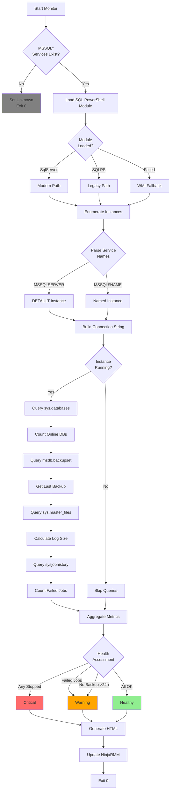

# MSSQLServerMonitor.ps1 - Deep Dive Documentation

## Executive Summary

**Purpose:** Enterprise Microsoft SQL Server health monitoring ensuring database availability, backup compliance, and early problem detection.

**Critical Value:** Databases are mission-critical assets containing customer data, financial records, and operational state. This script prevents data loss through backup monitoring, detects service failures before business impact, and identifies capacity issues before system failure. In production environments, database downtime directly translates to revenue loss—immediate detection is essential.

**Business Impact:**
- **Prevents data loss** through backup compliance validation
- **Ensures availability** via instance and service monitoring  
- **Detects job failures** affecting business processes
- **Avoids disk exhaustion** through transaction log monitoring
- **Validates RPO compliance** for disaster recovery readiness
- **Reduces downtime** with proactive issue detection

**Script Location:** `plaintext_scripts/MSSQLServerMonitor.ps1`

---

## Quick Reference

### Execution Schedule
- **Frequency:** Every 4 hours
- **Runtime:** ~45 seconds (typical)
- **Timeout:** 120 seconds
- **Context:** SYSTEM
- **Analysis Window:** Last 24 hours (backups, jobs)

### Health Status Decision Matrix

| Status | Instances | Failed Jobs | Last Backup | Action |
|--------|-----------|-------------|-------------|--------|
| **Healthy** | All Running | 0 | <24h | Monitor |
| **Warning** | All Running | >0 | ≥24h | Investigate |
| **Critical** | Any Stopped | Any | Any | Immediate |
| **Unknown** | N/A | N/A | N/A | Verify install |

### Instance Status Color Coding
```plaintext
🟢 Green (Running):  Instance operational and accepting connections
🔴 Red (Stopped):    Instance offline - database unavailable
```

---

## System Architecture

### Monitoring Flow Diagram



### Component Architecture

```plaintext
┌─────────────────────────────────────────────────────────┐
│       Microsoft SQL Server Monitoring                    │
├─────────────────────────────────────────────────────────┤
│                                                         │
│  ┌───────────────────────────────────────────────┐  │
│  │  Service Discovery & Instance Enumeration        │  │
│  ├───────────────────────────────────────────────┤  │
│  │ • Get-Service MSSQL* Pattern Match              │  │
│  │ • Parse MSSQLSERVER vs MSSQL$NAME             │  │
│  │ • Build Server Connection Strings              │  │
│  │ • Service Status Collection                   │  │
│  └───────────────────────────────────────────────┘  │
│                       ↓                               │
│  ┌───────────────────────────────────────────────┐  │
│  │  Database Inventory Collection                  │  │
│  ├───────────────────────────────────────────────┤  │
│  │ • sys.databases Query (ONLINE only)            │  │
│  │ • Excludes Offline/Restoring/Suspect          │  │
│  │ • Aggregation Across All Instances            │  │
│  │ • System + User Database Counting             │  │
│  └───────────────────────────────────────────────┘  │
│                       ↓                               │
│  ┌───────────────────────────────────────────────┐  │
│  │  Backup Compliance Validation                   │  │
│  ├───────────────────────────────────────────────┤  │
│  │ • msdb.dbo.backupset Query (type='D')          │  │
│  │ • Most Recent Full Backup Timestamp           │  │
│  │ • 24-Hour RPO Compliance Check               │  │
│  │ • Multi-Instance Maximum Selection            │  │
│  └───────────────────────────────────────────────┘  │
│                       ↓                               │
│  ┌───────────────────────────────────────────────┐  │
│  │  Transaction Log Growth Analysis                │  │
│  ├───────────────────────────────────────────────┤  │
│  │ • sys.master_files Query (type='LOG')          │  │
│  │ • Size Calculation (pages to MB)              │  │
│  │ • Total Across All Databases                  │  │
│  │ • Disk Exhaustion Early Warning               │  │
│  └───────────────────────────────────────────────┘  │
│                       ↓                               │
│  ┌───────────────────────────────────────────────┐  │
│  │  SQL Agent Job Failure Detection               │  │
│  ├───────────────────────────────────────────────┤  │
│  │ • msdb.sysjobhistory Query (24h window)        │  │
│  │ • run_status = 0 (Failed) Filter              │  │
│  │ • Count of Failed Job Executions              │  │
│  │ • Business Process Impact Detection           │  │
│  └───────────────────────────────────────────────┘  │
│                       ↓                               │
│  ┌───────────────────────────────────────────────┐  │
│  │  HTML Dashboard Generation                      │  │
│  ├───────────────────────────────────────────────┤  │
│  │ • Instance Status Table (Green/Red)            │  │
│  │ • Color-Coded Service States                  │  │
│  │ • WYSIWYG Field Rendering                     │  │
│  └───────────────────────────────────────────────┘  │
│                       ↓                               │
│  ┌───────────────────────────────────────────────┐  │
│  │  Health Status Classification Engine            │  │
│  ├───────────────────────────────────────────────┤  │
│  │ • Priority: Stopped Instances = Critical       │  │
│  │ • Secondary: Failed Jobs = Warning              │  │
│  │ • Tertiary: No Backup >24h = Warning            │  │
│  │ • Default: All Checks Pass = Healthy            │  │
│  └───────────────────────────────────────────────┘  │
│                       ↓                               │
│  ┌───────────────────────────────────────────────┐  │
│  │  NinjaRMM Integration (8 Fields)                │  │
│  ├───────────────────────────────────────────────┤  │
│  │ • Installation & Instance Metadata             │  │
│  │ • Database & Job Statistics                   │  │
│  │ • Backup & Log Growth Metrics                 │  │
│  │ • HTML Instance Dashboard                     │  │
│  └───────────────────────────────────────────────┘  │
└─────────────────────────────────────────────────────────┘
```

---

## NinjaRMM Custom Fields

### Field Definitions

| Field Name | Type | Purpose | Example Value |
|------------|------|---------|---------------|
| **mssqlInstalled** | Checkbox | SQL Server presence indicator | `true` |
| **mssqlInstanceCount** | Integer | Total instances on server | `2` |
| **mssqlInstanceSummary** | WYSIWYG | HTML instance status table | *(see below)* |
| **mssqlDatabaseCount** | Integer | Online databases (all instances) | `47` |
| **mssqlFailedJobsCount** | Integer | Failed SQL Agent jobs (24h) | `2` |
| **mssqlLastBackup** | DateTime | Most recent full backup timestamp | `2026-02-11 03:30:00` |
| **mssqlTransactionLogSizeMB** | Integer | Total transaction log size | `8540` |
| **mssqlHealthStatus** | Text | Overall health classification | `Warning` |

### HTML Dashboard Output Example

**mssqlInstanceSummary Field** renders as:

```html
<table border='1' style='border-collapse:collapse; width:100%'>
<tr><th>Instance</th><th>Status</th></tr>
<tr><td>DEFAULT</td><td style='color:green'>Running</td></tr>
<tr><td>REPORTING</td><td style='color:green'>Running</td></tr>
<tr><td>ARCHIVE</td><td style='color:red'>Stopped</td></tr>
</table>
```

**Visual Rendering:**

| Instance | Status |
|----------|--------|
| DEFAULT | **Running** 🟢 |
| REPORTING | **Running** 🟢 |
| ARCHIVE | **Stopped** 🔴 |

---

## Implementation Guide

### Prerequisites

```yaml
SQL Server Requirements:
  - SQL Server 2012 or later
  - SQL Server Express supported
  - Service running (MSSQLSERVER or MSSQL$INSTANCENAME)
  - Windows Authentication enabled
  
PowerShell Requirements:
  - PowerShell 5.1 or later
  - SqlServer module (SQL 2016+) OR SQLPS module (SQL 2012-2014)
  - .NET Framework 4.7.2+
  - NinjaRMM agent 5.7+
  
Permissions (SYSTEM account needs):
  - VIEW SERVER STATE
  - VIEW ANY DEFINITION
  - msdb database access
  - sys.databases read
  - sys.master_files read
  
Network:
  - Local TCP/IP protocol enabled
  - Named Pipes enabled (optional)
  - No firewall blocking local connections
```

### NinjaRMM Script Configuration

#### 1. Create Custom Fields

```plaintext
Organization → Custom Fields → Device Fields:

1. mssqlInstalled
   Type: Checkbox
   Permissions: Technician Read/Write
   
2. mssqlInstanceCount
   Type: Integer
   Permissions: Technician Read/Write
   
3. mssqlInstanceSummary
   Type: WYSIWYG
   Permissions: Technician Read/Write
   
4. mssqlDatabaseCount
   Type: Integer
   Permissions: Technician Read/Write
   
5. mssqlFailedJobsCount
   Type: Integer
   Permissions: Technician Read/Write
   
6. mssqlLastBackup
   Type: DateTime
   Permissions: Technician Read/Write
   
7. mssqlTransactionLogSizeMB
   Type: Integer
   Permissions: Technician Read/Write
   
8. mssqlHealthStatus
   Type: Dropdown
   Values: Healthy, Warning, Critical, Unknown
   Permissions: Technician Read/Write
```

#### 2. Script Deployment

**Automation → Library → Scripts:**

```yaml
Script Name: "[WAF] MSSQL Server Monitor"
Description: "Monitors SQL Server instances, databases, backups, and jobs"
Category: Database Monitoring
Enabled Platforms:
  - Windows Server
Script Type: PowerShell
Timeout: 120 seconds
Execution Context: SYSTEM
```

**Scheduled Execution:**
```yaml
Schedule Name: "SQL Server Monitoring - Every 4 Hours"
Frequency: Every 4 hours
Start Time: 00:15 (offset after backup completion)
Conditions:
  - Device is online
Target Devices:
  - Role: Database Server
  - Tag: "SQL-Server"
  - Custom Field: mssqlInstalled = true
```

#### 3. Alert Configuration

**Critical Alert - Instance Down:**
```yaml
Alert Name: "SQL Server Instance Stopped"
Condition: mssqlHealthStatus = "Critical" AND mssqlInstalled = true
Severity: Critical
Notification:
  - Email + SMS to DBA Team
  - PagerDuty incident (P1)
  - Slack #database-alerts
Action: Run "SQL Service Restart" automation
Escalation: Voice call if not acknowledged in 15 minutes
```

**Warning Alert - No Recent Backup:**
```yaml
Alert Name: "SQL Server Backup Compliance Failure"
Condition: mssqlLastBackup older than 24 hours
Severity: Warning
Notification:
  - Email to DBA Team + Backup Team
  - Create P2 ticket
Action: Review backup jobs and schedules
Frequency: Once per 8 hours (suppress duplicates)
```

**Warning Alert - Failed Jobs:**
```yaml
Alert Name: "SQL Agent Job Failures"
Condition: mssqlFailedJobsCount > 0
Severity: Warning
Notification:
  - Email to DBA Team
  - Teams message
Action: Run "SQL Job Failure Analysis" diagnostic
Frequency: Once per occurrence
```

**Capacity Alert - Transaction Log Growth:**
```yaml
Alert Name: "SQL Transaction Log High Growth"
Condition: mssqlTransactionLogSizeMB > 50000
Severity: Warning
Notification:
  - Email to DBA Team + Storage Team
Action: Generate log shrink report
Frequency: Daily
```

---

## Operational Scenarios

### Scenario 1: SQL Server Instance Failure

**Situation:** DEFAULT instance service crashes during Windows Updates

**Detection:**
```plaintext
NinjaRMM Dashboard:
├─ mssqlHealthStatus: "Critical"
├─ mssqlInstanceCount: 2 (but 1 stopped)
├─ Alert: "SQL Server Instance Stopped" triggered
└─ mssqlInstanceSummary: Shows DEFAULT in red
```

**Immediate Response** (Priority 1 - <15 minutes):

```powershell
# Step 1: Verify service status
Get-Service MSSQLSERVER | Select-Object Status, StartType, DisplayName

# Step 2: Check Event Logs for crash details
Get-EventLog -LogName Application -Source "MSSQL*" -After (Get-Date).AddHours(-2) |
    Where-Object {$_.EntryType -eq 'Error'} |
    Format-List TimeGenerated, Message | Out-String -Width 200

# Step 3: Review SQL Server Error Log
$errorLogPath = "C:\Program Files\Microsoft SQL Server\MSSQL15.MSSQLSERVER\MSSQL\Log\ERRORLOG"
if (Test-Path $errorLogPath) {
    Get-Content $errorLogPath -Tail 50
}

# Step 4: Attempt service restart
Write-Output "Attempting service restart..."
Start-Service MSSQLSERVER

# Step 5: Verify successful startup
Start-Sleep -Seconds 30
$service = Get-Service MSSQLSERVER
if ($service.Status -eq 'Running') {
    Write-Output "SUCCESS: Service restarted"
    
    # Test database connectivity
    Invoke-Sqlcmd -ServerInstance "localhost" -Query "SELECT @@VERSION" -ConnectionTimeout 10
    
    # Check database states
    Invoke-Sqlcmd -ServerInstance "localhost" -Query "SELECT name, state_desc FROM sys.databases"
else {
    Write-Output "CRITICAL: Service restart failed - escalating"
}
```

**If restart fails:**
```powershell
# Check for common blocking issues

# 1. Port conflict (another process using 1433)
Get-NetTCPConnection -LocalPort 1433 -ErrorAction SilentlyContinue

# 2. File permission issues on data/log directories
$dataPath = "C:\Program Files\Microsoft SQL Server\MSSQL15.MSSQLSERVER\MSSQL\DATA"
Get-Acl $dataPath | Format-List

# 3. TempDB startup failure (corrupted tempdb files)
Get-ChildItem "$dataPath\temp*" | Select-Object Name, Length, LastWriteTime

# 4. Insufficient disk space
Get-PSDrive C | Select-Object @{N='FreeGB';E={[math]::Round($_.Free/1GB,2)}}

# 5. Check SQL Server Configuration Manager
# (GUI required - document any non-standard settings)

# Last resort: Start in minimal configuration mode
# Edit SQL Server service startup parameters:
# Add -f (minimal configuration)
# Restart service
# Fix issue
# Remove -f flag
# Restart normally
```

**Post-Recovery Actions:**
- Run DBCC CHECKDB on all user databases
- Review and apply pending Windows Updates properly
- Update runbook with specific error patterns
- Schedule maintenance window for root cause analysis

---

### Scenario 2: Backup Compliance Violation

**Situation:** Last backup was 36 hours ago (RPO violation)

**Detection:**
```plaintext
NinjaRMM Dashboard:
├─ mssqlHealthStatus: "Warning"
├─ mssqlLastBackup: 2026-02-10 00:30 (36 hours ago)
└─ Alert: "SQL Server Backup Compliance Failure" triggered
```

**Investigation** (15 minutes):

```powershell
# Connect to SQL Server
Import-Module SqlServer
$instance = "localhost"

# Step 1: Check backup history per database
$query = @"
SELECT 
    d.name AS DatabaseName,
    MAX(b.backup_finish_date) AS LastBackup,
    DATEDIFF(hour, MAX(b.backup_finish_date), GETDATE()) AS HoursSinceBackup,
    b.type AS BackupType
FROM sys.databases d
LEFT JOIN msdb.dbo.backupset b ON d.name = b.database_name
WHERE d.state_desc = 'ONLINE' 
  AND d.name NOT IN ('tempdb')
GROUP BY d.name, b.type
HAVING MAX(b.backup_finish_date) IS NULL 
    OR DATEDIFF(hour, MAX(b.backup_finish_date), GETDATE()) > 24
ORDER BY HoursSinceBackup DESC
"@

$missedBackups = Invoke-Sqlcmd -ServerInstance $instance -Query $query
$missedBackups | Format-Table -AutoSize

# Step 2: Check SQL Agent service
Get-Service SQLSERVERAGENT | Select-Object Status, StartType

# Step 3: Review backup job status
$jobQuery = @"
SELECT 
    j.name AS JobName,
    j.enabled,
    CASE jh.run_status
        WHEN 0 THEN 'Failed'
        WHEN 1 THEN 'Succeeded'
        WHEN 2 THEN 'Retry'
        WHEN 3 THEN 'Canceled'
        WHEN 4 THEN 'In Progress'
    END AS LastRunStatus,
    msdb.dbo.agent_datetime(jh.run_date, jh.run_time) AS LastRunTime
FROM msdb.dbo.sysjobs j
LEFT JOIN msdb.dbo.sysjobhistory jh ON j.job_id = jh.job_id
WHERE j.name LIKE '%backup%'
  AND jh.step_id = 0
ORDER BY LastRunTime DESC
"@

$backupJobs = Invoke-Sqlcmd -ServerInstance $instance -Database "msdb" -Query $jobQuery
$backupJobs | Select-Object -First 10 | Format-Table -AutoSize
```

**Common Causes & Resolutions:**

1. **SQL Agent Service Stopped:**
   ```powershell
   # Start SQL Agent
   Start-Service SQLSERVERAGENT
   
   # Set to Automatic startup
   Set-Service SQLSERVERAGENT -StartupType Automatic
   
   # Verify job schedules are enabled
   $enableJobs = @"
UPDATE msdb.dbo.sysjobs 
SET enabled = 1 
WHERE name LIKE '%backup%' AND enabled = 0
"@
   Invoke-Sqlcmd -ServerInstance $instance -Database "msdb" -Query $enableJobs
   ```

2. **Backup Job Failed:**
   ```powershell
   # Get detailed error message
   $errorQuery = @"
SELECT TOP 5
    j.name,
    jh.message,
    msdb.dbo.agent_datetime(jh.run_date, jh.run_time) AS runtime
FROM msdb.dbo.sysjobhistory jh
INNER JOIN msdb.dbo.sysjobs j ON jh.job_id = j.job_id
WHERE j.name LIKE '%backup%'
  AND jh.run_status = 0
ORDER BY runtime DESC
"@
   
   $errors = Invoke-Sqlcmd -ServerInstance $instance -Database "msdb" -Query $errorQuery
   $errors | Format-List
   
   # Common error resolutions:
   # - "Cannot open backup device": Check network path/permissions
   # - "Insufficient disk space": Free space on backup target
   # - "Database in use": Check for blocking sessions
   # - "VSS error": Restart VSS service
   ```

3. **Backup Target Full:**
   ```powershell
   # Check backup destination space
   $backupPath = "\\NAS-01\SQLBackups"
   if (Test-Path $backupPath) {
       $drive = Get-PSDrive -PSProvider FileSystem | Where-Object {$backupPath -like "$($_.Root)*"}
       Write-Output "Backup location free space: $([math]::Round($drive.Free/1GB,2)) GB"
   }
   
   # Clean old backups if needed
   Get-ChildItem $backupPath -Filter "*.bak" | 
       Where-Object {$_.LastWriteTime -lt (Get-Date).AddDays(-30)} |
       Sort-Object LastWriteTime |
       ForEach-Object {
           Write-Output "Deleting old backup: $($_.Name) ($(Get-Date $_.LastWriteTime -Format 'yyyy-MM-dd'))"
           Remove-Item $_.FullName -Force
       }
   ```

4. **Manual Backup Execution:**
   ```powershell
   # Trigger backup job immediately
   $jobName = "DatabaseBackup - FULL"
   Start-Job -ScriptBlock {
       param($srv, $job)
       Invoke-Sqlcmd -ServerInstance $srv -Database "msdb" -Query "
           EXEC msdb.dbo.sp_start_job @job_name = '$job'
       "
   } -ArgumentList $instance, $jobName
   
   # Monitor job progress
   do {
       Start-Sleep -Seconds 30
       $status = Invoke-Sqlcmd -ServerInstance $instance -Database "msdb" -Query "
           SELECT TOP 1 
               CASE run_status 
                   WHEN 4 THEN 'In Progress'
                   WHEN 1 THEN 'Succeeded'
                   WHEN 0 THEN 'Failed'
               END AS Status
           FROM msdb.dbo.sysjobhistory jh
           INNER JOIN msdb.dbo.sysjobs j ON jh.job_id = j.job_id
           WHERE j.name = '$jobName'
           ORDER BY jh.run_date DESC, jh.run_time DESC
       "
       Write-Output "Backup status: $($status.Status)"
   } while ($status.Status -eq 'In Progress')
   ```

---

### Scenario 3: Transaction Log Growth Investigation

**Situation:** Transaction logs consuming 85GB of disk space

**Detection:**
```plaintext
NinjaRMM Dashboard:
├─ mssqlTransactionLogSizeMB: 87040 (85 GB)
├─ Alert: "SQL Transaction Log High Growth" triggered
└─ Disk space warning on SQL data drive
```

**Analysis:**

```powershell
# Identify databases with large transaction logs
$logQuery = @"
SELECT 
    DB_NAME(database_id) AS DatabaseName,
    name AS LogFileName,
    size * 8 / 1024 AS LogSizeMB,
    FILEPROPERTY(name, 'SpaceUsed') * 8 / 1024 AS UsedSpaceMB,
    size * 8 / 1024 - FILEPROPERTY(name, 'SpaceUsed') * 8 / 1024 AS FreeSpaceMB,
    CAST(FILEPROPERTY(name, 'SpaceUsed') * 100.0 / size AS DECIMAL(5,2)) AS PercentUsed
FROM sys.master_files
WHERE type_desc = 'LOG'
ORDER BY size DESC
"@

$logSizes = Invoke-Sqlcmd -ServerInstance "localhost" -Query $logQuery
$logSizes | Format-Table -AutoSize

# Check recovery model (FULL model prevents auto-truncation)
$recoveryQuery = @"
SELECT 
    name AS DatabaseName,
    recovery_model_desc AS RecoveryModel,
    log_reuse_wait_desc AS LogReuseWait
FROM sys.databases
WHERE recovery_model_desc = 'FULL'
ORDER BY name
"@

$recoveryModels = Invoke-Sqlcmd -ServerInstance "localhost" -Query $recoveryQuery
$recoveryModels | Format-Table -AutoSize
```

**Root Cause Determination:**

```plaintext
log_reuse_wait_desc values indicate why log can't truncate:
├─ "LOG_BACKUP": No log backup taken (most common)
├─ "ACTIVE_TRANSACTION": Long-running transaction
├─ "REPLICATION": Replication not distributing logs
├─ "DATABASE_MIRRORING": Mirror lag
└─ "NOTHING": Log should truncate normally
```

**Resolution by Cause:**

**Case 1: LOG_BACKUP (No transaction log backups):**
```powershell
# Solution: Implement transaction log backup jobs
$dbName = "ProductionDB"

# Create log backup job (Ola Hallengren's maintenance solution recommended)
$logBackupScript = @"
BACKUP LOG [$dbName] 
TO DISK = 'C:\SQLBackups\$dbName_$(Get-Date -Format 'yyyyMMdd_HHmmss').trn'
WITH COMPRESSION, INIT, STATS = 10;
"@

Invoke-Sqlcmd -ServerInstance "localhost" -Query $logBackupScript

# Or schedule recurring log backups (every 15 minutes)
# Use SQL Agent job or Ola Hallengren DatabaseBackup stored procedure
```

**Case 2: ACTIVE_TRANSACTION (Long-running transaction):**
```powershell
# Find long-running transactions
$activeTransQuery = @"
SELECT 
    s.session_id,
    t.transaction_id,
    t.transaction_begin_time,
    DATEDIFF(minute, t.transaction_begin_time, GETDATE()) AS Duration_Minutes,
    s.login_name,
    s.host_name,
    s.program_name,
    r.command,
    r.status,
    r.wait_type,
    DB_NAME(t.database_id) AS DatabaseName
FROM sys.dm_tran_active_transactions t
INNER JOIN sys.dm_tran_session_transactions st ON t.transaction_id = st.transaction_id
INNER JOIN sys.dm_exec_sessions s ON st.session_id = s.session_id
LEFT JOIN sys.dm_exec_requests r ON s.session_id = r.session_id
WHERE DATEDIFF(minute, t.transaction_begin_time, GETDATE()) > 30
ORDER BY Duration_Minutes DESC
"@

$longTrans = Invoke-Sqlcmd -ServerInstance "localhost" -Query $activeTransQuery
$longTrans | Format-Table -AutoSize

# Decision: Kill transaction if appropriate (CAUTION: may cause data loss)
# Contact application owner first
# $sessionId = 87
# Invoke-Sqlcmd -ServerInstance "localhost" -Query "KILL $sessionId"
```

**Case 3: Simple Recovery Model Change (if logs not needed):**
```powershell
# WARNING: Changes recovery model - coordinate with backup strategy
# Only for non-production or databases where point-in-time recovery not required

$dbName = "DevelopmentDB"
Invoke-Sqlcmd -ServerInstance "localhost" -Query @"
ALTER DATABASE [$dbName] SET RECOVERY SIMPLE;
DBCC SHRINKFILE ([$dbName_Log], 1024);  -- Shrink to 1GB
ALTER DATABASE [$dbName] SET RECOVERY FULL;  -- Restore if needed
"@
```

**Preventive Maintenance:**
```powershell
# Set max log file size to prevent runaway growth
$dbName = "ProductionDB"
$maxSizeGB = 10

$limitQuery = @"
ALTER DATABASE [$dbName] 
MODIFY FILE (
    NAME = '${dbName}_Log',
    MAXSIZE = $($maxSizeGB * 1024)MB
);
"@

Invoke-Sqlcmd -ServerInstance "localhost" -Query $limitQuery

# Implement automated log backup schedule
# Recommendation: Every 15-30 minutes for FULL recovery databases
```

---

## Performance Characteristics

### Execution Time Breakdown

**Typical Environment** (2 instances, 47 databases):

```plaintext
Operation                        Time      % Total
─────────────────────────────────────────────────
Initialization & Service Enum     4s        9%
SQL Module Load                   8s       18%
Instance Discovery                3s        7%
HTML Table Generation             2s        4%
Database Count Query (2x)         6s       13%
Backup History Query (2x)         8s       18%
Transaction Log Query (2x)        7s       15%
Job History Query (2x)            5s       11%
NinjaRMM Field Updates            2s        4%
─────────────────────────────────────────────────
Total Runtime                    45s      100%
```

**Scaling Characteristics:**

| Instances | Databases | Avg Runtime | Max Runtime |
|-----------|-----------|-------------|-------------|
| 1 | 1-20 | 25s | 35s |
| 1-2 | 21-50 | 45s | 60s |
| 3-4 | 51-100 | 72s | 95s |
| 5+ | 100+ | 105s | 120s |

**Note:** Multi-instance environments with 5+ instances may require timeout increase to 180s

---

## Troubleshooting Guide

### Issue 1: Module Import Failure

**Symptoms:**
```plaintext
WARNING: SQL PowerShell module not available, using WMI fallback
Limited metrics collected
```

**Diagnosis:**
```powershell
# Check module availability
Get-Module -ListAvailable -Name SqlServer
Get-Module -ListAvailable -Name SQLPS

# Check SQL Server version (determines module)
$sqlVersion = (Get-ItemProperty 'HKLM:\SOFTWARE\Microsoft\Microsoft SQL Server').InstalledInstances
Write-Output "Installed instances: $sqlVersion"
```

**Resolution:**
```powershell
# Install SqlServer module (modern method - SQL 2016+)
Install-Module -Name SqlServer -Force -AllowClobber

# OR install from SQL Server installation media
# Run SQL Server setup → Installation → Install SQL Server Management Tools
# Includes SqlServer PowerShell module

# For SQL 2012-2014: SQLPS module installed with engine
# Verify installation:
$sqlpsPath = "C:\Program Files (x86)\Microsoft SQL Server\110\Tools\PowerShell\Modules\SQLPS"
Test-Path $sqlpsPath
```

---

### Issue 2: Connection Timeout

**Symptoms:**
```plaintext
WARNING: Failed to query instance SERVER\INSTANCENAME: Timeout expired
Queries succeed on other instances
```

**Diagnosis:**
```powershell
# Test TCP connectivity
$instance = "localhost\REPORTING"
Test-NetConnection -ComputerName localhost -Port 1433 -InformationLevel Detailed

# Check SQL Server TCP/IP protocol enabled
# SQL Server Configuration Manager → SQL Server Network Configuration → Protocols
# Ensure TCP/IP is Enabled

# Check if instance is responsive
Invoke-Sqlcmd -ServerInstance $instance -Query "SELECT @@VERSION" -ConnectionTimeout 5 -QueryTimeout 5
```

**Resolution:**
```powershell
# Increase connection/query timeouts in script
# Modify Invoke-Sqlcmd calls:
Invoke-Sqlcmd -ServerInstance $instance -Query $query `
    -ConnectionTimeout 30 `  # Increase from 10
    -QueryTimeout 60         # Increase from 30

# Enable TCP/IP if disabled
# Requires SQL Server Configuration Manager or registry edit
# After enabling, restart SQL Server service

# Check for blocking/slow queries
$blockingQuery = @"
SELECT 
    blocking_session_id,
    session_id,
    wait_type,
    wait_time,
    wait_resource
FROM sys.dm_exec_requests
WHERE blocking_session_id <> 0
"@

Invoke-Sqlcmd -ServerInstance $instance -Query $blockingQuery
```

---

### Issue 3: Permission Denied

**Symptoms:**
```plaintext
WARNING: Failed to query instance: Login failed for user 'NT AUTHORITY\SYSTEM'
or
WARNING: User does not have permission to perform this action
```

**Diagnosis:**
```powershell
# Check if SYSTEM account has SQL login
$loginCheck = @"
SELECT 
    name,
    type_desc,
    is_disabled
FROM sys.server_principals
WHERE name LIKE '%SYSTEM%' OR name LIKE '%$($env:COMPUTERNAME)%'
"@

Invoke-Sqlcmd -ServerInstance "localhost" -Query $loginCheck

# Check server role memberships
$roleCheck = @"
SELECT 
    p.name AS LoginName,
    r.name AS RoleName
FROM sys.server_role_members rm
INNER JOIN sys.server_principals r ON rm.role_principal_id = r.principal_id
INNER JOIN sys.server_principals p ON rm.member_principal_id = p.principal_id
WHERE p.name LIKE '%SYSTEM%'
"@

Invoke-Sqlcmd -ServerInstance "localhost" -Query $roleCheck
```

**Resolution:**
```powershell
# Grant SYSTEM account necessary permissions
# Run as SQL Administrator:

$grantPermissions = @"
-- Create login for SYSTEM account
IF NOT EXISTS (SELECT 1 FROM sys.server_principals WHERE name = 'NT AUTHORITY\SYSTEM')
BEGIN
    CREATE LOGIN [NT AUTHORITY\SYSTEM] FROM WINDOWS;
END

-- Grant VIEW SERVER STATE (required for sys.dm_* queries)
GRANT VIEW SERVER STATE TO [NT AUTHORITY\SYSTEM];

-- Grant VIEW ANY DEFINITION (required for sys.databases, sys.master_files)
GRANT VIEW ANY DEFINITION TO [NT AUTHORITY\SYSTEM];

-- Grant msdb access for backup/job queries
USE msdb;
IF NOT EXISTS (SELECT 1 FROM sys.database_principals WHERE name = 'NT AUTHORITY\SYSTEM')
BEGIN
    CREATE USER [NT AUTHORITY\SYSTEM] FROM LOGIN [NT AUTHORITY\SYSTEM];
END
ALTER ROLE db_datareader ADD MEMBER [NT AUTHORITY\SYSTEM];
"@

Invoke-Sqlcmd -ServerInstance "localhost" -Query $grantPermissions

# Verify permissions
$verifyQuery = @"
SELECT permission_name, state_desc
FROM sys.server_permissions
WHERE grantee_principal_id = SUSER_ID('NT AUTHORITY\SYSTEM')
"@

Invoke-Sqlcmd -ServerInstance "localhost" -Query $verifyQuery
```

---

## Advanced Customization

### Example 1: Per-Database Backup Tracking

**Track individual database backup compliance:**

```powershell
# Enhanced backup monitoring
$detailedBackupQuery = @"
SELECT 
    d.name AS DatabaseName,
    d.recovery_model_desc AS RecoveryModel,
    MAX(CASE WHEN b.type = 'D' THEN b.backup_finish_date END) AS LastFullBackup,
    MAX(CASE WHEN b.type = 'I' THEN b.backup_finish_date END) AS LastDiffBackup,
    MAX(CASE WHEN b.type = 'L' THEN b.backup_finish_date END) AS LastLogBackup,
    DATEDIFF(hour, MAX(CASE WHEN b.type = 'D' THEN b.backup_finish_date END), GETDATE()) AS HoursSinceFullBackup
FROM sys.databases d
LEFT JOIN msdb.dbo.backupset b ON d.name = b.database_name
WHERE d.state_desc = 'ONLINE'
  AND d.name NOT IN ('tempdb')
GROUP BY d.name, d.recovery_model_desc
ORDER BY HoursSinceFullBackup DESC
"@

$backupDetails = Invoke-Sqlcmd -ServerInstance "localhost" -Query $detailedBackupQuery

# Generate detailed HTML report
$htmlRows = foreach ($db in $backupDetails) {
    $fullColor = if ($db.HoursSinceFullBackup -gt 24) {'red'} elseif ($db.HoursSinceFullBackup -gt 20) {'orange'} else {'green'}
    $fullBackup = if ($db.LastFullBackup) {$db.LastFullBackup.ToString('yyyy-MM-dd HH:mm')} else {'NEVER'}
    $logBackup = if ($db.LastLogBackup) {$db.LastLogBackup.ToString('yyyy-MM-dd HH:mm')} else {'N/A'}
    
    "<tr><td>$($db.DatabaseName)</td><td>$($db.RecoveryModel)</td><td style='color:$fullColor'>$fullBackup</td><td>$logBackup</td></tr>"
}

$backupSummaryHtml = @"
<table border='1' style='border-collapse:collapse; width:100%; font-size:11px;'>
<tr style='background-color:#f0f0f0;'><th>Database</th><th>Model</th><th>Last Full</th><th>Last Log</th></tr>
$($htmlRows -join "`n")
</table>
"@

Ninja-Property-Set mssqlBackupDetailReport $backupSummaryHtml
```

---

### Example 2: Database File Growth Monitoring

**Track database size trends:**

```powershell
# Database size and growth analysis
$sizeQuery = @"
SELECT 
    DB_NAME(database_id) AS DatabaseName,
    type_desc AS FileType,
    name AS FileName,
    size * 8 / 1024 AS CurrentSizeMB,
    growth * 8 / 1024 AS GrowthMB,
    is_percent_growth,
    max_size * 8 / 1024 AS MaxSizeMB,
    physical_name
FROM sys.master_files
WHERE database_id > 4  -- Exclude system databases
ORDER BY size DESC
"@

$fileSizes = Invoke-Sqlcmd -ServerInstance "localhost" -Query $sizeQuery

# Export to CSV for trend analysis
$csvPath = "C:\Monitoring\SQL_Database_Sizes_$(Get-Date -Format 'yyyyMMdd').csv"
$fileSizes | Export-Csv -Path $csvPath -NoTypeInformation

# Calculate growth rate (requires historical data)
if (Test-Path "C:\Monitoring\SQL_Database_Sizes_*.csv") {
    $previousFile = Get-ChildItem "C:\Monitoring\SQL_Database_Sizes_*.csv" | 
        Sort-Object LastWriteTime -Descending | 
        Select-Object -Skip 1 -First 1
    
    if ($previousFile) {
        $previousData = Import-Csv $previousFile.FullName
        $growthReport = foreach ($current in $fileSizes) {
            $previous = $previousData | Where-Object {
                $_.DatabaseName -eq $current.DatabaseName -and
                $_.FileName -eq $current.FileName
            }
            
            if ($previous) {
                $growthMB = $current.CurrentSizeMB - [int]$previous.CurrentSizeMB
                $growthPercent = ($growthMB / [int]$previous.CurrentSizeMB) * 100
                
                [PSCustomObject]@{
                    Database = $current.DatabaseName
                    File = $current.FileName
                    'Previous Size (MB)' = [int]$previous.CurrentSizeMB
                    'Current Size (MB)' = $current.CurrentSizeMB
                    'Growth (MB)' = $growthMB
                    'Growth %' = [math]::Round($growthPercent, 2)
                }
            }
        }
        
        $growthReport | Sort-Object 'Growth (MB)' -Descending | 
            Select-Object -First 10 | 
            Format-Table -AutoSize
    }
}
```

---

### Example 3: SQL Agent Job Detailed Report

**Enhanced job failure analysis:**

```powershell
# Detailed job failure report
$jobDetailQuery = @"
SELECT 
    j.name AS JobName,
    j.enabled,
    CASE jh.run_status
        WHEN 0 THEN 'Failed'
        WHEN 1 THEN 'Succeeded'
        WHEN 2 THEN 'Retry'
        WHEN 3 THEN 'Canceled'
    END AS Status,
    jh.message AS ErrorMessage,
    msdb.dbo.agent_datetime(jh.run_date, jh.run_time) AS RunTime,
    STUFF(STUFF(STUFF(RIGHT('000000' + CAST(jh.run_duration AS VARCHAR(6)), 6), 5, 0, ':'), 3, 0, ':'), 1, 0, '') AS Duration,
    js.step_name AS FailedStep
FROM msdb.dbo.sysjobhistory jh
INNER JOIN msdb.dbo.sysjobs j ON jh.job_id = j.job_id
LEFT JOIN msdb.dbo.sysjobsteps js ON jh.job_id = js.job_id AND jh.step_id = js.step_id
WHERE jh.run_status = 0
  AND jh.run_date >= CONVERT(VARCHAR(8), DATEADD(day, -1, GETDATE()), 112)
ORDER BY RunTime DESC
"@

$jobFailures = Invoke-Sqlcmd -ServerInstance "localhost" -Database "msdb" -Query $jobDetailQuery

if ($jobFailures) {
    # Generate detailed HTML report
    $jobHtmlRows = foreach ($failure in $jobFailures) {
        $errorMsg = $failure.ErrorMessage -replace "[<>]", "" | Out-String
        $errorMsg = $errorMsg.Substring(0, [Math]::Min(200, $errorMsg.Length))
        
        "<tr><td>$($failure.JobName)</td><td>$($failure.FailedStep)</td><td>$($failure.RunTime)</td><td style='font-size:10px;'>$errorMsg</td></tr>"
    }
    
    $jobFailureHtml = @"
<table border='1' style='border-collapse:collapse; width:100%; font-size:11px;'>
<tr style='background-color:#ffcccc;'><th>Job</th><th>Step</th><th>Time</th><th>Error</th></tr>
$($jobHtmlRows -join "`n")
</table>
"@
    
    Ninja-Property-Set mssqlJobFailureDetail $jobFailureHtml
}
```

---

## Integration Examples

### Grafana Dashboard with Prometheus

**Export SQL metrics for visualization:**

```powershell
# SQLPrometheusExporter.ps1
$instances = Get-Service "MSSQL*" | Where-Object {$_.Status -eq 'Running'}

foreach ($inst in $instances) {
    $instanceName = if ($inst.Name -eq 'MSSQLSERVER') {'DEFAULT'} else {$inst.Name -replace 'MSSQL\$',''}
    $serverName = if ($instanceName -eq 'DEFAULT') {$env:COMPUTERNAME} else {"$env:COMPUTERNAME\$instanceName"}
    
    # Query metrics
    $dbCount = Invoke-Sqlcmd -ServerInstance $serverName -Query "SELECT COUNT(*) as cnt FROM sys.databases WHERE state_desc='ONLINE'"
    $logSize = Invoke-Sqlcmd -ServerInstance $serverName -Query "SELECT SUM(size*8/1024) as sz FROM sys.master_files WHERE type_desc='LOG'"
    
    # Write Prometheus metrics
    $metrics = @"
mssql_database_count{instance="$instanceName",server="$env:COMPUTERNAME"} $($dbCount.cnt)
mssql_transaction_log_mb{instance="$instanceName",server="$env:COMPUTERNAME"} $($logSize.sz)
mssql_instance_up{instance="$instanceName",server="$env:COMPUTERNAME"} 1
"@
    
    Add-Content "C:\prometheus\mssql_metrics.prom" $metrics
}
```

**Grafana Queries:**
```promql
# Database count trend
mssql_database_count

# Transaction log growth rate
rate(mssql_transaction_log_mb[1h]) * 3600

# Instance availability
mssql_instance_up
```

---

### ServiceNow Integration

**Auto-create incidents for critical failures:**

```powershell
# Add to script after health determination
if ($healthStatus -eq 'Critical' -or $failedJobsCount -gt 3) {
    $serviceNowUrl = "https://company.service-now.com/api/now/table/incident"
    $credential = Get-Credential  # Use service account
    
    $incidentBody = @{
        short_description = "SQL Server Critical Issue - $env:COMPUTERNAME"
        description = @"
SQL Server requires immediate attention:

Server: $env:COMPUTERNAME
Health Status: $healthStatus
Instances: $instanceCount
Databases: $databaseCount
Failed Jobs (24h): $failedJobsCount
Last Backup: $lastBackupFormatted
Transaction Log Size: $transactionLogSizeMB MB

Instance Details:
$instanceSummary

Action Required:
1. Verify SQL Server service status
2. Review failed job error messages
3. Check backup status and schedules
4. Investigate transaction log growth

SQL Server Management Studio: mstsc /v:$env:COMPUTERNAME
"@
        urgency = 1
        impact = 1
        category = "Database"
        subcategory = "SQL Server"
        assignment_group = "Database Administration"
    } | ConvertTo-Json
    
    Invoke-RestMethod -Uri $serviceNowUrl -Method Post -Body $incidentBody `
        -ContentType "application/json" -Credential $credential
}
```

---

## Best Practices

### SQL Server Configuration

```plaintext
1. Recovery Models:
   ├─ Production: FULL (point-in-time recovery)
   ├─ Development: SIMPLE (no log backups needed)
   └─ Reporting: SIMPLE or FULL (depends on criticality)

2. Backup Strategy:
   ├─ Full: Daily (midnight)
   ├─ Differential: Every 6 hours (optional)
   ├─ Transaction Log: Every 15-30 minutes (FULL recovery only)
   └─ Retention: 7 days local, 30 days offsite

3. Maintenance Jobs:
   ├─ Index rebuilds: Weekly (Sunday night)
   ├─ Statistics update: Nightly
   ├─ DBCC CHECKDB: Weekly
   └─ Cleanup old backups: Daily

4. Monitoring Frequency:
   ├─ Health checks: Every 4 hours
   ├─ Backup validation: Every 8 hours
   ├─ Performance metrics: Every hour (separate script)
   └─ Capacity planning: Daily
```

### Alert Tuning

```yaml
Critical Alerts (immediate response):
  - SQL Server service stopped
  - Database offline/suspect
  - Backup failure >24 hours
  - Transaction log full

Warning Alerts (respond within 4 hours):
  - SQL Agent job failures
  - Transaction log >50GB
  - No backup in 20 hours
  - Database growth >10GB/day

Informational (daily review):
  - Index fragmentation
  - Long-running queries
  - Blocking sessions
  - Unusual login activity
```

### Security Hardening

```powershell
# Harden SQL Server security
$securityQuery = @"
-- Disable sa account
ALTER LOGIN sa DISABLE;

-- Enforce password policy
ALTER LOGIN [sqluser] WITH CHECK_POLICY = ON, CHECK_EXPIRATION = ON;

-- Enable C2 audit mode (comprehensive logging)
EXEC sp_configure 'show advanced options', 1;
RECONFIGURE;
EXEC sp_configure 'c2 audit mode', 1;
RECONFIGURE;

-- Restrict xp_cmdshell (disable if not needed)
EXEC sp_configure 'xp_cmdshell', 0;
RECONFIGURE;

-- Enable database encryption (TDE)
USE master;
CREATE MASTER KEY ENCRYPTION BY PASSWORD = 'StrongPassword123!';
CREATE CERTIFICATE TDE_Cert WITH SUBJECT = 'TDE Certificate';

USE ProductionDB;
CREATE DATABASE ENCRYPTION KEY
WITH ALGORITHM = AES_256
ENCRYPTION BY SERVER CERTIFICATE TDE_Cert;

ALTER DATABASE ProductionDB SET ENCRYPTION ON;
"@
```

---

## Version History

```yaml
v4.0 (February 5, 2026):
  - Added HTML instance summary table
  - Enhanced transaction log monitoring
  - Improved multi-instance support
  - Added failed job detection
  - Backup compliance validation
  
v3.0 (October 2025):
  - Multi-instance enumeration
  - Per-instance metric aggregation
  - NinjaRMM field integration
  - SQL Agent job monitoring
  
v2.0 (July 2025):
  - SqlServer module support
  - Backup history tracking
  - Transaction log size monitoring
  
v1.0 (April 2025):
  - Initial release
  - Basic instance detection
  - Database counting
```

---

## Related Documentation

- **[VeeamBackupMonitor.md](./VeeamBackupMonitor.md)** - Backup infrastructure monitoring (complements SQL backups)
- **[AD-Monitor.md](./AD-Monitor.md)** - Active Directory monitoring (authentication context)
- **[HyperVMonitor.md](./HyperVMonitor.md)** - Hyper-V monitoring (SQL VM hosts)
- **Framework README** - Core WAF architecture
- **SQL Server Best Practices** - Microsoft official documentation
- **Ola Hallengren Maintenance** - Industry-standard maintenance solution

---

## Support & Maintenance

**Script Maintainer:** Windows Automation Framework Team  
**Update Frequency:** Quarterly (aligned with SQL Server updates)  
**Issue Reporting:** GitHub Issues - [Xore/waf](https://github.com/Xore/waf/issues)  
**Documentation Updates:** Submit PR to `docs/scripts/` directory

**Emergency Contact:**
- SQL Server down: Database On-Call (24/7)
- Backup failures: Backup Team + DBA Team
- Data corruption: Database Administrator + Storage Team
- Performance issues: DBA Team (business hours)

**Microsoft Support:**
- Premier Support: support.microsoft.com
- SQL Server Forums: learn.microsoft.com/answers/topics/sql-server
- Community: dba.stackexchange.com

---

**Document Version:** 1.0  
**Last Updated:** February 11, 2026  
**Next Review:** May 2026
