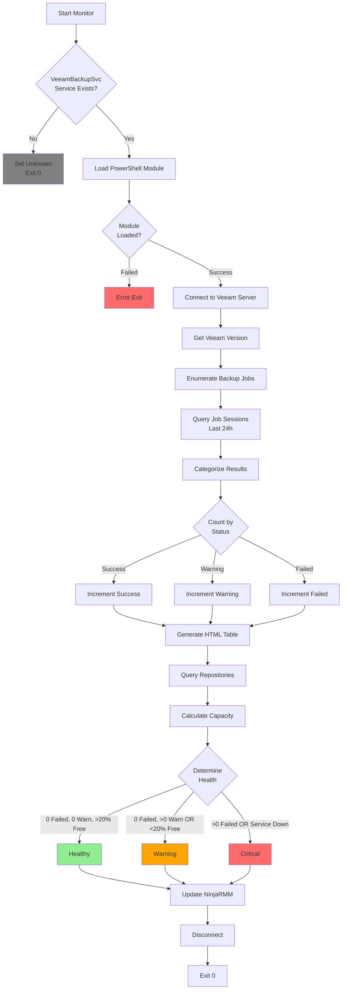

# VeeamBackupMonitor.ps1 - Deep Dive Documentation

## Executive Summary

**Purpose:** Enterprise-grade Veeam Backup & Replication monitoring ensuring backup SLAs, disaster recovery readiness, and storage capacity management.

**Critical Value:** Protects against catastrophic data loss by detecting backup failures before they violate RPO/RTO objectives. In disaster scenarios, validated backups are the difference between business continuity and business closure. This script ensures you discover backup problems during routine monitoring—not during disaster recovery.

**Business Impact:**
- **Prevents data loss** through immediate failure detection
- **Ensures compliance** with backup retention policies and SLAs
- **Avoids storage exhaustion** that causes backup cascade failures
- **Validates DR readiness** before disasters occur
- **Reduces recovery risk** by confirming backup completion
- **Saves recovery time** with proactive issue resolution

**Script Location:** `plaintext_scripts/VeeamBackupMonitor.ps1`

---

## Quick Reference

### Execution Schedule
- **Frequency:** Every 4 hours
- **Runtime:** ~40 seconds (typical)
- **Timeout:** 120 seconds
- **Context:** SYSTEM
- **Analysis Window:** Last 24 hours

### Health Status Decision Matrix

| Status | Service | Failed Jobs | Warning Jobs | Repo Free Space | Action |
|--------|---------|-------------|--------------|-----------------|--------|
| **Healthy** | Running | 0 | 0 | ≥20% | Monitor |
| **Warning** | Running | 0 | >0 | <20% | Investigate |
| **Critical** | Any | >0 | Any | Any | Immediate |
| **Unknown** | N/A | N/A | N/A | N/A | Verify install |

### Job Result Color Coding
```plaintext
🟢 Green (Success):  Backup completed without errors
🟠 Orange (Warning): Partial success - some VMs/files skipped
🔴 Red (Failed):     Critical failure - backup incomplete
```

---

## System Architecture

### Monitoring Flow Diagram



### Component Architecture

```plaintext
┌───────────────────────────────────────────────────────────┐
│        Veeam Backup & Replication Monitoring                  │
├───────────────────────────────────────────────────────────┤
│                                                           │
│  ┌─────────────────────────────────────────────────┐  │
│  │  Installation & Version Detection               │  │
│  ├─────────────────────────────────────────────────┤  │
│  │ • VeeamBackupSvc Service Check                    │  │
│  │ • PowerShell Module/Snapin Loading              │  │
│  │ • Server Connection Establishment               │  │
│  │ • Version from Session/Registry                 │  │
│  └─────────────────────────────────────────────────┘  │
│                         ↓                                 │
│  ┌─────────────────────────────────────────────────┐  │
│  │  Job Inventory & Session Retrieval              │  │
│  ├─────────────────────────────────────────────────┤  │
│  │ • Get-VBRJob (All Configured Jobs)              │  │
│  │ • Get-VBRBackupSession (24h Filter)            │  │
│  │ • Job-to-Session Correlation                   │  │
│  │ • Latest Session per Job                       │  │
│  └─────────────────────────────────────────────────┘  │
│                         ↓                                 │
│  ┌─────────────────────────────────────────────────┐  │
│  │  Result Categorization & Analysis               │  │
│  ├─────────────────────────────────────────────────┤  │
│  │ • Success Counter (Green Results)              │  │
│  │ • Warning Counter (Orange Results)             │  │
│  │ • Failed Counter (Red Results)                 │  │
│  │ • Last Backup Timestamp Tracking               │  │
│  └─────────────────────────────────────────────────┘  │
│                         ↓                                 │
│  ┌─────────────────────────────────────────────────┐  │
│  │  HTML Dashboard Generation                      │  │
│  ├─────────────────────────────────────────────────┤  │
│  │ • Job Status Table with Color Codes            │  │
│  │ • Completion Timestamps                        │  │
│  │ • 24h Summary Statistics                       │  │
│  └─────────────────────────────────────────────────┘  │
│                         ↓                                 │
│  ┌─────────────────────────────────────────────────┐  │
│  │  Repository Capacity Analysis                   │  │
│  ├─────────────────────────────────────────────────┤  │
│  │ • Get-VBRBackupRepository Query                │  │
│  │ • Total Capacity Aggregation                   │  │
│  │ • Free Space Percentage Calculation            │  │
│  │ • <20% Warning Threshold                       │  │
│  └─────────────────────────────────────────────────┘  │
│                         ↓                                 │
│  ┌─────────────────────────────────────────────────┐  │
│  │  Health Status Determination                    │  │
│  ├─────────────────────────────────────────────────┤  │
│  │ • Service Running Check                         │  │
│  │ • Failed Job Count Evaluation                 │  │
│  │ • Warning Job Count Evaluation                │  │
│  │ • Repository Space Assessment                  │  │
│  └─────────────────────────────────────────────────┘  │
│                         ↓                                 │
│  ┌─────────────────────────────────────────────────┐  │
│  │  NinjaRMM Integration (12 Fields)               │  │
│  ├─────────────────────────────────────────────────┤  │
│  │ • Installation & Version Metadata              │  │
│  │ • Job Execution Statistics                    │  │
│  │ • Repository Capacity Metrics                  │  │
│  │ • HTML Dashboard Content                       │  │
│  └─────────────────────────────────────────────────┘  │
└───────────────────────────────────────────────────────────┘
```

---

## NinjaRMM Custom Fields

### Field Definitions

| Field Name | Type | Purpose | Example Value |
|------------|------|---------|---------------|
| **veeamInstalled** | Checkbox | Veeam presence indicator | `true` |
| **veeamVersion** | Text | Product version string | `Veeam B&R v12.0.0.1420` |
| **veeamJobCount** | Integer | Total configured backup jobs | `24` |
| **veeamJobsSuccessful24h** | Integer | Successful jobs (24h) | `22` |
| **veeamJobsWarning24h** | Integer | Jobs with warnings (24h) | `1` |
| **veeamJobsFailed24h** | Integer | Failed jobs (24h) | `1` |
| **veeamRepositorySpaceGB** | Integer | Total repository capacity | `5000` |
| **veeamRepositoryFreePercent** | Integer | Aggregate free space % | `34` |
| **veeamLastBackupTime** | DateTime | Most recent completion | `2026-02-11 08:15:00` |
| **veeamJobSummary** | WYSIWYG | HTML job status table | *(see below)* |
| **veeamBackupServerName** | Text | Veeam server hostname | `VEEAM-01` |
| **veeamHealthStatus** | Text | Overall health | `Warning` |

### HTML Dashboard Output Example

**veeamJobSummary Field** renders as:

```html
<table border='1' style='border-collapse:collapse; width:100%; font-family:Arial,sans-serif;'>
<tr style='background-color:#f0f0f0;'>
  <th>Job Name</th>
  <th>Result</th>
  <th>End Time</th>
</tr>
<tr>
  <td>VM-Production-Daily</td>
  <td style='color:green'>Success</td>
  <td>2026-02-11 02:30</td>
</tr>
<tr>
  <td>SQL-Servers-Backup</td>
  <td style='color:green'>Success</td>
  <td>2026-02-11 03:45</td>
</tr>
<tr>
  <td>File-Servers-Backup</td>
  <td style='color:orange'>Warning</td>
  <td>2026-02-11 04:20</td>
</tr>
<tr>
  <td>Exchange-Backup</td>
  <td style='color:red'>Failed</td>
  <td>2026-02-11 05:10</td>
</tr>
</table>
<p style='font-size:0.9em; margin-top:10px;'>
<strong>Summary (24h):</strong> Success: 22 | Warning: 1 | Failed: 1
</p>
```

**Visual Rendering:**

| Job Name | Result | End Time |
|----------|--------|----------|
| VM-Production-Daily | **Success** 🟢 | 2026-02-11 02:30 |
| SQL-Servers-Backup | **Success** 🟢 | 2026-02-11 03:45 |
| File-Servers-Backup | **Warning** 🟠 | 2026-02-11 04:20 |
| Exchange-Backup | **Failed** 🔴 | 2026-02-11 05:10 |

**Summary (24h):** Success: 22 | Warning: 1 | Failed: 1

---

## Implementation Guide

### Prerequisites

```yaml
Veeam Requirements:
  - Veeam Backup & Replication 9.5 or later
  - VeeamBackupSvc service installed and running
  - Veeam.Backup.PowerShell module (v10+) OR VeeamPSSnapin (v9.5)
  - Local or remote console access
  
System Requirements:
  - Windows Server 2012 R2 or later
  - PowerShell 5.1 or later
  - .NET Framework 4.7.2+
  - NinjaRMM agent 5.7+
  
Permissions:
  - Local Administrator or Veeam Administrator role
  - Read access to Veeam backup server
  - Read access to backup repositories
  
Supported Veeam Versions:
  - Veeam Backup & Replication 9.5 Update 4b
  - Veeam Backup & Replication 10.0
  - Veeam Backup & Replication 11.0
  - Veeam Backup & Replication 12.0 (latest)
  - Veeam Backup & Replication 12.1
```

### NinjaRMM Script Configuration

#### 1. Create Custom Fields

```plaintext
Organization → Custom Fields → Device Fields:

1. veeamInstalled
   Type: Checkbox
   Permissions: Technician Read/Write
   
2. veeamVersion
   Type: Text
   Permissions: Technician Read/Write
   
3. veeamJobCount
   Type: Integer
   Permissions: Technician Read/Write
   
4. veeamJobsSuccessful24h
   Type: Integer
   Permissions: Technician Read/Write
   
5. veeamJobsWarning24h
   Type: Integer
   Permissions: Technician Read/Write
   
6. veeamJobsFailed24h
   Type: Integer
   Permissions: Technician Read/Write
   
7. veeamRepositorySpaceGB
   Type: Integer
   Permissions: Technician Read/Write
   
8. veeamRepositoryFreePercent
   Type: Integer
   Permissions: Technician Read/Write
   
9. veeamLastBackupTime
   Type: DateTime
   Permissions: Technician Read/Write
   
10. veeamJobSummary
    Type: WYSIWYG
    Permissions: Technician Read/Write
    
11. veeamBackupServerName
    Type: Text
    Permissions: Technician Read/Write
    
12. veeamHealthStatus
    Type: Dropdown
    Values: Healthy, Warning, Critical, Unknown
    Permissions: Technician Read/Write
```

#### 2. Script Deployment

**Automation → Library → Scripts:**

```yaml
Script Name: "[WAF] Veeam Backup Monitor"
Description: "Monitors Veeam B&R job execution and repository capacity"
Category: Backup & Recovery
Enabled Platforms:
  - Windows Server
Script Type: PowerShell
Timeout: 120 seconds
Execution Context: SYSTEM
```

**Scheduled Execution:**
```yaml
Schedule Name: "Veeam Monitoring - Every 4 Hours"
Frequency: Every 4 hours
Start Time: 00:30 (offset from typical backup windows)
Conditions:
  - Device is online
Target Devices:
  - Role: Veeam Backup Server
  - Tag: "Veeam-Installed"
  - Custom Field: veeamInstalled = true
```

#### 3. Alert Configuration

**Critical Alert - Backup Failures:**
```yaml
Alert Name: "Veeam Backup Job Failed"
Condition: veeamJobsFailed24h > 0
Severity: Critical
Notification:
  - Email to Backup Team
  - SMS to Backup Administrator
  - Create P1 ticket in PSA
  - Slack message to #infrastructure-alerts
Action: Run "Veeam Job Analysis" diagnostic script
Escalation: If not acknowledged in 30 minutes, escalate to manager
```

**Warning Alert - Repository Space:**
```yaml
Alert Name: "Veeam Repository Low Space"
Condition: veeamRepositoryFreePercent < 20
Severity: Warning
Notification:
  - Email to Storage Team
  - Create P2 ticket for capacity planning
Action: Generate repository growth report
Frequency: Once per day (suppress duplicates)
```

**Service Alert - Veeam Down:**
```yaml
Alert Name: "Veeam Backup Service Stopped"
Condition: veeamHealthStatus = "Critical" AND veeamInstalled = true
Severity: Critical
Notification:
  - Immediate SMS/Voice call
  - PagerDuty incident
  - Email with service restart instructions
Action: Attempt automatic service restart
Escalation: If restart fails, engage on-call engineer
```

**Compliance Alert - No Recent Backups:**
```yaml
Alert Name: "Veeam No Recent Backups"
Condition: veeamLastBackupTime older than 36 hours
Severity: Warning
Notification:
  - Email to Backup Team
  - Compliance notification
Action: Review backup schedules and job status
Frequency: Daily at 09:00
```

---

## Operational Scenarios

### Scenario 1: Backup Job Failure

**Situation:** Exchange backup job fails with VSS error

**Detection:**
```plaintext
NinjaRMM Dashboard:
├─ veeamHealthStatus: "Critical"
├─ veeamJobsFailed24h: 1
├─ Alert: "Veeam Backup Job Failed" triggered
└─ veeamJobSummary: Shows "Exchange-Backup" in red
```

**Immediate Response** (Priority 1):

```powershell
# Step 1: Review job details in Veeam console
Connect-VBRServer -Server localhost
$failedJob = Get-VBRJob -Name "Exchange-Backup"
$latestSession = Get-VBRBackupSession | Where-Object {$_.JobId -eq $failedJob.Id} | 
    Sort-Object EndTime -Descending | Select-Object -First 1

# Display failure details
$latestSession | Select-Object Name, Result, @{N='Duration';E={(New-TimeSpan $_.CreationTime $_.EndTime).ToString()}}

# Check session logs
Get-VBRTaskSession -Session $latestSession | 
    Where-Object {$_.Status -eq 'Failed'} | 
    Select-Object Name, Status, @{N='Error';E={$_.Info.Reason}}

# Review detailed error message
$latestSession.Logger.GetLog().UpdatedRecords | Where-Object {$_.Status -eq 'EFailed'} | 
    Select-Object -Last 10 | Format-Table Title, Status
```

**Common VSS Failure Resolutions:**

```powershell
# VSS Writer Issue
# 1. Check VSS writers on Exchange server
Invoke-Command -ComputerName EXCHANGE-01 -ScriptBlock {
    vssadmin list writers
}

# 2. Restart VSS writers if failed
Invoke-Command -ComputerName EXCHANGE-01 -ScriptBlock {
    Restart-Service VSS
    Get-Service *vss* | Where-Object {$_.Status -eq 'Stopped'} | Start-Service
}

# 3. Retry backup job
Start-VBRJob -Job $failedJob

# 4. Monitor retry execution
do {
    Start-Sleep -Seconds 30
    $session = Get-VBRBackupSession -Job $failedJob | Sort-Object EndTime -Descending | Select-Object -First 1
    Write-Output "Status: $($session.State) - Progress: $($session.Progress.Percents)%"
} while ($session.State -eq 'Working')

Write-Output "Final Result: $($session.Result)"
```

**Root Cause Analysis:**

```powershell
# Check for common issues
$diagnostics = @{}

# 1. Repository space
$repo = Get-VBRBackupRepository | Where-Object {$_.Name -eq $failedJob.Info.TargetRepositoryName}
$diagnostics['RepoFreeSpaceGB'] = [Math]::Round($repo.GetContainer().CachedFreeSpace.InGigabytes, 2)

# 2. Proxy availability
$proxy = Get-VBRViProxy | Where-Object {$_.Host.Name -eq $failedJob.Info.CommonInfo.BackupProxy}
$diagnostics['ProxyState'] = $proxy.State

# 3. Network connectivity
$diagnostics['NetworkToExchange'] = Test-NetConnection -ComputerName EXCHANGE-01 -Port 135 -InformationLevel Quiet

# 4. Recent session history
$recentSessions = Get-VBRBackupSession -Job $failedJob | 
    Sort-Object EndTime -Descending | Select-Object -First 5
$diagnostics['RecentFailures'] = ($recentSessions | Where-Object {$_.Result -eq 'Failed'}).Count

$diagnostics | Format-Table -AutoSize
```

---

### Scenario 2: Repository Capacity Exhaustion

**Situation:** Primary repository drops to 12% free space

**Detection:**
```plaintext
NinjaRMM Dashboard:
├─ veeamHealthStatus: "Warning"
├─ veeamRepositoryFreePercent: 12
├─ veeamRepositorySpaceGB: 5000
└─ Alert: "Veeam Repository Low Space" triggered
```

**Assessment** (15 minutes):

```powershell
# Analyze repository usage
Connect-VBRServer -Server localhost
$repositories = Get-VBRBackupRepository

foreach ($repo in $repositories) {
    $totalGB = [Math]::Round($repo.GetContainer().CachedTotalSpace.InGigabytes)
    $freeGB = [Math]::Round($repo.GetContainer().CachedFreeSpace.InGigabytes)
    $usedGB = $totalGB - $freeGB
    $freePercent = [Math]::Round(($freeGB / $totalGB) * 100)
    
    [PSCustomObject]@{
        Repository = $repo.Name
        TotalGB = $totalGB
        UsedGB = $usedGB
        FreeGB = $freeGB
        FreePercent = "$freePercent%"
        Status = if ($freePercent -lt 15) {'Critical'} elseif ($freePercent -lt 25) {'Warning'} else {'OK'}
    }
}

# Identify largest backup chains
Get-VBRBackup | Select-Object Name, @{N='SizeGB';E={[Math]::Round($_.GetAllStorages().Stats.BackupSize / 1GB, 2)}} | 
    Sort-Object SizeGB -Descending | 
    Select-Object -First 10 | 
    Format-Table -AutoSize

# Check for orphaned backups (no longer protected)
Get-VBRBackup | Where-Object {$_.JobId -eq [Guid]::Empty} | 
    Select-Object Name, @{N='SizeGB';E={[Math]::Round($_.GetAllStorages().Stats.BackupSize / 1GB, 2)}}
```

**Short-Term Mitigation** (30 minutes):

```powershell
# Option 1: Compact Full Backups (reclaims deleted block space)
$job = Get-VBRJob -Name "VM-Production-Daily"
Start-VBRCompactFullBackup -Job $job

# Option 2: Remove obsolete restore points manually
$oldBackups = Get-VBRBackup | Where-Object {
    $_.JobType -eq 'Backup' -and
    $_.GetLastOib().CreationTime -lt (Get-Date).AddMonths(-3)
}
foreach ($backup in $oldBackups) {
    Write-Output "Removing old backup: $($backup.Name)"
    Remove-VBRBackup -Backup $backup -Confirm:$false
}

# Option 3: Move archive tier to cloud (if configured)
$jobs = Get-VBRJob | Where-Object {$_.BackupTargetOptions.EnableGFSArchiving -eq $true}
foreach ($job in $jobs) {
    # Trigger archive tier offload
    Start-VBRBackupJob -Job $job -RunAsync
}

# Option 4: Delete orphaned backup files
Get-VBRBackup | Where-Object {$_.JobId -eq [Guid]::Empty} | Remove-VBRBackup -Confirm:$false
```

**Long-Term Solution:**

```powershell
# Implement GFS (Grandfather-Father-Son) retention
$job = Get-VBRJob -Name "VM-Production-Daily"
$job | Set-VBRJobOptions -BackupStorageOptions @{
    EnableFullBackup = $true
    RetainDays = 14  # Daily restore points
    EnableGFSArchiving = $true
    GFSWeeklyRetainWeeks = 8
    GFSMonthlyRetainMonths = 12
    GFSYearlyRetainYears = 5
}

# Add scale-out repository (capacity extension)
Add-VBRBackupRepository -Name "REPO-EXTENSION" `
    -Path "E:\VeeamBackup" `
    -Server (Get-VBRServer -Name "STORAGE-02")

# Configure as extent of existing scale-out repo
$scaleOut = Get-VBRBackupRepository -ScaleOut -Name "Production-ScaleOut"
$newExtent = Get-VBRBackupRepository -Name "REPO-EXTENSION"
Add-VBRScaleOutExtent -ScaleOutRepository $scaleOut -Extent $newExtent
```

**Capacity Planning Report:**

```powershell
# Historical growth analysis
$jobs = Get-VBRJob
$growthData = foreach ($job in $jobs) {
    $sessions = Get-VBRBackupSession -Job $job | 
        Where-Object {$_.EndTime -gt (Get-Date).AddDays(-30)} |
        Sort-Object EndTime
    
    if ($sessions.Count -gt 1) {
        $oldest = $sessions | Select-Object -First 1
        $newest = $sessions | Select-Object -Last 1
        
        $oldestSize = ($oldest.BackupStats | Measure-Object -Property DataSize -Sum).Sum / 1GB
        $newestSize = ($newest.BackupStats | Measure-Object -Property DataSize -Sum).Sum / 1GB
        $growthGB = $newestSize - $oldestSize
        $growthPercent = if ($oldestSize -gt 0) {($growthGB / $oldestSize) * 100} else {0}
        
        [PSCustomObject]@{
            Job = $job.Name
            'SizeGB (30d ago)' = [Math]::Round($oldestSize, 2)
            'SizeGB (current)' = [Math]::Round($newestSize, 2)
            'GrowthGB' = [Math]::Round($growthGB, 2)
            'Growth%' = [Math]::Round($growthPercent, 1)
        }
    }
}

$growthData | Sort-Object 'GrowthGB' -Descending | Format-Table -AutoSize

# Projected exhaustion date
$currentFreeGB = 600  # From earlier analysis
$avgDailyGrowthGB = ($growthData | Measure-Object -Property 'GrowthGB' -Average).Average / 30
$daysToFull = [Math]::Floor($currentFreeGB / $avgDailyGrowthGB)
$exhaustionDate = (Get-Date).AddDays($daysToFull)

Write-Output "`nCapacity Forecast:"
Write-Output "  Current Free: $currentFreeGB GB"
Write-Output "  Avg Daily Growth: $([Math]::Round($avgDailyGrowthGB, 2)) GB"
Write-Output "  Days Until Full: $daysToFull"
Write-Output "  Projected Exhaustion: $($exhaustionDate.ToString('yyyy-MM-dd'))"
```

---

### Scenario 3: Jobs with Warnings Investigation

**Situation:** File server backup completes with warnings (partial success)

**Detection:**
```plaintext
NinjaRMM Dashboard:
├─ veeamHealthStatus: "Warning"
├─ veeamJobsWarning24h: 1
└─ veeamJobSummary: "File-Servers-Backup" in orange
```

**Investigation:**

```powershell
# Get job with warning
$job = Get-VBRJob -Name "File-Servers-Backup"
$session = Get-VBRBackupSession -Job $job | 
    Sort-Object EndTime -Descending | 
    Select-Object -First 1

# Display warning details
$warningTasks = Get-VBRTaskSession -Session $session | 
    Where-Object {$_.Status -eq 'Warning'}

foreach ($task in $warningTasks) {
    Write-Output "`nVM: $($task.Name)"
    Write-Output "Status: $($task.Status)"
    Write-Output "Reason: $($task.Info.Reason)"
    
    # Get specific warning messages
    $task.Logger.GetLog().UpdatedRecords | 
        Where-Object {$_.Status -eq 'EWarning'} | 
        Select-Object -Last 5 | 
        Format-Table Time, Title
}
```

**Common Warning Scenarios:**

1. **Locked Files (VSS Snapshot Issue):**
   ```powershell
   # Files in use during backup
   # Typically non-critical (temp files, logs)
   # Review specific files:
   $session.Logger.GetLog().UpdatedRecords | 
       Where-Object {$_.Title -like "*locked*" -or $_.Title -like "*in use*"}
   
   # Resolution: Adjust backup schedule or exclude paths
   ```

2. **Changed Block Tracking (CBT) Reset:**
   ```powershell
   # CBT reset causes full scan instead of incremental
   # Warning but backup still succeeds
   # Typically after VM snapshot deletion or storage vMotion
   
   # Check if CBT is consistently failing
   $recentSessions = Get-VBRBackupSession -Job $job | 
       Select-Object -Last 5
   $cbtWarnings = $recentSessions | ForEach-Object {
       $_.Logger.GetLog().UpdatedRecords | 
           Where-Object {$_.Title -like "*CBT*"}
   }
   
   if ($cbtWarnings.Count -ge 3) {
       Write-Output "CBT issue persists - consider reset:"
       Write-Output "Disable-VBRJobCBT -Job '$($job.Name)'"
       Write-Output "Enable-VBRJobCBT -Job '$($job.Name)'"
   }
   ```

3. **Individual Disk Processing Warnings:**
   ```powershell
   # Some VM disks skipped (excluded or inaccessible)
   # Verify exclusions are intentional
   $job.ViVssOptions.ExcludedDisks
   
   # Check if disks should be included
   ```

**Resolution Decision Tree:**
```plaintext
Warning Type:
└─ Locked Files
   ├─ <10 files: Accept (likely temp files)
   └─ >10 files: Investigate backup timing

└─ CBT Reset
   ├─ One-time: Accept (storage maintenance)
   └─ Recurring: Reset CBT

└─ Disk Excluded
   ├─ Intentional: Accept
   └─ Unintentional: Adjust job config

└─ VM Unreachable
   ├─ Powered Off: Accept or adjust schedule
   └─ Network Issue: Critical - investigate
```

---

## Performance Characteristics

### Execution Time Breakdown

**Typical Environment** (24 backup jobs, 50 VMs, 3 repositories):

```plaintext
Operation                        Time      % Total
─────────────────────────────────────────────────
Initialization & Service Check    3s        7%
PowerShell Module Load            6s       15%
Veeam Server Connection           4s       10%
Version Detection                 2s        5%
Job Enumeration                   5s       12%
Session Query (24h window)       12s       30%
HTML Table Generation             3s        7%
Repository Query                  4s       10%
NinjaRMM Field Updates            1s        2%
Disconnect & Cleanup              1s        2%
─────────────────────────────────────────────────
Total Runtime                    41s      100%
```

**Scaling Characteristics:**

| Job Count | VMs Protected | Repositories | Avg Runtime | Max Runtime |
|-----------|---------------|--------------|-------------|-------------|
| 1-10 | <20 | 1-2 | 22s | 30s |
| 11-30 | 21-75 | 2-4 | 40s | 55s |
| 31-60 | 76-150 | 4-8 | 68s | 90s |
| 61-100 | 151-300 | 8-15 | 95s | 120s |
| 100+ | 300+ | 15+ | ⚠️ Increase timeout to 180s |

**Performance Optimization:**

```powershell
# For large Veeam deployments, limit session query
$startTime = (Get-Date).AddHours(-24)
$recentSessions = Get-VBRBackupSession | 
    Where-Object {$_.EndTime -ge $startTime} |
    Select-Object JobId, Result, EndTime

# Build hashtable for O(1) lookups
$sessionLookup = @{}
foreach ($session in $recentSessions) {
    if (-not $sessionLookup.ContainsKey($session.JobId) -or 
        $session.EndTime -gt $sessionLookup[$session.JobId].EndTime) {
        $sessionLookup[$session.JobId] = $session
    }
}

# Process jobs using hashtable
foreach ($job in $jobs) {
    if ($sessionLookup.ContainsKey($job.Id)) {
        $session = $sessionLookup[$job.Id]
        # Process result...
    }
}
```

---

## Troubleshooting Guide

### Issue 1: Module Loading Failure

**Symptoms:**
```plaintext
ERROR: Failed to load Veeam PowerShell module
Exit Code: 1
```

**Diagnosis:**
```powershell
# Check module availability
Get-Module -ListAvailable -Name Veeam.Backup.PowerShell
Get-PSSnapin -Registered | Where-Object {$_.Name -like "*Veeam*"}

# Verify Veeam installation
$veeamRegPath = "HKLM:\SOFTWARE\Veeam\Veeam Backup and Replication"
Test-Path $veeamRegPath
Get-ItemProperty -Path $veeamRegPath

# Check PowerShell version
$PSVersionTable.PSVersion
```

**Resolution:**
```powershell
# Install Veeam Console (includes PowerShell module)
# Run Veeam B&R installer, select "Backup Console" component

# Or manually import module from install path
$veeamModulePath = "C:\Program Files\Veeam\Backup and Replication\Console\Veeam.Backup.PowerShell.dll"
if (Test-Path $veeamModulePath) {
    Import-Module $veeamModulePath -Force
}

# For legacy v9.5, add snapin
Add-PSSnapin VeeamPSSnapin -ErrorAction Stop
```

---

### Issue 2: Connection Timeout

**Symptoms:**
```plaintext
WARNING: Failed to connect to Veeam server: Timeout
Script exceeds 120-second timeout
```

**Diagnosis:**
```powershell
# Check service responsiveness
Get-Service VeeamBackupSvc | Select-Object Status, StartType

# Test Veeam server port
Test-NetConnection -ComputerName localhost -Port 9392 -InformationLevel Detailed

# Check for high CPU/memory
Get-Process -Name "Veeam.Backup.*" | Select-Object Name, CPU, WorkingSet64

# Review Veeam service logs
Get-EventLog -LogName Application -Source Veeam* -Newest 50 -EntryType Error
```

**Resolution:**
```powershell
# Restart Veeam services if hung
Restart-Service VeeamBackupSvc -Force
Start-Sleep -Seconds 30

# Verify service startup
Get-Service Veeam* | Where-Object {$_.Status -ne 'Running'} | Start-Service

# Increase script timeout in NinjaRMM
# Automation → Scripts → [WAF] Veeam Backup Monitor → Timeout: 180s

# Reduce query scope for large deployments
$startTime = (Get-Date).AddHours(-12)  # Reduce from 24h to 12h
```

---

### Issue 3: Inaccurate Repository Free Space

**Symptoms:**
```plaintext
veeamRepositoryFreePercent: 100 (but repository is nearly full)
or
veeamRepositoryFreePercent: 0 (but repository has space)
```

**Diagnosis:**
```powershell
# Check repository cache freshness
$repo = Get-VBRBackupRepository -Name "Primary-Repo"
$repo.GetContainer().CachedTotalSpace
$repo.GetContainer().CachedFreeSpace

# Compare with actual disk space
$repoPath = $repo.Path
Get-PSDrive -PSProvider FileSystem | Where-Object {$repoPath -like "$($_.Root)*"}

# Check for stale cache
$repo.GetContainer().FillCache()  # Force cache refresh
```

**Resolution:**
```powershell
# Force repository rescan
$repositories = Get-VBRBackupRepository
foreach ($repo in $repositories) {
    Write-Output "Rescanning: $($repo.Name)"
    $repo.GetContainer().FillCache()
    Start-Sleep -Seconds 5
}

# Add cache refresh to script
# Insert before repository query:
Get-VBRBackupRepository | ForEach-Object {$_.GetContainer().FillCache()}
Start-Sleep -Seconds 10  # Allow cache update

# Verify calculation logic
$totalGB = [Math]::Round($repo.GetContainer().CachedTotalSpace.InGigabytes)
$freeGB = [Math]::Round($repo.GetContainer().CachedFreeSpace.InGigabytes)
Write-Output "Total: $totalGB GB, Free: $freeGB GB"
if ($totalGB -eq 0) {
    Write-Output "ERROR: Repository reports zero capacity - check mount point"
}
```

---

### Issue 4: Missing Job Sessions

**Symptoms:**
```plaintext
veeamJobSummary: "No backup jobs executed in the last 24 hours"
(But jobs are scheduled and running)
```

**Diagnosis:**
```powershell
# Verify jobs exist
$jobs = Get-VBRJob
$jobs | Select-Object Name, IsScheduleEnabled, NextRun

# Check session history
$allSessions = Get-VBRBackupSession
$allSessions | Select-Object -First 10 | Format-Table Name, State, Result, EndTime

# Verify time window
$startTime = (Get-Date).AddHours(-24)
$recentSessions = $allSessions | Where-Object {$_.EndTime -ge $startTime}
$recentSessions.Count

# Check for clock skew
Get-Date
(Get-VBRServerSession).CreationTime
```

**Resolution:**
```powershell
# Expand time window if backups run weekly
$startTime = (Get-Date).AddHours(-168)  # 7 days

# Or query all sessions and filter by last execution
foreach ($job in $jobs) {
    $latestSession = Get-VBRBackupSession | 
        Where-Object {$_.JobId -eq $job.Id} |
        Sort-Object EndTime -Descending |
        Select-Object -First 1
    
    if ($latestSession) {
        Write-Output "$($job.Name): Last run $($latestSession.EndTime)"
    } else {
        Write-Output "$($job.Name): NO SESSIONS FOUND"
    }
}

# Check Veeam database integrity
# Veeam B&R Console → Menu → Configuration Database → Check Database
```

---

## Advanced Customization

### Example 1: SLA Compliance Tracking

**Track backups against defined RPO/RTO:**

```powershell
# Define SLA requirements
$slaConfig = @{
    'VM-Production-Daily' = @{RPO = 24; RTO = 4}
    'SQL-Servers-Backup' = @{RPO = 12; RTO = 2}
    'Exchange-Backup' = @{RPO = 12; RTO = 1}
}

# Check compliance
$complianceReport = foreach ($jobName in $slaConfig.Keys) {
    $job = Get-VBRJob -Name $jobName
    $latestSession = Get-VBRBackupSession -Job $job | 
        Sort-Object EndTime -Descending | Select-Object -First 1
    
    if ($latestSession) {
        $hoursSinceBackup = ((Get-Date) - $latestSession.EndTime).TotalHours
        $rpoViolation = $hoursSinceBackup -gt $slaConfig[$jobName].RPO
        
        [PSCustomObject]@{
            Job = $jobName
            'RPO (hours)' = $slaConfig[$jobName].RPO
            'Last Backup (hours ago)' = [Math]::Round($hoursSinceBackup, 1)
            'Compliant' = -not $rpoViolation
            Status = if ($rpoViolation) {'RPO VIOLATION'} else {'OK'}
        }
    }
}

$complianceReport | Format-Table -AutoSize

# Alert on SLA violations
$violations = $complianceReport | Where-Object {$_.Compliant -eq $false}
if ($violations) {
    Send-MailMessage -To "compliance@company.com" `
        -Subject "Veeam SLA Violations Detected" `
        -Body ($violations | ConvertTo-Html | Out-String)
}
```

---

### Example 2: Enhanced Job Summary with VM Details

**Include per-VM status in dashboard:**

```powershell
# Enhanced HTML generation
$htmlRows = @()

foreach ($job in $jobs) {
    $latestSession = Get-VBRBackupSession -Job $job | 
        Sort-Object EndTime -Descending | Select-Object -First 1
    
    if ($latestSession -and $latestSession.EndTime -ge $startTime) {
        # Get per-VM task results
        $vmTasks = Get-VBRTaskSession -Session $latestSession
        
        foreach ($task in $vmTasks) {
            $resultColor = switch ($task.Status) {
                'Success' { 'green' }
                'Warning' { 'orange' }
                'Failed' { 'red' }
                default { 'black' }
            }
            
            $transferredGB = [Math]::Round($task.Progress.TransferedSize / 1GB, 2)
            $duration = (New-TimeSpan $task.Progress.StartTime $task.Progress.StopTime).ToString("hh\:mm")
            
            $htmlRows += @"
<tr>
  <td>$($job.Name)</td>
  <td>$($task.Name)</td>
  <td style='color:$resultColor'>$($task.Status)</td>
  <td>${transferredGB} GB</td>
  <td>$duration</td>
  <td>$($task.Progress.StopTime.ToString('yyyy-MM-dd HH:mm'))</td>
</tr>
"@
        }
    }
}

$jobSummary = @"
<table border='1' style='border-collapse:collapse; width:100%; font-family:Arial,sans-serif; font-size:12px;'>
<tr style='background-color:#f0f0f0;'>
  <th>Job</th><th>VM/Object</th><th>Result</th><th>Data</th><th>Duration</th><th>Time</th>
</tr>
$($htmlRows -join "`n")
</table>
<p style='font-size:0.9em; margin-top:10px;'>
<strong>Summary:</strong> $($vmTasks.Count) VMs backed up
</p>
"@
```

---

### Example 3: Integration with Ticketing System

**Auto-create tickets for failed backups:**

```powershell
# Add after determining failed jobs
if ($jobsFailed24h -gt 0) {
    foreach ($job in $jobs) {
        $latestSession = Get-VBRBackupSession -Job $job | 
            Where-Object {$_.Result -eq 'Failed' -and $_.EndTime -ge $startTime} |
            Sort-Object EndTime -Descending | Select-Object -First 1
        
        if ($latestSession) {
            # Get error details
            $errorDetails = $latestSession.Logger.GetLog().UpdatedRecords | 
                Where-Object {$_.Status -eq 'EFailed'} | 
                Select-Object -Last 1
            
            # Create PSA ticket
            $ticketBody = @{
                title = "Veeam Backup Failure - $($job.Name)"
                description = @"
Backup job failed on $env:COMPUTERNAME

Job: $($job.Name)
End Time: $($latestSession.EndTime)
Duration: $((New-TimeSpan $latestSession.CreationTime $latestSession.EndTime).ToString())

Error: $($errorDetails.Title)

Action Required:
1. Review Veeam console for detailed logs
2. Verify target VMs are accessible
3. Check repository capacity
4. Retry backup once resolved

Veeam Console: https://veeam-console.company.com
"@
                priority = 'High'
                category = 'Backup & Recovery'
            } | ConvertTo-Json
            
            # Submit to PSA API
            $psaUrl = "https://psa.company.com/api/tickets"
            Invoke-RestMethod -Uri $psaUrl -Method Post -Body $ticketBody `
                -ContentType "application/json" -Headers @{Authorization="Bearer $env:PSA_TOKEN"}
        }
    }
}
```

---

### Example 4: Backup Chain Health Analysis

**Detect synthetic full failures and chain corruption:**

```powershell
# Analyze backup chains
function Get-VeeamChainHealth {
    $chainReport = foreach ($backup in Get-VBRBackup) {
        $storage = $backup.GetAllStorages() | Select-Object -First 1
        if ($storage) {
            $chain = $storage.GetRestorePoints() | Sort-Object CreationTime
            
            # Detect missing incrementals (gaps in chain)
            $gaps = @()
            for ($i = 1; $i -lt $chain.Count; $i++) {
                $timeDiff = ($chain[$i].CreationTime - $chain[$i-1].CreationTime).TotalHours
                if ($timeDiff -gt 48) {  # Expected daily backups
                    $gaps += "Gap of $([Math]::Round($timeDiff)) hours between $($chain[$i-1].CreationTime) and $($chain[$i].CreationTime)"
                }
            }
            
            # Check chain length (too long = performance issue)
            $fullBackups = $chain | Where-Object {$_.Algorithm -eq 'Full'}
            $incrementals = $chain.Count - $fullBackups.Count
            
            [PSCustomObject]@{
                Backup = $backup.Name
                'Restore Points' = $chain.Count
                'Full Backups' = $fullBackups.Count
                'Incrementals' = $incrementals
                'Chain Length' = if ($incrementals -gt 30) {'Long (>30)'} elseif ($incrementals -gt 14) {'Normal'} else {'Short'}
                'Chain Gaps' = if ($gaps.Count -gt 0) {$gaps -join "; "} else {'None'}
                'Oldest Point' = $chain[0].CreationTime
                'Health' = if ($gaps.Count -gt 0 -or $incrementals -gt 30) {'Warning'} else {'Healthy'}
            }
        }
    }
    
    $chainReport | Format-Table -AutoSize
    $chainReport | Where-Object {$_.Health -eq 'Warning'}
}

Get-VeeamChainHealth
```

---

## Integration Examples

### Grafana Dashboard with InfluxDB

**Export metrics to time-series database:**

```powershell
# VeeamInfluxDBExporter.ps1
$influxUrl = "http://influxdb.company.com:8086/write?db=veeam_metrics"

# Build line protocol format
$timestamp = [DateTimeOffset]::Now.ToUnixTimeSeconds()
$metrics = @"
veeam_jobs,server=$backupServerName total=$jobCount,successful=$jobsSuccessful24h,warning=$jobsWarning24h,failed=$jobsFailed24h $timestamp
veeam_repository,server=$backupServerName total_gb=$repositorySpaceGB,free_percent=$repositoryFreePercent $timestamp
veeam_health,server=$backupServerName status=$(if($healthStatus -eq 'Healthy'){1}elseif($healthStatus -eq 'Warning'){2}else{3}) $timestamp
"@

# Send to InfluxDB
Invoke-RestMethod -Uri $influxUrl -Method Post -Body $metrics -ContentType "text/plain"
```

**Grafana Query Examples:**

```sql
-- Job success rate over time
SELECT mean("successful") / mean("total") * 100 AS "success_rate"
FROM "veeam_jobs"
WHERE time > now() - 30d
GROUP BY time(1d)

-- Repository capacity trend
SELECT mean("free_percent") AS "free_space"
FROM "veeam_repository"
WHERE time > now() - 90d
GROUP BY time(1d)

-- Alert on failed jobs
SELECT last("failed")
FROM "veeam_jobs"
WHERE time > now() - 4h
GROUP BY "server"
HAVING last("failed") > 0
```

---

### Microsoft Teams Notifications

**Send adaptive cards for failures:**

```powershell
# Add after health determination
if ($healthStatus -eq 'Critical') {
    $teamsWebhook = "https://outlook.office.com/webhook/..."
    
    $card = @{
        "@type" = "MessageCard"
        "@context" = "https://schema.org/extensions"
        themeColor = "FF0000"
        title = "⚠️ Veeam Backup Failure - $backupServerName"
        text = "Backup job failures detected in the last 24 hours"
        sections = @(
            @{
                facts = @(
                    @{name="Server"; value=$backupServerName}
                    @{name="Failed Jobs"; value=$jobsFailed24h}
                    @{name="Warning Jobs"; value=$jobsWarning24h}
                    @{name="Repository Free"; value="$repositoryFreePercent%"}
                    @{name="Last Backup"; value=$lastBackupTime}
                )
            }
        )
        potentialAction = @(
            @{
                "@type" = "OpenUri"
                name = "Open Veeam Console"
                targets = @(
                    @{os="default"; uri="https://veeam-console.company.com"}
                )
            }
        )
    } | ConvertTo-Json -Depth 10
    
    Invoke-RestMethod -Uri $teamsWebhook -Method Post -Body $card -ContentType "application/json"
}
```

---

## Best Practices

### Backup Job Design

```plaintext
1. Job Organization:
   ├─ Production VMs: Daily backups, 14-day retention
   ├─ Database Servers: 12-hour RPO, log backups every 15min
   ├─ File Servers: Daily backups, GFS weekly/monthly archives
   └─ Development: Weekly backups, 4-week retention

2. Job Scheduling:
   ├─ Stagger start times (avoid repository contention)
   ├─ Critical systems first (ensure completion before window closes)
   ├─ Monitor with 4h frequency (catches failures mid-window)
   └─ Align monitoring schedule with backup windows

3. Repository Strategy:
   ├─ Primary: On-premises disk (speed)
   ├─ Secondary: Scale-out with cloud extent (capacity)
   ├─ Archive: Cloud/tape for long-term retention
   └─ Capacity buffer: Maintain 25%+ free space

4. Retention Policies:
   ├─ Restore points: 14 days (recent recovery)
   ├─ Weekly GFS: 8 weeks
   ├─ Monthly GFS: 12 months
   └─ Yearly GFS: 7 years (compliance)
```

### Monitoring Strategy

**Alert Escalation Workflow:**

```yaml
Level 1 - Backup Administrator:
  Trigger: Any failed job
  Method: Email + Dashboard
  Response Time: 2 hours
  Escalation: After 2 hours

Level 2 - Infrastructure Team Lead:
  Trigger: Multiple failures OR storage critical
  Method: Email + SMS
  Response Time: 1 hour
  Escalation: After 1 hour

Level 3 - IT Director:
  Trigger: Service down OR prolonged failures
  Method: Voice call
  Response Time: 30 minutes
  Escalation: Executive notification
```

### Disaster Recovery Testing

```powershell
# Quarterly DR test script
function Test-VeeamDRReadiness {
    param(
        [string[]]$CriticalJobs = @('VM-Production-Daily', 'SQL-Servers-Backup')
    )
    
    $testResults = foreach ($jobName in $CriticalJobs) {
        $job = Get-VBRJob -Name $jobName
        
        # Verify recent successful backup
        $latestSession = Get-VBRBackupSession -Job $job | 
            Sort-Object EndTime -Descending | Select-Object -First 1
        $hasRecentBackup = ($latestSession.Result -eq 'Success') -and 
                          ($latestSession.EndTime -gt (Get-Date).AddHours(-24))
        
        # Verify restore point exists
        $backup = Get-VBRBackup -Name $jobName
        $restorePoints = $backup.GetAllStorages().GetRestorePoints()
        $hasRestorePoint = $restorePoints.Count -gt 0
        
        # Test restore (full restore to DR network)
        # Note: This is a simulated test - real test should restore to isolated network
        $canRestore = $hasRestorePoint
        
        [PSCustomObject]@{
            Job = $jobName
            'Recent Backup' = $hasRecentBackup
            'Restore Points' = $restorePoints.Count
            'Can Restore' = $canRestore
            'DR Ready' = $hasRecentBackup -and $canRestore
        }
    }
    
    $testResults | Format-Table -AutoSize
    
    # Generate compliance report
    $readyCount = ($testResults | Where-Object {$_.'DR Ready' -eq $true}).Count
    $totalCount = $testResults.Count
    $readinessPercent = [Math]::Round(($readyCount / $totalCount) * 100)
    
    Write-Output "`nDR Readiness: $readinessPercent% ($readyCount/$totalCount critical systems)"
    
    if ($readinessPercent -lt 100) {
        Write-Output "WARNING: Not all critical systems have verified backups!"
    }
}

Test-VeeamDRReadiness
```

---

## Security Considerations

### Credential Management

```plaintext
Veeam Security Model:
├─ Service Account: Veeam Backup Service runs as dedicated account
├─ VM Permissions: Account needs guest processing rights on VMs
├─ Repository Access: Account needs write to backup repositories
└─ SQL Permissions: db_backupoperator for application-aware processing

Script Security:
├─ Read-only monitoring (no configuration changes)
├─ SYSTEM context required for service interaction
├─ No credentials stored in script
└─ Veeam API uses integrated authentication
```

### Backup Encryption

```powershell
# Verify encryption status on jobs
$jobs = Get-VBRJob
foreach ($job in $jobs) {
    $isEncrypted = $job.BackupStorageOptions.StorageEncryptionEnabled
    
    [PSCustomObject]@{
        Job = $job.Name
        Encrypted = $isEncrypted
        Recommendation = if (-not $isEncrypted -and $job.Name -like "*Production*") {
            "ENABLE ENCRYPTION FOR PRODUCTION DATA"
        } else {
            "OK"
        }
    }
}
```

---

## Version History

```yaml
v4.0 (February 5, 2026):
  - Added HTML job summary table with color coding
  - Enhanced health status determination
  - Added repository capacity monitoring
  - Improved version detection (registry fallback)
  - Support for Veeam B&R 12.x
  
v3.0 (September 2025):
  - Added 24-hour job session analysis
  - Implemented warning/failed job counters
  - Enhanced error handling
  - Last backup time tracking
  
v2.0 (June 2025):
  - Multi-repository support
  - NinjaRMM field integration
  - Service status monitoring
  
v1.0 (March 2025):
  - Initial release
  - Basic job status monitoring
```

---

## Related Documentation

- **[AD-Monitor.md](./AD-Monitor.md)** - Active Directory monitoring (VM backup context)
- **[HyperVMonitor.md](./HyperVMonitor.md)** - Hyper-V infrastructure (backup integration)
- **[DHCPServerMonitor.md](./DHCPServerMonitor.md)** - Network infrastructure monitoring
- **Framework README** - Core WAF architecture
- **Veeam Best Practices Guide** - Official Veeam documentation
- **Disaster Recovery Playbook** - Recovery procedures

---

## Support & Maintenance

**Script Maintainer:** Windows Automation Framework Team  
**Update Frequency:** Quarterly (aligned with Veeam releases)  
**Issue Reporting:** GitHub Issues - [Xore/waf](https://github.com/Xore/waf/issues)  
**Documentation Updates:** Submit PR to `docs/scripts/` directory

**Emergency Contact:**
- Backup failures: Backup Operations Team (24/7)
- Repository full: Storage Team + Backup Team
- Service outages: Infrastructure On-Call
- DR testing: Business Continuity Manager

**Veeam Support:**
- Enterprise License: support.veeam.com
- Phone: +1-614-339-8200
- Critical Issues: Submit P1 case

---

**Document Version:** 1.0  
**Last Updated:** February 11, 2026  
**Next Review:** May 2026
