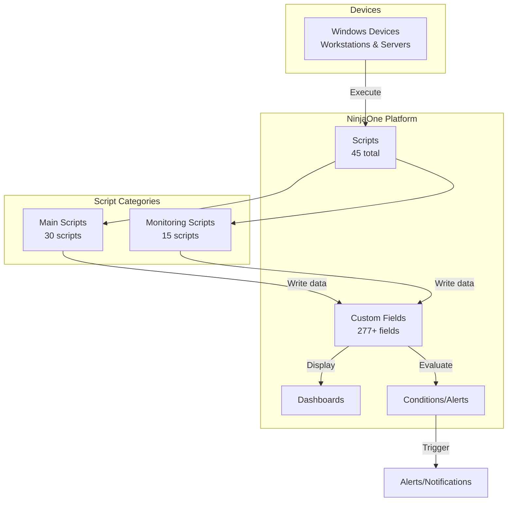

# Phase 4: Diagrams Execution Plan

**Date:** February 8, 2026, 11:47 AM CET  
**Phase:** Phase 4 - Architecture and Data Flow Diagrams  
**Estimated Time:** 2-3 hours  
**Status:** READY TO EXECUTE

---

## Objective

Create visual documentation to complement the comprehensive text documentation. Diagrams will illustrate architecture, data flows, field relationships, and script dependencies to help users understand the framework structure.

---

## Diagrams to Create

### Diagram 1: Framework Architecture Overview
**Type:** High-level architecture diagram  
**Estimated Time:** 30 minutes  
**Purpose:** Show overall WAF structure and component relationships

**Components to Include:**
- NinjaOne Platform (custom fields, scripts, conditions)
- Script Categories (main scripts, monitoring scripts)
- Data Flow (device → script → field → dashboard)
- User Touchpoints (admin config, dashboard views, alerts)

**Key Elements:**
- 45 total scripts (30 main + 15 monitoring)
- 277+ custom fields
- Field types (text, WYSIWYG, dropdown→text, datetime)
- Script execution flow
- Data storage patterns (Base64 JSON, Unix Epoch)

### Diagram 2: Script Organization Structure
**Type:** Directory/file structure diagram  
**Estimated Time:** 20 minutes  
**Purpose:** Visual representation of repository organization

**Structure to Show:**
```
waf/
├── scripts/
│   ├── 01-30 Main Scripts
│   └── monitoring/
│       └── Script_01-48 Monitoring Scripts
├── docs/
│   ├── Pre-Phase Summaries
│   ├── Phase Documentation
│   ├── Field Mapping Documents
│   └── Coding Standards
├── planning/
│   ├── Continuation Plans
│   ├── Status Updates
│   └── Phase Completion Summaries
└── README files
```

### Diagram 3: Data Flow - Script Execution to Dashboard
**Type:** Sequence/flow diagram  
**Estimated Time:** 30 minutes  
**Purpose:** Show how data moves from script execution to dashboard visibility

**Flow Steps:**
1. Script executes on device (scheduled/manual)
2. Script collects data (WMI, registry, ADSI, file system)
3. Data processing (calculations, transformations)
4. Base64 encoding (complex data) or direct storage
5. Ninja-Property-Set writes to custom fields
6. NinjaOne stores field values
7. Dashboard displays data
8. Conditions evaluate for alerts
9. Users view/filter/sort data

**Technical Details:**
- Base64-encoded JSON for complex structures
- Unix Epoch timestamps for datetime fields
- Text fields for all status values
- WYSIWYG for formatted reports

### Diagram 4: Field Type Conversion Journey
**Type:** Timeline/process diagram  
**Estimated Time:** 20 minutes  
**Purpose:** Visualize Phase 1 field type conversion process

**Timeline:**
- Original State: 28 dropdown fields
- Phase 1 Part A: Script documentation updated
- Phase 1 Part B: NinjaOne field conversions (pending)
- Phase 1 Part C: Testing and validation (pending)
- End State: 28 text fields (searchable/filterable)

**Benefits Shown:**
- Dashboard filtering enabled
- Search capability added
- Sorting functionality improved
- Consistency with framework standards

### Diagram 5: Pre-Phase Technical Foundation
**Type:** Layer/stack diagram  
**Estimated Time:** 30 minutes  
**Purpose:** Show how pre-phases built technical foundation

**Layers (bottom to top):**
1. **Pre-Phase A:** LDAP:// Protocol (no RSAT)
2. **Pre-Phase B:** Module Dependencies (server roles only)
3. **Pre-Phase C:** Base64 Encoding (complex data)
4. **Pre-Phase D:** Language Neutrality (German/English)
5. **Pre-Phase E:** Unix Epoch Timestamps (date/time)
6. **Pre-Phase F:** Self-Contained Scripts (no external deps)
7. **Phase 0:** Coding Standards (consistency)
8. **Production Scripts:** 45 scripts built on foundation

### Diagram 6: Script Dependency Map
**Type:** Dependency/relationship diagram  
**Estimated Time:** 30 minutes  
**Purpose:** Show which scripts depend on or relate to each other

**Categories:**
- **Independent Scripts:** Run standalone (most scripts)
- **Baseline Dependent:** Scripts requiring 12_Baseline_Manager
- **AD Dependent:** Scripts requiring domain connection
- **Role Dependent:** Scripts requiring specific server roles
- **Shared Fields:** Scripts writing to same custom fields

**Key Relationships:**
- Baseline Manager → Software Inventory scripts
- AD Monitor → Domain-joined systems only
- Server Role Identifier → Server monitoring scripts
- Validator scripts → Patch deployment scripts

### Diagram 7: Health Status Classification System
**Type:** Decision tree/flowchart  
**Estimated Time:** 20 minutes  
**Purpose:** Show how scripts determine health status values

**Standard 4-State Pattern:**
```
Start → Check if data available
├─ No → Unknown
└─ Yes → Evaluate metrics
    ├─ All metrics good → Healthy
    ├─ Minor issues → Warning
    └─ Major issues → Critical
```

**Examples:**
- BitLocker: Encrypted=Healthy, Partial=Warning, None=Critical
- Disk Space: >20%=Healthy, 10-20%=Warning, <10%=Critical
- Service: Running=Healthy, Stopped=Critical
- Backup: <24h=Healthy, 24-48h=Warning, >48h=Critical

---

## Diagram Format

### Tool Choice

**Option 1: Mermaid (Recommended)**
- Text-based diagrams in markdown
- Renders natively in GitHub
- Version control friendly
- Easy to update
- No external tool required

**Option 2: Draw.io**
- Visual editor
- More design flexibility
- Export to PNG/SVG
- Requires separate tool
- Harder to maintain

**Recommendation:** Use Mermaid for all diagrams
- Store as .md files with mermaid code blocks
- GitHub renders automatically
- Easy to modify and maintain
- Version controlled

### Diagram Storage Location

```
waf/
└── docs/
    └── diagrams/
        ├── 01_Framework_Architecture.md
        ├── 02_Script_Organization.md
        ├── 03_Data_Flow.md
        ├── 04_Field_Conversion_Journey.md
        ├── 05_PrePhase_Foundation.md
        ├── 06_Script_Dependencies.md
        └── 07_Health_Status_Classification.md
```

---

## Execution Steps

### Step 1: Create Diagrams Directory (5 minutes)

1. Create `/docs/diagrams/` directory
2. Create README.md in diagrams folder
3. List all diagrams with descriptions
4. Add viewing instructions

### Step 2: Create Diagram 1 - Framework Architecture (30 min)

**Mermaid Code:**


### Step 3: Create Diagram 2 - Script Organization (20 min)

Use Mermaid directory tree or simple flowchart showing repository structure.

### Step 4: Create Diagram 3 - Data Flow (30 min)

**Sequence diagram showing:**
- Script execution trigger
- Data collection
- Processing/transformation
- Field writing
- Dashboard display
- Alert evaluation

### Step 5: Create Diagram 4 - Field Conversion (20 min)

**Timeline/Gantt style diagram showing:**
- Phase 1 Parts A, B, C
- Before/after states
- Benefits achieved

### Step 6: Create Diagram 5 - PrePhase Foundation (30 min)

**Layer diagram showing:**
- 6 pre-phases as foundation layers
- Phase 0 coding standards
- Production scripts on top
- Dependencies between layers

### Step 7: Create Diagram 6 - Script Dependencies (30 min)

**Network/relationship diagram showing:**
- Script nodes
- Dependency arrows
- Grouping by category
- Shared field connections

### Step 8: Create Diagram 7 - Health Status (20 min)

**Flowchart showing:**
- Decision points
- Health status determination
- Example thresholds
- Common patterns

### Step 9: Create Diagrams Index (10 min)

**Create master index document:**
- List all diagrams
- Descriptions
- Links to files
- Usage guidance

### Step 10: Update Main Documentation (10 min)

**Add diagram references to:**
- Main README.md
- ACTION_PLAN documentation
- Phase completion documents
- Link to diagrams directory

---

## Success Criteria

**Phase 4 is complete when:**

- [ ] `/docs/diagrams/` directory created
- [ ] Diagram 1: Framework Architecture created
- [ ] Diagram 2: Script Organization created
- [ ] Diagram 3: Data Flow created
- [ ] Diagram 4: Field Conversion Journey created
- [ ] Diagram 5: PrePhase Foundation created
- [ ] Diagram 6: Script Dependencies created
- [ ] Diagram 7: Health Status Classification created
- [ ] Diagrams README/index created
- [ ] Main documentation updated with diagram links
- [ ] All diagrams render correctly in GitHub
- [ ] All changes committed to git
- [ ] Phase 4 completion summary created

---

## Quality Standards

### Diagram Quality
- Clear and readable
- Consistent styling
- Accurate information
- Appropriate level of detail
- Renders correctly in GitHub

### Documentation Quality
- Each diagram has description
- Usage context explained
- Referenced from main docs
- Easy to find and navigate

---

## Time Budget

| Diagram | Estimated | Notes |
|---------|-----------|-------|
| Setup | 5 min | Create directory |
| Diagram 1 | 30 min | Framework architecture |
| Diagram 2 | 20 min | Script organization |
| Diagram 3 | 30 min | Data flow |
| Diagram 4 | 20 min | Field conversion |
| Diagram 5 | 30 min | PrePhase foundation |
| Diagram 6 | 30 min | Script dependencies |
| Diagram 7 | 20 min | Health status |
| Index | 10 min | Diagrams index |
| Integration | 10 min | Update main docs |
| **Total** | **2-3 hours** | |

---

## Next Steps After Phase 4

**When Phase 4 is complete:**

1. Review all diagrams for accuracy
2. Verify GitHub rendering
3. Create Phase 4 completion summary
4. Update project progress tracking
5. Choose next phase:
   - Phase 5: Reference Suite (6-8 hours)
   - Phase 1 Part B: NinjaOne conversions (if access available)

---

**Status:** Ready to Execute  
**Created:** February 8, 2026, 11:47 AM CET  
**Next Action:** Create diagrams directory and begin Diagram 1
